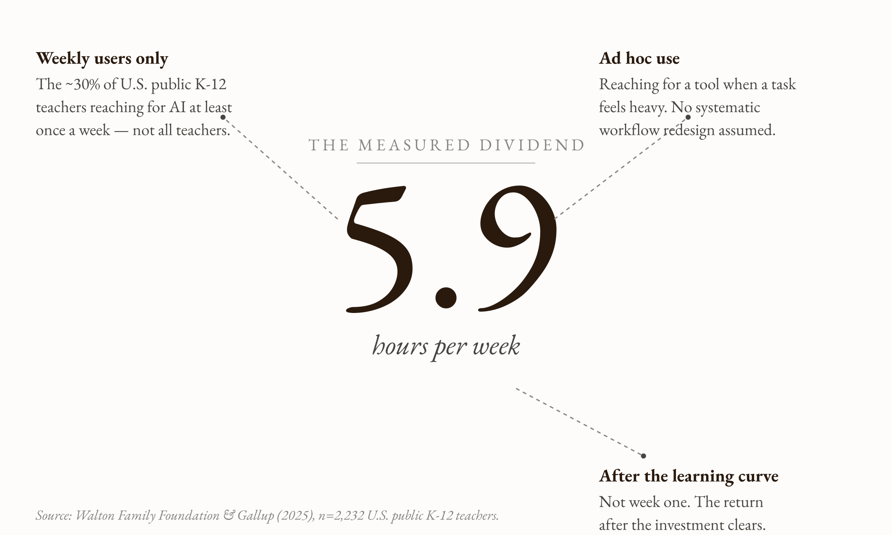
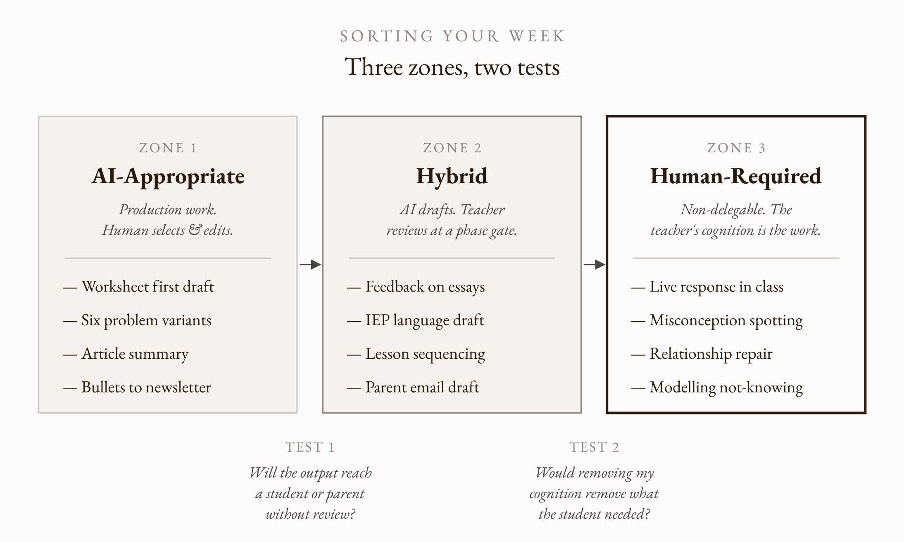

# Chapter 1 — The AI Dividend: What Teachers Actually Get Back

*Not what they hoped for. Not what the headlines said. What they actually got.*

---

There is a number at the center of this chapter. It is 5.9. That is hours per week — the average time savings reported by U.S. teachers who use AI tools at least weekly. Not per month. Per week. The Walton Family Foundation and Gallup measured it across 2,232 teachers drawn from the RAND American Teacher Panel, a probability-based nationally representative sample of U.S. public school K–12 teachers. The fieldwork ran from March 18 to April 11, 2025.[^gallup]

You may have heard a different number. Twenty hours a week. A full day. Half the job. Those numbers float through LinkedIn and conference keynotes, and they are not invented — some teachers really do report them. But they are not the average. They are what you get after months of deliberate workflow redesign, tool-specific practice, and the accumulated muscle memory of knowing which task to delegate and exactly how to say what you need. The 5.9-hour figure is what teachers who reach for an AI tool when something feels heavy, get help, and put the tool down again actually save. Not aspiration. Measurement.

The chapter's job is to show you what 5.9 hours actually means: where it comes from, what it does not include, and how to figure out which six hours belong to your week specifically.


*Figure 1.1 — The 5.9-hour number is specific and bounded, not a universal promise.*

---

## The number and where it lives

First, let me be precise about the population. Sixty percent of U.S. public K–12 teachers reported using AI for any school-related task during the 2024–25 school year. About 30 percent used AI weekly. The 5.9-hour figure describes the weekly users — the third of teachers who had already crossed the learning curve, not the majority who are still on the early slope where time is going out before it comes back.[^gallup]

This matters for planning. A teacher who tries an AI tool on a Monday and finds it slower than doing the task herself is not seeing a contradiction. She is seeing week one. The 5.9 hours is the return after the investment clears.

Now the more important precision: there are actually two different numbers in circulation, and they mean two entirely different things. Conflating them is how teachers end up either undershooting the dividend or setting themselves up for disappointment.

**The first number is 5.9 hours per week.** This is what you get from ad hoc use — reaching for a tool when a task feels heavy, without any systematic workflow design. It has nationally representative survey evidence behind it.[^gallup]

**The second number is approximately 16 to 17 hours per week.** This is a projection of what might be recovered if AI were integrated systematically across every category of teacher work: lesson preparation, grading, administrative tasks, differentiation, assessment design, data analysis, professional development. It is not a measured finding. It is what you get when you multiply baseline hours by plausible substitution rates for each category and add up the column.

The second number is built on top of the first. The lesson-preparation row in that projection has one external anchor: the NFER / Education Endowment Foundation ran a randomized controlled trial during summer 2024 with 259 Year 7 and 8 science teachers across 68 English schools. Teachers given access to ChatGPT spent 56.2 minutes per week on lesson preparation; the control group spent 81.5 minutes. The difference is about 25 minutes — roughly 31 percent of the baseline.[^nfer] Every other row is a judgment estimate built on what the tools can plausibly do. The estimates are informed. They are not data.

I am telling you this because the hostile-reader test matters. A number you cannot defend under questioning is not a number you should plan around. Plan around 5.9. Treat 16 as a ceiling you might approach over years of deliberate practice. Treat 20 as what some teachers have achieved and you might someday reach, but not a baseline expectation.

| Dimension       | Ad-hoc savings (5.9 hrs/week)                                | Systematic deployment ceiling (~16–17 hrs/week)              |
|-----------------|--------------------------------------------------------------|--------------------------------------------------------------|
| Evidence basis  | Self-reported, observed                                       | Modeled upper bound from time-and-motion studies              |
| Population      | Teachers already using AI weekly                              | Hypothetical teacher with fully designed workflows            |
| When it applies | After the learning curve, in ordinary practice                | Only with sustained workflow redesign and admin support       |
| Planning use    | Personal target for the second semester                       | District-level planning ceiling, not an individual promise    |

*Table 1.1 — Two claims, different epistemic weight. Use the left column for personal planning; treat the right column as the policy ceiling, not the personal floor.*

---

## What the six hours are actually recovering

Across the nine task categories in the Gallup-Walton survey — preparing to teach, making worksheets, modifying materials, administrative work, and others — between 60 and 84 percent of teachers who tried AI for a given task said it saved them time. Fewer than 7 percent in any category said it made the task take longer.[^gallup]

The savings concentrate where you would expect them: the work that is preparatory rather than live, the work that is structural rather than relational, the work that produces a draft rather than a judgment. The work, in short, where the problem is production rather than understanding.

Here is how to see the distinction clearly. Consider a high school English teacher with thirty essays to grade. She has a rubric. She knows what good analysis looks like. She has read enough essays by these thirty students to know who needs a different kind of push. The cognitive work in that grading session is of two very different types.

The first type: identifying whether the essay hits each rubric criterion and producing a sentence or two on each. This is structural work. It requires knowing the rubric, reading carefully, and writing clearly. It does not require knowing this student's particular pattern of thinking.

The second type: noticing that student number eleven is almost right but wrong in a specific way she has never been wrong before, and writing the question that will make her see it. This requires knowing her, having read her previous three essays, and understanding what the gap between this essay and her last one means.

The first type is AI-appropriate. The second is not. The dividend on grading is not that AI grades the essays. It is that AI handles the structural first pass well enough that the teacher arrives at essay eleven with enough left to write the question that matters.

What teachers in the survey report doing with recovered time is consistent with this: deeper instructional planning, more individualized student support, and relationship-building with students and families are the three most-cited reinvestments.[^gallup] Not more grading. Not additional administrative tasks. The things that require the human to actually be present.

---

## A taxonomy you can use

Every recurring task a teacher does falls into one of three categories. Not in the abstract — for you, on your actual week.

**AI-appropriate tasks** are ones where the cognitive work is preparatory rather than pedagogical. Producing a first draft of a worksheet. Generating six versions of a problem at four difficulty levels. Summarizing a research article you will read closely but cannot read cold at 10 p.m. on a Tuesday. Converting bullet notes into the bones of a parent newsletter. In all of these, the human judgment is in selection and editing, not in production. AI is good at production. The teacher is good at selection.

**Hybrid tasks** are ones where AI can handle a bulk draft but a review is non-negotiable because the output will reach a student or parent. Feedback on student work. IEP language. Lesson sequencing for a class with known specific dynamics. The dividend is real here — often the largest single chunk of recoverable time — but only after the teacher has set the right gate between the draft and what goes out. The failure mode on hybrid tasks without gates is not "AI didn't save time." It is "AI saved time and sent the wrong thing."

**Human-required tasks** are ones where removing the teacher's cognition from the task removes something the student needed. The live conversation responding to confusion in the room. The recognition of a misconception embedded in an almost-right answer. The relationship with a student who is losing momentum. The modeling — and this is the one most often overlooked — of what it looks like to not-know-yet and keep going anyway.

The test I use for human-required is: *would delegating this task remove something the student needed?* Not "would it be less efficient" — efficiency is not the criterion. The question is whether the output of the task serves a pedagogical function that depends specifically on the teacher's cognition being inside it. If yes, the task stays.

This taxonomy is a sorting question, not a verdict. Two teachers doing the same nominal activity may sort it differently, and both may be right. For one teacher, essay grading is mostly structural first-pass work — hybrid. For another, essay grading is how she catches the misconception that determines tomorrow's lesson — human-required, even though the margin comments could be delegated without harm. The taxonomy is useful because it forces the question, not because it returns a universal answer.


*Figure 1.2 — The three-zone task taxonomy. Sort your own tasks on the first read; you will revisit the boundaries every month.*

---

## What gets harder when you ignore the categories

The Bastani et al. (2025) study on AI in Turkish high school mathematics is the cleanest demonstration of what goes wrong when the categories collapse.[^bastani] About 1,000 students used a general-purpose ChatGPT during math practice. They scored 48 percent higher than the control group during the practice session. On the subsequent unaided exam, they scored lower — not by a small amount.

The savings during practice were real. The cost on the exam was also real. The same structure governs the teacher side. Delegate lesson preparation without sitting with the lesson long enough to anticipate misconceptions and you arrive in class "prepared" in a narrow sense. The lesson exists. The teacher has not pre-loaded the contextual understanding that the preparation hour was producing — the sense of where this class is likely to get stuck, which analogy will land for this group, where the lesson might need to bend based on what happened yesterday. The hour came home. The teaching went with it.

The dividend is not the hours. The dividend is what the hours were doing for you, returned in a form you can spend on something the hours were not doing.

---

## The reinvestment problem

The most common way the dividend disappears in practice is not that the tool stops working. It is that the saved time gets absorbed back into the schedule without a decision being made about it.

A teacher saves ninety minutes on Monday by delegating worksheet generation. On Tuesday she uses ninety minutes on something that expands to fill the space — a committee email, an additional prep pass, twenty more minutes of gradebook administration. The dividend does not appear because she never decided what it was for.

The Gallup-Walton survey data on reinvestment is suggestive but not airtight. The teachers said they were reinvesting saved time in instructional and relational work. The survey did not follow them and measure where the hours actually went. Self-reported reinvestment tends to be optimistic. The closest causal evidence on whether teacher AI use translates into improved student outcomes is still pending — the NFER follow-up trial of Oak National Academy's Aila lesson-planning tool with roughly 450 Key Stage 2 teachers is expected to report in 2026.[^aila] Until then, the reinvestment finding is an encouraging correlation, not a closed case.

What the data cannot tell you, you have to design for. Pre-committing the dividend before you earn it is the cheapest known fix. Name the specific task you will do with the recovered time — not "more time for students" but "one-on-one conference with Marcus on his argument structure" — and name how you will know you did it. The dividend is real. Whether it lands somewhere useful is a decision, not a consequence.

---

## One worked example: the social studies teacher's week

Take a middle school social studies teacher with 120 students across five sections. Here is what her week looks like by her own count — a representative week in October, not an unusual one.

Lesson planning for five lessons across five sections runs about eight hours. Grading and feedback across essays, document analyses, and short-answer work runs about seven hours. Parent communication and administrative email runs about four hours. Differentiation — Lexile adjustments, ELL scaffolds, IEP-aligned materials — runs about three hours. Quiz and assessment design runs about two and a half hours. Data analysis (gradebook, attendance, formative data) runs about two hours. Live instruction and supervision runs about thirty-two and a half hours.

The last category is not delegable. Those hours stay where they are. The machinery of what AI can do operates on the first six categories — the roughly twenty-six and a half hours of discretionary work.

Using conservative substitution rates (the lesson-prep rate anchored to the NFER/EEF RCT, the others as judgment estimates), the projected recovery across all six categories is somewhere between 13 and 14 hours per week under systematic deployment with the right phase gates. That is well above 5.9 and well below 16.7, sitting approximately where I would expect a careful teacher to land in year two of using these tools well.

Here is the sentence that matters: **the dividend you actually get is the sum of the per-task substitutions you actually run, on your actual week, with the phase gates the tasks actually need.** Not an average. Not a projection. The number on your week.

And the limit: the table assumes the phase gates are in place. A teacher who delegates grading without rubric calibration, or differentiation without anonymizing student data appropriately, will save time and produce problems. The hours come home with consequences attached.

| Task                                  | Hours/week | Category        | Projected recovery |
|---------------------------------------|------------|-----------------|--------------------|
| Live instruction and supervision      | 25         | Human-Required  | —                  |
| Lesson planning and material design   | 8          | Hybrid          | 2–3 hrs            |
| Grading and written feedback          | 7          | Hybrid          | 2–3 hrs            |
| Parent and student email              | 4          | AI-Appropriate  | 2 hrs              |
| Quiz and rubric drafting              | 3          | AI-Appropriate  | 1.5 hrs            |
| Slide assembly for upcoming units     | 3          | AI-Appropriate  | 1.5 hrs            |
| Administrative paperwork and reports  | 2          | AI-Appropriate  | 1 hr               |

*Table 1.2 — A social studies teacher's week. "Live instruction and supervision" is non-delegable. The other six categories show where the 5.9 hours can plausibly come from. Reproduce this audit for your own week before committing to a workflow.*

---

## Three things that would make me revise this chapter

I want to be honest about what the chapter rests on, so you know where the load-bearing pieces are.

First: if a peer-reviewed RCT of systematic AI deployment across multiple teacher task categories found that integration costs exceed integration gains — that the 16-hour projected ceiling actually comes in below the 5.9-hour ad hoc baseline — I would update the projection table immediately and say so on the first page of the next edition. The ceiling is a hypothesis. Measurements beat hypotheses.

Second: if a measured reinvestment study found that teachers' self-reported reinvestment in instructional work overstates actual reinvestment by more than half — that the hours are reported as relational time but are actually absorbed by administrative creep — the chapter's central claim about the nature of the dividend would need to be renegotiated. Right now, "not doing less; doing the right things" is a frame built on self-report. It is not yet built on clock time.

Third: the Aila trial results. If AI-assisted lesson preparation is found to produce measurably worse lesson quality even while reducing preparation time, the lesson-preparation row in the projection table needs a quality-cost line added to it, and the net savings estimate for that row needs to come down. The trial design measures both time and resource quality. The 2026 result will be the closest thing we have to a definitive answer on the most heavily weighted row in the projection.[^aila]

---

## Exercises: using AI to understand AI

These exercises are designed to be done with an AI tool — Claude, ChatGPT, or any general-purpose assistant. They are not assignments. They are ways of using the thing you are learning about to learn about it more precisely.

**Exercise 1: The claim audit with an AI assistant.**

Find one AI time-savings claim in the wild — a LinkedIn post, a district email, a vendor case study. Paste it into an AI assistant and ask it to run four checks: Is there a primary source? Is the population specified? Is the savings measured or projected? Does the claim distinguish ad hoc from systematic use? Ask the assistant to flag which checks fail and why. Then read its assessment critically. Does it miss anything? Does it overstate the problem? The exercise has two outputs: a paragraph on the claim, and a sentence on where the AI assistant's analysis fell short.

**Exercise 2: Build and interrogate your own projection table.**

Describe your workweek to an AI assistant in about two hundred words — the recurring tasks, the rough hours for each, the nature of the cognitive work each requires. Ask it to generate a projection table using the same structure as the one in this chapter. Then ask it to tell you which rows it is most uncertain about and why. Compare its uncertainty estimates to your own judgment. Where do you disagree, and what does the disagreement reveal about the limits of the tool versus the limits of your self-knowledge?

**Exercise 3: The phase gate interview.**

Pick the hybrid task in your week that you are most nervous about delegating — the one where "AI gets it wrong" would have real consequences. Describe the task to an AI assistant. Ask it: *What information would you need from me to produce a first draft that I would need to substantially edit?* Then ask: *What would be the most likely ways this draft would be wrong?* Its answer to the second question is your phase gate — the checklist you run before anything from the draft goes to a student or parent. Write the gate down before you use the tool for the task the first time.

---

The dividend is real. The ceiling is a hypothesis. The reinvestment is a decision you make before you earn it, not after. Chapter 2 introduces the phase gate in full — the explicit boundary between what the tool does and what you verify, designed so the dividend is safe to spend.

---

[^gallup]: Walton Family Foundation & Gallup (2025). *Teaching for Tomorrow: Unlocking Six Weeks a Year With AI.* Released June 18, 2025; fieldwork March 18 – April 11, 2025; n = 2,232 U.S. public K–12 teachers via RAND American Teacher Panel. [https://static.waltonfamilyfoundation.org/df/fb/eba12807470a9402d7433cc47dba/teaching-for-tomorrow-unlocking-six-weeks-a-year-with-ai-report.pdf](https://static.waltonfamilyfoundation.org/df/fb/eba12807470a9402d7433cc47dba/teaching-for-tomorrow-unlocking-six-weeks-a-year-with-ai-report.pdf). See also the Gallup news release: [https://news.gallup.com/poll/691967/three-teachers-weekly-saving-six-weeks-year.aspx](https://news.gallup.com/poll/691967/three-teachers-weekly-saving-six-weeks-year.aspx).

[^nfer]: NFER & Education Endowment Foundation (2024). *ChatGPT in lesson preparation: A Teacher Choices Trial.* 259 Year 7 and 8 science teachers across 68 English schools; ten-week implementation summer 2024; ChatGPT group spent 56.2 min/week on lesson prep versus 81.5 min/week for control. [https://www.nfer.ac.uk/publications/chatgpt-in-lesson-preparation-a-teacher-choices-trial/](https://www.nfer.ac.uk/publications/chatgpt-in-lesson-preparation-a-teacher-choices-trial/).

[^aila]: Education Endowment Foundation (2025). *Lesson planning using AI lesson assistant, Aila — Teacher Choices Trial.* ~450 Key Stage 2 teachers across 86 English primary schools; results expected 2026; evaluator NFER. [https://educationendowmentfoundation.org.uk/projects-and-evaluation/projects/aila-teacher-choices-trial](https://educationendowmentfoundation.org.uk/projects-and-evaluation/projects/aila-teacher-choices-trial).

[^bastani]: Bastani, H., Bastani, O., Sungu, A., Ge, H., Kabakcı, Ö., & Mariman, R. (2025). Generative AI without guardrails can harm learning: Evidence from high school mathematics. *PNAS*, 122. [https://www.pnas.org/doi/10.1073/pnas.2422633122](https://www.pnas.org/doi/10.1073/pnas.2422633122). Correction: [https://www.pnas.org/doi/10.1073/pnas.2518204122](https://www.pnas.org/doi/10.1073/pnas.2518204122).

---

## Prompts

Use these prompts with Claude to generate interactive D3 v7 versions of the
figures in this chapter. Each produces a standalone HTML file you can open
in a browser and modify freely.

**Prerequisites:** Load `brutalist/CLAUDE.md` and `brutalist/DESIGN.md` into
your Claude project context before using these prompts. They define the stack,
naming conventions, color system, and typography the figures use.

---

### Figure 1.1 — The 5.9-hour anchor

Build a single-file HTML "hero number" figure. Center one display-size value, the string `5.9`, in EB Garamond at roughly 150px in `var(--color-red)`; immediately beneath it set the italic unit `hours per week` in EB Garamond at ~20px in `var(--color-ink)`. Above the number, render a short eyebrow label `THE MEASURED DIVIDEND` in 11px Inter letter-spaced, with a 160px hairline rule in `var(--color-border)` below it. Arrange three callouts around the anchor at 11, 1, and 5 o'clock with one anchor point on each leader pointing to the number. Each callout is a bold 13px Inter title plus 2–3 lines of 13px EB Garamond secondary text. The three titles and bodies: "Weekly users only" (~30% of U.S. public K-12 teachers, not all teachers); "Ad hoc use" (reaching for a tool when a task feels heavy, no systematic workflow); "After the learning curve" (not week one — the return after the investment clears). Leaders are 1px dashed `var(--color-secondary)` terminating in a 2.5px filled dot. Add an italic source caption at the bottom-left. Each callout must be a tab-focusable hit zone with an aria-label and a tooltip that expands the boundary into one sentence. Accessibility: `role="img"`, `<title>` and `<desc>`, prefers-reduced-motion suppression, prefers-color-scheme dark variant.

> Reference implementation: `d3/01-the-ai-dividend-fig-01.html`

---

### Figure 1.2 — Three-zone task taxonomy

Build a single-file HTML diagram with three equal-width card rectangles arranged left to right with consistent gaps between them. Card 1 is AI-Appropriate, card 2 is Hybrid, card 3 is Human-Required. Card 3 takes a 2px `var(--color-red)` border to mark non-delegable territory; the other two take a 1px `var(--color-border)` border. Inside each card, top to bottom: an 11px Inter zone tag in `var(--color-secondary)` ("ZONE 1/2/3"), a 22px EB Garamond bold zone title, a 13px italic EB Garamond definition line, a hairline divider, then a vertical list of 4 task examples in 13px EB Garamond, each prefixed by an em dash. Use the example sets in the chapter: production drafts (worksheets, problem variants, summaries, newsletter bullets) for AI-Appropriate; feedback, IEP language, lesson sequencing, parent email drafts for Hybrid; live response, misconception spotting, relationship repair, modelling not-knowing for Human-Required. Between adjacent cards render a horizontal arrow at mid-height with an arrowhead defined once in `<defs>`, then a TEST 1 / TEST 2 label beneath in ochre and an italic two- or three-line question in `var(--color-secondary)`. Test 1 asks whether output will reach a student or parent without review; Test 2 asks whether removing the teacher's cognition would remove what the student needed. Each card is keyboard-focusable with a tooltip elaborating the zone. Accessibility: `role="img"`, `<title>` and `<desc>`, prefers-reduced-motion suppression, prefers-color-scheme dark variant.

> Reference implementation: `d3/01-the-ai-dividend-fig-02.html`

---

## AI Wayback Machine

The instinct to study where a teacher's hours actually go — and to redesign the workflow around what matters — was operationalized in American teacher training in the 1960s and 70s by **Madeline Hunter** (1916–1994). Hunter's ITIP framework (Instructional Theory Into Practice) broke teaching into observable elements: anticipatory set, objective and purpose, input, modelling, checking for understanding, guided practice, closure, independent practice. The point was not to mechanize teaching but to surface the structure underneath good lessons so that the structure could be taught — and so that a teacher overwhelmed by a hundred small decisions could compare their day against a checklist and recover the parts that had drifted. The audit move in this chapter — the social studies teacher writing down where the week's forty-two hours actually go — is Hunter's instinct applied to time instead of to a single lesson.


*Madeline Hunter, circa 1980. AI-generated portrait based on a public domain photograph (Wikimedia Commons).*

**Run this:**

```
Who was Madeline Hunter, and how does her ITIP framework connect to the time-audit move in this chapter? Keep it to three paragraphs. End with the single most surprising thing about her career or impact.
```

→ Search **"Madeline Hunter"** on Wikipedia.

**Now make the prompt better.** Try one of these:

- Ask it to map the seven ITIP elements onto the AI-Appropriate / Hybrid / Human-Required zones in this chapter.
- Ask about the criticism Hunter's framework received from researchers in the 1990s — what survives and what doesn't?

What changes? What gets better? What gets worse?
