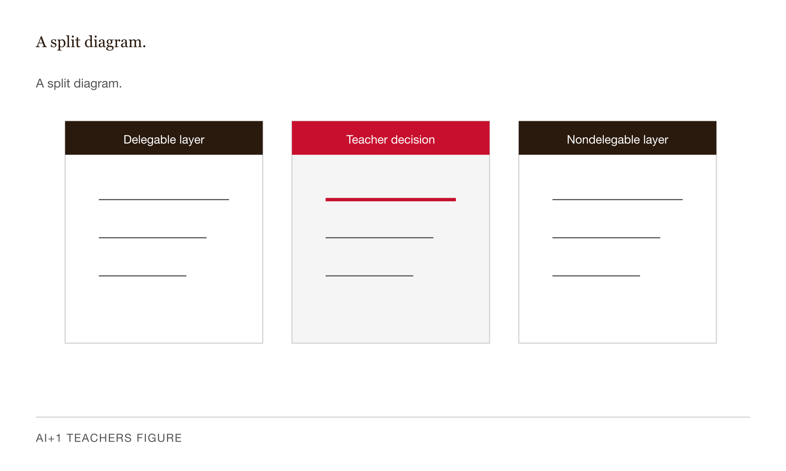
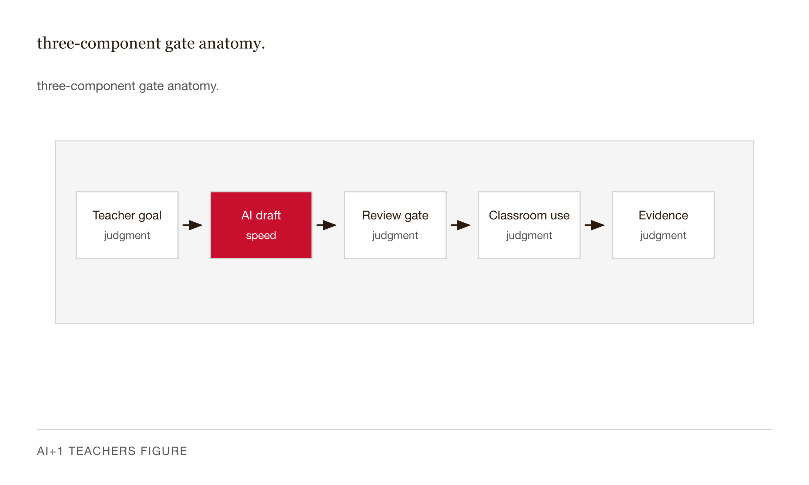
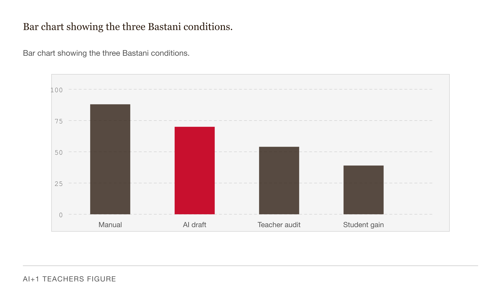
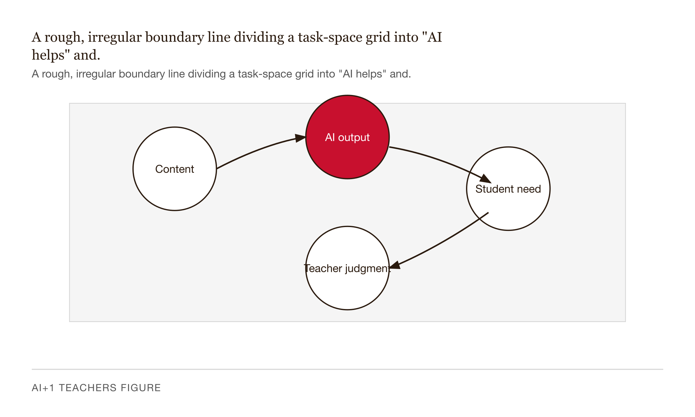
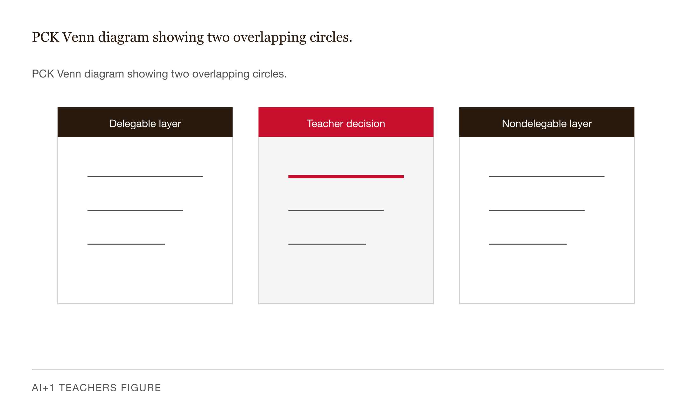
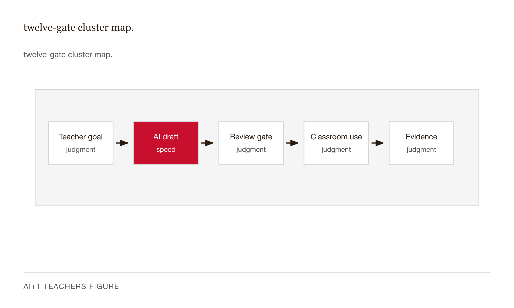
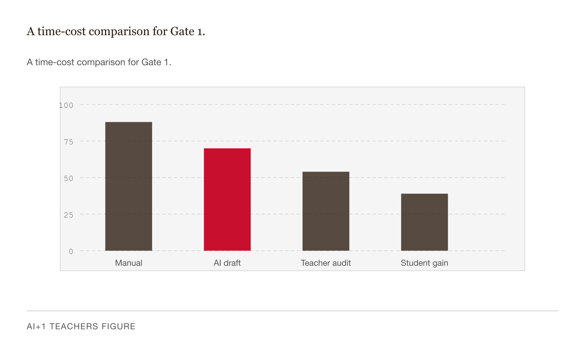

# Chapter 2 — The Phase Gate: What AI Handles, What You Must Keep

## TL;DR

- Doing the cognitive work the workflow was designed to skip.
- The chapter moves through What a gate actually is, Why the operation is the thing, The jagged frontier, The irreducibly human content, and related ideas.
- Read it for the main argument, the vocabulary it introduces, and the practical judgment it asks you to develop.

*Doing the cognitive work the workflow was designed to skip.*

---

*The click is not the operation. This is the whole chapter, if you need it fast. Everything below is the explanation of why.*

---

Here is a thing that happened, and it is not unusual.

A district bought a license for an AI grading assistant. Teachers uploaded essays, the tool returned scores and paragraph-level feedback, and the dashboard tracked approvals before anything reached the gradebook. The training materials said teachers were "in the loop." The vendor's slides said it. The consent letter to parents said it. For six weeks, it looked true: teachers reported saving four to seven hours a week, and the approval rate on AI-generated scores was 99.4%.

Then three parents called in the same week. Not about the scores. About the feedback. A student who had spent the year working on argument structure received a comment praising her "clear thesis" — on an essay where she had, according to her teacher, repeated the thesis four times because the teacher had been coaching her specifically on emphasis. Another student received feedback flagging "weak evidence" on a piece built around a local event the model had never heard of. A third got a generic note about transition words on an essay that her teacher knew, from a conversation the week before, was deliberately experimenting with juxtaposition.

Each comment was rubric-accurate. Each one was wrong. Each one had been approved. The approval took about three seconds per essay.


*Figure 2.1 — failed-workflow flowchart of the opening case.*

The district shut the tool down. The vendor was not at fault. The rubric was not at fault. What failed was simpler and harder to see: the workflow had been designed so that a specific operation — *did the teacher who knows this student actually read this comment and ask whether it fits?* — did not have to occur. The click happened. The operation did not. The phrase "human in the loop" was accurate on the dashboard. It was not accurate as a description of what was happening in the room.

Cory Doctorow put it bluntly: "A neck in a noose is also a human in the loop." Madeleine Clare Elish named the structure it creates: a *moral crumple zone*. When an automated system fails in a way that harms someone, responsibility flows not toward the system's designers but toward whichever human was nominally "in control" at the moment. The workflow gave teachers the responsibility and three seconds. It did not give them the time, the information, or the structural insistence to perform the operation that makes the responsibility real.

This chapter is about what makes a phase gate an actual gate — not a phrase, not a click — and why getting it right is the structural commitment the rest of the book depends on.

---

## What a gate actually is



*Figure 2.2 — A split diagram.*

A phase gate is not a checkbox. It is not a policy that says "teachers must review all AI output." Those things may exist around a gate. Neither is a gate.

A gate has three components, and stripping any one of them collapses it:

A defined upstream task the AI completed — specific, not vague. "The AI scored 120 essays against the rubric." Not "the AI did some grading."

A defined cognitive operation only a human can perform at this point — specific, not vague. "The teacher hand-grades five essays at the rubric extremes, compares those grades to the AI's criterion by criterion, and adjusts the rubric or the prompt where the two diverge." Not "the teacher reviews the output."

A defined downstream action that occurs only after the human acts — specific, not vague. "Bulk grading proceeds only with the recalibrated rubric." Not "scores are released."

Here is the test, stated plainly: name the upstream task, the cognitive operation, and the downstream action in one sentence each. If you cannot, there is no gate. There is only a phrase.



*Figure 2.3 — three-component gate anatomy.*

The opening case fails the test immediately. The cognitive operation — *does this fit this student?* — is not named. It is implied, the way "you should probably think about it" is implied, which is to say it is not structurally present at all. The dashboard records the click. Nobody can tell, from the dashboard, whether the operation happened. That is not a minor design flaw. That is the design. The click is easy to require. The operation is harder to require. Workflows under time pressure produce the click and skip the operation, predictably, every time.

---

## Why the operation is the thing

Let me try to explain the underlying reason, because it matters more than the framework.

Learning — actual learning, the kind that persists — is a biological event. A specific cascade: a prediction error fires in the dopaminergic system, the hippocampus indexes the surprise against existing structure, slow synaptic consolidation happens over hours and days. What triggers this cascade is not exposure to correct information. What triggers it is the learner encountering something that does not fit her current model and having to update the model. The struggle is not the obstacle to the biological cascade. The struggle is the trigger.

This is not a metaphor or an encouraging slogan. It is the mechanism. And it has a direct consequence for what AI does to learning when the gate is in the wrong place.



*Figure 2.4 — Bar chart showing the three Bastani conditions.*

Bastani and colleagues (2025) ran roughly a thousand Turkish high school students through three conditions in mathematics: no AI, an unscaffolded GPT-4 chatbot, and a version of the same model wrapped in teacher-designed prompts that gave hints calibrated to the curriculum rather than direct answers. During practice, students with the unscaffolded chatbot outperformed the no-AI group by roughly 48%. Students with the scaffolded version outperformed them by 127%. So far: AI helps, more carefully designed AI helps more. The press reported this part.

Then came the unaided exam. Students who had used the unscaffolded chatbot during practice scored *17 percentage points below* the no-AI control group. Not below the scaffolded group. Below the students who had no AI at all. The practice artifacts — correct answers to problems — said the students had learned. The exam said they had not. The AI had produced the artifacts of learning by doing the cognitive work that produces learning. The two things look identical from outside and are completely different from inside.

The scaffolded version did not show this decrement. The difference between the two conditions is exactly what I mean by gate location. Same model. Same students. Same curriculum. The gate in the scaffolded version was placed so that the student still had to perform the cognitive operation — working through the problem, encountering the mismatch, updating the model — that builds durable knowledge. The gate in the unscaffolded version was nominally the student's own judgment, which is exactly the cognitive capacity the student was supposed to be building, which is exactly why the student could not supply it. A gate placed where the operation has not yet developed is not a gate.

Now apply the same logic one level up, to the teacher.

A teacher's professional judgment — diagnosing this particular student's misreading, calibrating tone in a message about a sensitive situation, choosing which analogy will land for this class — is also built by repeated cognitive operations, performed day by day, across years. Each time a teacher reads an essay and asks *what does this student actually understand versus what does she merely seem to understand?*, the operation builds the professional capacity we call expertise. The artifact that comes out is feedback. The operation that produced the artifact is also what produces the teacher.

Offload the operation to an AI — have the AI read the essay and produce the feedback, with the teacher clicking approve — and the artifact still appears. The feedback reaches the student. But the operation that built the teacher's judgment did not occur, and the operation that filters the feedback through the teacher's knowledge of this student did not occur. Both losses are invisible. The dashboard says everything happened. Nothing shows that it didn't.

This is the Bastani finding, scaled to the professional. The fluency trap is not a student problem. It is a human-cognition problem. And there is one more piece of it worth naming: students using the unscaffolded AI reported feeling *more confident* about the material than control students. They were less able to do it. Fluent AI assistance produces a strong metacognitive signal — *I get this* — that is accurate when you have done the work and misleading when you haven't. You cannot tell from inside. The only way to tell from outside is to remove the scaffolding and see what happens. By then, the exam has already occurred.

---

## The jagged frontier



*Figure 2.5 — A rough, irregular boundary line dividing a task-space grid into "AI helps" and.*

One tempting response to all of this is a uniform policy: all AI output gets human review, or no AI output gets deployed. The problem is that AI capability is not uniform.

Dell'Acqua, Mollick, and colleagues at Harvard Business School ran 758 BCG consultants — roughly 7% of the firm's individual-contributor workforce — through realistic professional tasks with and without GPT-4 access. On tasks "inside the frontier," where the model was capable, consultants with AI access produced work that was faster by about 25% and rated higher in quality by about 40%. On tasks "outside the frontier," where the model was less capable, consultants with AI access were 19 percentage points *more likely* to produce incorrect answers than consultants without it. Same model. Same workflow. Opposite effects, depending on which specific task the model was doing.

The paper named the finding the "jagged technological frontier." The boundary between "AI helps" and "AI hurts" is not a clean line. It is irregular, and it is not predictable from the task description alone. Two tasks that look similar to a knowledge worker can sit on opposite sides of the frontier. Without a gate, the worker cannot tell which side she is on until the consequences arrive — and in a classroom, the consequences arrive on the exam, weeks later, or in the parent call.

For teaching, this means that a single uniform review policy — "I look over all AI output before it goes out" — is simultaneously too permissive on some tasks and too restrictive on others, and it does not specify what "look over" means as a cognitive operation. Task-specific gates are the structural response to a capability surface that is genuinely irregular. The gate is calibrated to the operation that has to happen, not to a general posture of skepticism.

---

## The irreducibly human content

There is a specific kind of knowledge that AI cannot have access to, regardless of how capable the model becomes, and the gate is where this knowledge enters the workflow.

Lee Shulman named it in his 1985 AERA presidential address: *pedagogical content knowledge*. PCK is the fusion of subject-matter knowledge and pedagogical knowledge that lets a teacher answer questions like: which mistakes do students predictably make when they first encounter related rates? Which analogies clarify the binomial distribution, and which quietly mislead? When the standard explanation fails, what do I reach for next? These are not subject-matter questions and they are not generic-pedagogy questions. They are questions about this topic with this kind of learner, built from repeated direct contact with learners struggling with exactly this material.



*Figure 2.6 — PCK Venn diagram showing two overlapping circles.*

A large language model can have encyclopedic subject-matter knowledge. It has zero PCK for the class sitting in front of you. It does not know which misconception load this group carried in from the prior unit. It does not know that two students are still off-balance from something that happened last week. It does not know that the analogy it just produced — clear, concise, plausible — is precisely the analogy that, in your experience with this age group, locks in the wrong intuition and takes three weeks to undo. The gate is where your PCK enters the workflow. Until it does, the workflow is producing rubric-accurate artifacts that are pedagogically disconnected from your students.

This is also what makes the 99.4% approval rate in the opening case a signal rather than a success metric. The AI's rubric application was, in fact, largely accurate. The feedback was largely competent. Three comments out of 120 were wrong in ways that mattered. The question is not whether those three comments were worth catching. They obviously were. The question is whether a three-second approval process catches them. It does not, because catching them requires the operation — *does this fit this student?* — and that operation requires the teacher to actually hold the student's trajectory in mind while reading the comment. That cannot happen in three seconds. The gate has to be designed so the operation can happen. If the workflow does not give the teacher the time, the information, and the structural insistence to perform it, the gate is not present. A click without an operation is the noose.

---

## The twelve gates

The table below is a working map of the cognitive operations that have to remain with humans in AI-assisted instructional workflows. It is grounded in Bastani, Dell'Acqua, Shulman, Hattie, Elish, and FERPA — synthesized here as a practitioner framework, not presented as a settled list from prior literature. Adapt it to your context.



*Figure 2.7 — twelve-gate cluster map.*

| # | Gate | Description | Risk tier |
|---|------|-------------|-----------|
| 1 | Rubric calibration | Before bulk grading, AI scores five samples; teacher hand-grades the same five, compares criterion by criterion, and adjusts the rubric or the prompt where they diverge. | yellow |
| 2 | Discrepancy resolution | When a student contests a score, the AI is barred from the resolution; the teacher reviews and decides. | green |
| 3 | Socratic scaffolding | During student practice, the AI gives hints calibrated to the curriculum rather than direct answers; the student performs the cognitive work that produces learning. | yellow |
| 4 | Direct instruction | The AI does not deliver live instruction; the teacher teaches, and the AI may analyze the lesson afterward. | green |
| 5 | Content accuracy | Before distributing AI-generated materials, the teacher verifies them for errors, hallucinations, and grade-level fit. | yellow |
| 6 | IEP / 504 compliance | The AI may suggest accommodations based on an anonymized profile, but a licensed specialist authorizes anything that enters the plan. | red |
| 7 | Parent communication | On sensitive messages, the teacher drafts the core; the AI is limited to tone adjustment on already-drafted text. | green |
| 8 | Student intervention | The AI flags patterns; the teacher designs and executes the intervention based on judgment about cause. | green |
| 9 | PCK misconception | For complex concepts, the AI may suggest analogies; the teacher selects based on this class's actual misconception load. | yellow |
| 10 | RAG walled garden | When planning with AI on curriculum materials, only verified curriculum sits in the corpus; the teacher verifies the source grounding of any output. | green |
| 11 | Behavioral crisis | The AI is excluded from live disruption response; the teacher and trained staff handle the moment directly. | red |
| 12 | Student anonymization | All PII is removed before any AI interaction; the teacher anonymizes inputs and re-personalizes outputs locally, protecting FERPA and COPPA obligations. | red |

*Table 2.1 — The twelve gates, with risk tier. Green is recoverable; yellow is difficult to reverse; red is permanent or carries legal consequence.*

| # | Gate | Trigger | AI boundary | Human operation | Cost of skipping |
|---|------|---------|-------------|-----------------|-----------------|
| 1 | Rubric calibration | Before bulk grading | AI runs on 5 samples | Teacher calibrates against own grades; adjusts rubric or prompt | Systematic bias propagates to full class |
| 2 | Discrepancy resolution | Student contests a score | AI barred from resolution | Teacher reviews and decides | Grade disputed without human judgment |
| 3 | Socratic scaffolding | Student practice | AI cannot give direct answers | AI gives hints only; student performs cognitive work | Bastani performance paradox: practice gain, learning loss |
| 4 | Direct instruction | Live classroom | AI cannot deliver instruction | Teacher teaches; AI may analyze afterward | Learning stripped of PCK and relationship |
| 5 | Content accuracy | Before distributing AI-generated materials | AI generates draft | Teacher verifies for errors, hallucinations, grade-level fit | Students receive incorrect content |
| 6 | IEP/504 compliance | Drafting accommodations | AI may suggest based on anonymized profile | Licensed specialist authorizes | Legal and clinical risk |
| 7 | Parent communication | Sensitive communications | AI adjusts tone only | Teacher drafts core message | Authentic relationship replaced by generated text |
| 8 | Student intervention | Academic-risk flagging | AI flags patterns | Teacher designs and executes intervention | Intervention without human judgment about cause |
| 9 | PCK misconception | Complex concept instruction | AI suggests analogies | Teacher selects based on this class's misconceptions | Generic instruction that misses the actual barrier |
| 10 | RAG walled garden | Planning with AI using curriculum materials | Only verified curriculum in the corpus | Teacher verifies source grounding | Hallucinated standards references |
| 11 | Behavioral crisis | Live classroom disruption | AI excluded entirely | Teacher and staff handle | AI has no appropriate role in crisis |
| 12 | Student anonymization | Any student data input to AI | PII removed before any AI interaction | Teacher anonymizes inputs; re-personalizes outputs locally | FERPA / COPPA violation; student privacy breach |

Two notes. Gates 6 and 11 route work away from the classroom teacher to a licensed specialist or trained staff. Having the gate in place is not the same as the teacher being equipped to handle IEPs or crises — the gate's job is the routing. Gate 12 is worth pausing on, because the failure mode is not dramatic and the legal consequence is. Pasting a student's name, performance data, and family context into a free consumer LLM is a disclosure of education records to a third party that has not signed a FERPA-compliant data-processing agreement with the district. The free consumer versions of the major models reserve the right to use submitted content for training. Deleting the chat does not cure the disclosure. The anonymization operation takes about two minutes. The FERPA exposure is permanent.

---

## The surgical timeout


*Figure 2.8 — Two-panel illustration.*

Before any surgical incision in a modern operating room, the team pauses. The surgeon names the patient, names the procedure, names the side, confirms allergies and antibiotic timing. Every member of the team listens. Only after the timeout does the incision occur.

The timeout is not a measure of distrust. Nobody pauses because they doubt the surgeon's competence. The pause exists because surgical workflows under time pressure produce predictable, well-documented errors — wrong-site surgery, missed allergies, wrong patient — that no individual surgeon, however competent, can reliably catch *in the workflow*. The timeout is a structural insistence that a specific cognitive operation occurs at a specific point, performed by the team, regardless of how busy the day has been.

The phase gate is the same thing. The operation that has to happen — calibrate the rubric, check the hallucinated quotation, anonymize the student data — is not happening because the teacher distrusts the AI. It is happening because the workflow under time pressure produces predictable errors that the operation prevents.

Where the analogy breaks: a surgical timeout is performed in front of witnesses, inside a professional culture that has trained itself to enforce the pause. A teacher at a laptop on Sunday afternoon is alone, with the dashboard reporting completion. A 2025 review in *Frontiers in Education* of human-in-the-loop assessment found that humans operating as oversight on automated systems "experience a diminished sense of control, responsibility, and moral agency" — and that the effect persists even after explicit training to resist it. The lesson is not that teachers should try harder. It is that workflows that substitute teacher willpower for structural gate design will lose, predictably, the moment the workflow gets busy. The gate has to be structural: a building-level agreement, a co-teaching pair, a personal protocol specific enough that "approved without reading" cannot be confused with "approved." Without that scaffolding, the gate depends entirely on willpower, and willpower is not a reliable structural element.

---

## Three things people get wrong


*Figure 2.9 — three-column misconception-vs-mechanism comparison card.*

The first is that the gate is about distrust of AI. It is not. The gate is calibrated to which cognitive operation must remain with a human — and that does not change based on how capable the AI gets. Gate 9 (PCK misconception) requires the teacher's judgment about this class. A more capable AI does not have access to this class. The gate stays.

The second is that if the AI is right, no gate is needed. This was the structural fact of the opening case. The scores were rubric-accurate. The feedback was rubric-aligned. The students still received feedback that was wrong for them, because rubric accuracy and pedagogical fit are different properties. The gate is what converts the first property into the second. Without the gate, "the AI is right" means "the AI's output matched a textual rubric," which is not the same as "this output is right for this student." The teacher's reading is the operation that makes that conversion. No reading, no conversion.

The third is that gates slow you down. They take some time. They save more. Gate 1 — rubric calibration on five essays before bulk grading — costs roughly 25 minutes. It recovers the three to five hours that the bulk pass would otherwise need to be re-checked essay by essay, plus the time-cost-with-interest of unwinding a systematically biased grade distribution discovered four weeks later. The deeper version of the misconception treats all time costs as equivalent. The 25 minutes of rubric calibration is cognitively dense time — it is what the teacher's expertise is for. The three to five hours of essay-by-essay second-guessing is cognitively wasteful time — it is the teacher performing the calibration anyway, spread thinly across 120 instances instead of concentrated in five. The gate moves the work to where it is most efficient.



*Figure 2.10 — A time-cost comparison for Gate 1.*

---

## LLM-assisted exercises

**Exercise 1 — The gate specification drill.** Open a conversation with a capable LLM. Paste this prompt: *"I want to use AI to [name one task from your workweek]. Play the role of a skeptical workflow designer and ask me three questions: what cognitive operation must I perform before the AI output can be trusted to reach students; what information do I need to perform that operation; and how long will it realistically take? Do not accept 'review the output' as an answer to the first question — push me to name the specific cognitive act."* The conversation that follows will surface, quickly, whether you have a gate or a phrase.

**Exercise 2 — The Bastani diagnostic applied to your practice.** Give an LLM this prompt: *"Here is a task I currently use AI for: [describe it]. I want you to help me identify two things: first, what is the cognitive operation that produces the learning in this task — mine or my students'? Second, is my current AI use category-preserving (it makes the productive operation more accessible) or category-collapsing (it bypasses the productive operation while producing the artifact)? If category-collapsing, propose one gate that would re-separate the two."* Evaluate the LLM's proposal against the three-component test: does it name an upstream task, a cognitive operation, and a downstream action?

**Exercise 3 — The moral crumple zone audit.** Identify one workflow in your school or district that carries a "human in the loop" claim — AI plagiarism detection with teacher review, AI grading with teacher approval, AI-suggested IEP accommodations. Paste a description of the workflow to an LLM and ask: *"Apply Elish's moral crumple zone analysis to this workflow. Who absorbs the blame if this system fails publicly? What structural change would move meaningful accountability toward the designers and away from the teacher? Be specific — name the change, not the aspiration."* Compare the LLM's structural proposal to what your district's workflow actually provides.

---

## What would change my mind

A peer-reviewed randomized controlled trial showing that, on a workflow with no phase gate at all — AI output released directly to students, no teacher review of any kind — student outcomes measured by an unassisted summative assessment four to eight weeks later did not differ from outcomes under a phase-gated workflow, across diverse populations including English learners and students with IEPs. That finding, if it survived replication, would force a retreat from "the gate is the mechanism" to "the gate is a useful default." That is a much weaker claim than this chapter makes.

---

## Still puzzling

The twelve-gate framework treats the gate as static: one location, one operation, one workflow. But a teacher's expertise is not static. A first-year teacher performing Gate 9 — selecting the right analogy for this class's misconceptions — is performing a different operation than a twenty-year veteran performing the same gate on the same content. Should the gate location shift as expertise develops? And if so, how do you design a workflow that accommodates that shift without collapsing the gate for teachers who are still building the expertise that makes the operation meaningful?

I don't have a good answer to this. Chapter 9 takes up the professional development question, which is where the thread continues.

---

## References

- H. Bastani, O. Bastani, A. Sungu, H. Ge, Ö. Kabakcı, R. Mariman. Generative AI without guardrails can harm learning: Evidence from high school mathematics. *PNAS* 122(26): e2422633122, 2025. https://www.pnas.org/doi/10.1073/pnas.2422633122
- F. Dell'Acqua, E. McFowland III, E. Mollick, H. Lifshitz-Assaf, K. Kellogg, S. Rajendran, L. Krayer, F. Candelon, K. Lakhani. Navigating the Jagged Technological Frontier. *HBS Working Paper 24-013*, 2023. https://www.hbs.edu/faculty/Pages/item.aspx?num=64700
- L. S. Shulman. Those Who Understand: Knowledge Growth in Teaching. *Educational Researcher* 15(2): 4–14, 1986. https://www.jstor.org/stable/1175860
- M. C. Elish. Moral Crumple Zones. *Engaging Science, Technology, and Society* 5: 40–60, 2019. https://estsjournal.org/index.php/ests/article/view/260
- C. Doctorow. AI's "human in the loop" isn't. *Pluralistic*, 30 Oct 2024. https://pluralistic.net/2024/10/30/a-neck-in-a-noose/
- E. L. Bjork, R. A. Bjork. Making things hard on yourself, but in a good way. In *Psychology and the Real World*, 2011. https://bjorklab.psych.ucla.edu/wp-content/uploads/sites/13/2016/04/EBjork_RBjork_2011.pdf
- U.S. Department of Education. FERPA overview. https://studentprivacy.ed.gov; 20 U.S.C. § 1232g.

---

##  AI Wayback Machine
Skinner's programmed instruction and teaching machines (1954-58) are the chapter's intellectual ancestor: design the contingency, set the schedule, decide what counts as a successful response, and let the learner work through the gate one frame at a time. The phase-gate framework this chapter develops for AI use is Skinner's instinct re-applied to a teacher's day rather than a single student's worksheet.


*B.F. Skinner, 1904-1990. AI-generated portrait based on a public domain photograph (Wikimedia Commons).*


*Puppet Art by [Nik Bear Brown](https://www.nikbearbrown.com/).*

**Run this:**

```
Who was B.F. Skinner, and how does their work connect to the ideas in this chapter? Keep it to three paragraphs. End with the single most surprising thing about their career or thinking.
```

→ Search **"B.F. Skinner"** on Wikipedia.

**Now make the prompt better.** Try one of these:

- Ask it to apply Skinner's framework to a specific scenario in this chapter — what gets surfaced that the chapter's prose left implicit?
- Ask about the critics of Skinner's work and which criticisms still bite today.

What changes? What gets better? What gets worse?

## Prompts

Use these prompts with Claude to generate interactive D3 v7 versions of the
figures in this chapter. Each produces a standalone HTML file you can open
in a browser and modify freely.

**Prerequisites:** Load `brutalist/CLAUDE.md` and `brutalist/DESIGN.md` into
your Claude project context before using these prompts. They define the stack,
naming conventions, color system, and typography the figures use.

---

### Figure 2.1 — failed-workflow flowchart of the opening case.

Create a standalone D3 v7 HTML file for a bar or comparison chart titled "failed-workflow flowchart of the opening case.". Use teacher AI-workflow states: learning goal, AI draft, teacher review gate, classroom use, equity check, and student evidence. Encode the AI-assisted step with one red mark and all teacher-controlled checks with neutral ink. Include direct labels, a zero baseline if values are shown, short annotations, accessible SVG title and description, responsive redraw with ResizeObserver, dark-mode CSS variables, and reduced-motion handling. Use the D3 7.9.0 CDN and inline CSS/JS only.

> Reference implementation: `d3/02-the-phase-gate-fig-01.html`

---

### Figure 2.10 — A time-cost comparison for Gate 1.

Create a standalone D3 v7 HTML file for a bar or comparison chart titled "A time-cost comparison for Gate 1.". Use teacher AI-workflow states: learning goal, AI draft, teacher review gate, classroom use, equity check, and student evidence. Encode the AI-assisted step with one red mark and all teacher-controlled checks with neutral ink. Include direct labels, a zero baseline if values are shown, short annotations, accessible SVG title and description, responsive redraw with ResizeObserver, dark-mode CSS variables, and reduced-motion handling. Use the D3 7.9.0 CDN and inline CSS/JS only.

> Reference implementation: `d3/02-the-phase-gate-fig-10.html`

---

### Figure 2.2 — A split diagram.

Create a standalone D3 v7 HTML file for a side-by-side comparison diagram titled "A split diagram.". Use teacher AI-workflow states: learning goal, AI draft, teacher review gate, classroom use, equity check, and student evidence. Encode the AI-assisted step with one red mark and all teacher-controlled checks with neutral ink. Include direct labels, a zero baseline if values are shown, short annotations, accessible SVG title and description, responsive redraw with ResizeObserver, dark-mode CSS variables, and reduced-motion handling. Use the D3 7.9.0 CDN and inline CSS/JS only.

> Reference implementation: `d3/02-the-phase-gate-fig-02.html`

---

### Figure 2.3 — three-component gate anatomy.

Create a standalone D3 v7 HTML file for a phase-gate workflow diagram titled "three-component gate anatomy.". Use teacher AI-workflow states: learning goal, AI draft, teacher review gate, classroom use, equity check, and student evidence. Encode the AI-assisted step with one red mark and all teacher-controlled checks with neutral ink. Include direct labels, a zero baseline if values are shown, short annotations, accessible SVG title and description, responsive redraw with ResizeObserver, dark-mode CSS variables, and reduced-motion handling. Use the D3 7.9.0 CDN and inline CSS/JS only.

> Reference implementation: `d3/02-the-phase-gate-fig-03.html`

---

### Figure 2.4 — Bar chart showing the three Bastani conditions.

Create a standalone D3 v7 HTML file for a bar or comparison chart titled "Bar chart showing the three Bastani conditions.". Use teacher AI-workflow states: learning goal, AI draft, teacher review gate, classroom use, equity check, and student evidence. Encode the AI-assisted step with one red mark and all teacher-controlled checks with neutral ink. Include direct labels, a zero baseline if values are shown, short annotations, accessible SVG title and description, responsive redraw with ResizeObserver, dark-mode CSS variables, and reduced-motion handling. Use the D3 7.9.0 CDN and inline CSS/JS only.

> Reference implementation: `d3/02-the-phase-gate-fig-04.html`

---

### Figure 2.5 — A rough, irregular boundary line dividing a task-space grid into "AI helps" and.

Create a standalone D3 v7 HTML file for a concept map titled "A rough, irregular boundary line dividing a task-space grid into "AI helps" and.". Use teacher AI-workflow states: learning goal, AI draft, teacher review gate, classroom use, equity check, and student evidence. Encode the AI-assisted step with one red mark and all teacher-controlled checks with neutral ink. Include direct labels, a zero baseline if values are shown, short annotations, accessible SVG title and description, responsive redraw with ResizeObserver, dark-mode CSS variables, and reduced-motion handling. Use the D3 7.9.0 CDN and inline CSS/JS only.

> Reference implementation: `d3/02-the-phase-gate-fig-05.html`

---

### Figure 2.6 — PCK Venn diagram showing two overlapping circles.

Create a standalone D3 v7 HTML file for a side-by-side comparison diagram titled "PCK Venn diagram showing two overlapping circles.". Use teacher AI-workflow states: learning goal, AI draft, teacher review gate, classroom use, equity check, and student evidence. Encode the AI-assisted step with one red mark and all teacher-controlled checks with neutral ink. Include direct labels, a zero baseline if values are shown, short annotations, accessible SVG title and description, responsive redraw with ResizeObserver, dark-mode CSS variables, and reduced-motion handling. Use the D3 7.9.0 CDN and inline CSS/JS only.

> Reference implementation: `d3/02-the-phase-gate-fig-06.html`

---

### Figure 2.7 — twelve-gate cluster map.

Create a standalone D3 v7 HTML file for a phase-gate workflow diagram titled "twelve-gate cluster map.". Use teacher AI-workflow states: learning goal, AI draft, teacher review gate, classroom use, equity check, and student evidence. Encode the AI-assisted step with one red mark and all teacher-controlled checks with neutral ink. Include direct labels, a zero baseline if values are shown, short annotations, accessible SVG title and description, responsive redraw with ResizeObserver, dark-mode CSS variables, and reduced-motion handling. Use the D3 7.9.0 CDN and inline CSS/JS only.

> Reference implementation: `d3/02-the-phase-gate-fig-07.html`

---

### Figure 2.8 — Two-panel illustration.

Create a standalone D3 v7 HTML file for a side-by-side comparison diagram titled "Two-panel illustration.". Use teacher AI-workflow states: learning goal, AI draft, teacher review gate, classroom use, equity check, and student evidence. Encode the AI-assisted step with one red mark and all teacher-controlled checks with neutral ink. Include direct labels, a zero baseline if values are shown, short annotations, accessible SVG title and description, responsive redraw with ResizeObserver, dark-mode CSS variables, and reduced-motion handling. Use the D3 7.9.0 CDN and inline CSS/JS only.

> Reference implementation: `d3/02-the-phase-gate-fig-08.html`

---

### Figure 2.9 — three-column misconception-vs-mechanism comparison card.

Create a standalone D3 v7 HTML file for a bar or comparison chart titled "three-column misconception-vs-mechanism comparison card.". Use teacher AI-workflow states: learning goal, AI draft, teacher review gate, classroom use, equity check, and student evidence. Encode the AI-assisted step with one red mark and all teacher-controlled checks with neutral ink. Include direct labels, a zero baseline if values are shown, short annotations, accessible SVG title and description, responsive redraw with ResizeObserver, dark-mode CSS variables, and reduced-motion handling. Use the D3 7.9.0 CDN and inline CSS/JS only.

> Reference implementation: `d3/02-the-phase-gate-fig-09.html`
