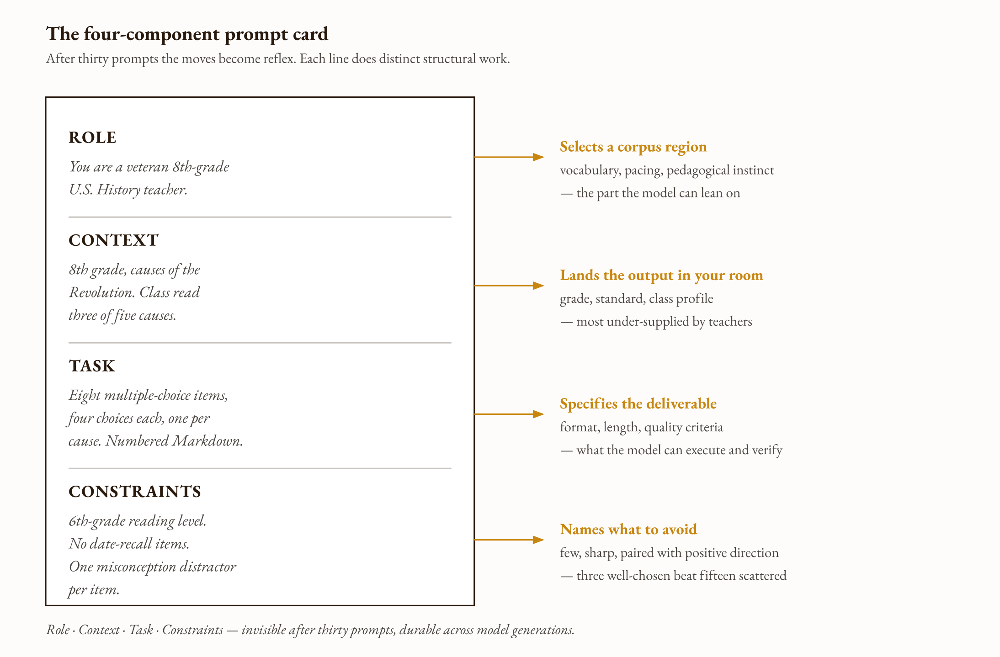

# Chapter 3 — Prompting That Works: The Foundation Skill

*The model has no context the prompt does not supply. Everything else follows from that.*

---

Two 8th-grade U.S. History teachers are in the same building. Same standard. Same textbook chapter. Same week of school. On a Sunday evening they both open the same chatbot to write a formative quiz on the causes of the American Revolution.

Teacher A types: *Generate quiz questions about the American Revolution.*

Five questions come back. Three are date-recall. One has the correct answer obviously longer than the distractors. The reading level lands around eleventh grade. None of the items touch the misconception this class is carrying — that "no taxation without representation" meant Americans paid *higher* taxes than Britons. They did not. They paid lower taxes. The problem was the absence of parliamentary representation, not the size of the bill. The questions are technically correct. They are not usable for Monday.

Teacher B types a longer prompt. Six sentences. She names the standard. She names the grade. She names which causes the unit has covered and which it has not yet reached. She asks for eight multiple-choice items, one per cause, four choices per item, with one distractor per item targeting a documented 8th-grade misconception. She bans date-recall items. She specifies 6th-grade reading level because three students read below grade level.

Eight items come back. One per cause. The distractors are sharp — including the exact "Americans paid more" misconception her class is carrying into the quiz. She edits two stems and saves the prompt to a file.

Same tool. Same minute. One teacher got trivia. The other got something she will reuse next quarter.

The chatbot did not change. The prompt did.

| Specification component | Teacher A | Teacher B |
|---|---|---|
| Standard cited | — | 8th-grade U.S. History standard, causes of the Revolution |
| Grade level stated | — | 8th grade |
| Reading level specified | — | 6th grade (three students read below grade level) |
| Misconception named | — | "Americans paid higher taxes than Britons" |
| Format specified | — | Multiple choice, four options per item |
| Item count | — | Eight items, one per cause |
| Distractor criteria | — | One distractor per item targets a documented misconception |
| Banned item types | — | No date-recall items |
| Prompt length | 1 sentence | 6 sentences |
| Result | Five generic items at 11th-grade reading level | Eight usable items targeting the class's actual misconception |

*Table 3.1 — The same chatbot. The same minute. The specification gap is the entire difference between trivia and a quiz Teacher B can reuse next quarter.*

---

The question worth asking is why. Not just "the prompt was more detailed" — that is description, not explanation. The *why* is what you need if you want to do this reliably, not just accidentally.

Here is the structural reason.

When you type a question into a search engine, documents come back that already existed. The engine looked up what matched your keywords in an index and returned the top results. Your words pointed at things in the world. The thing you got was already there before you typed.

A generative language model does something entirely different. When you type into a chatbot, nothing is retrieved. The model samples the next word from a probability distribution that depends on every word before it. Then it samples the next word, and the next, building the output one token at a time — conditioned on the entire prompt. The prompt is not a query pointing at stored knowledge. The prompt *is* the conditioning. The output is being constructed in response to it, from scratch, every single time.

This means the prompt is carrying a weight that a search query never does. A search query is a pointer. A prompt is the entire specification of what gets built.


*Figure 3.1 — Pointer versus specification. A search query selects from what already exists; a prompt builds something that did not exist until you asked.*

And here is the consequence that matters for teachers: the model has no context the prompt does not supply.

It does not know your school. It does not know the standard. It does not know that three of your students are ELLs at WIDA level 2, that the unit started two weeks ago, that last year's class tripped on the taxation misconception, or that your assistant principal wants quizzes formatted as numbered Markdown lists. The model has access to one thing: the words in the prompt. Everything not in the prompt is filled in by the model's average guess — and the average of what "quiz questions on the American Revolution" looks like across a training corpus is generic trivia at an unspecified grade level, because that is what most of the internet's American Revolution quiz content is.

A vague prompt is a request for the average. An average is rarely useful for a specific class.

This is not a criticism of the model. It is a structural description. The model is doing exactly what it should: drawing on everything the prompt implies. The problem is that a short, casual prompt implies things the writer never intended. Specification is how you close the gap between what you typed and what you meant.

---

There is a structure that forces you to supply what an ad-hoc prompt forgets. Different practitioners call it different things; this book uses four components: role, context, task, and constraints.

    ROLE:        You are [specific role relevant to this task].
    CONTEXT:     [Grade level, subject, standard, class profile, what's been covered].
    TASK:        [Specific deliverable with format, length, and quality criteria].
    CONSTRAINTS: [What to avoid, what format to use, what the output will be used for.]


*Figure 3.2 — The four-component card. Each line does distinct structural work; after thirty prompts the moves become reflex.*

Each line does distinct work, and it is worth understanding what that work is — because once you do, the structure becomes reflex rather than a checklist.

The *role* tells the model which region of its training to draw from. "You are a veteran 8th-grade U.S. History teacher" pulls the vocabulary, pacing, and pedagogical instincts the corpus associates with that role. The evidence on this is mixed — more on that honestly in a moment — but for tasks where register and style matter, which most teacher tasks are, it helps.

The *context* is the part teachers under-supply most. Grade. Subject. Standard. Class profile. What the class has covered. What it has not. Without this, the model defaults to a generic high-school treatment at an adult reading level. Context is what makes the output land in your classroom rather than in some hypothetical average one.

The *task* is the deliverable. Format, length, quality criteria. "Make quiz questions" is a task the same way "make food" is a task at a restaurant. The model can comply with both. You will not like either result. "Write eight multiple-choice questions, each with four answer choices and a one-sentence rationale for the correct answer and each distractor, output as a numbered Markdown list" is a task the model can execute and you can verify.

The *constraints* are what to avoid and what the output is for. Anthropic's own guidance — and the research behind it — recommends positive instructions over negative ones: telling the model what *to* do is more reliable than telling it what *not* to do. But negative constraints earn their place when they are few, sharp, and paired with a positive direction. "Do not include date-recall items; write conceptual application items instead." That works. A list of fifteen "do not" rules does not — models drop them the way a reader skims footnotes. Three well-chosen negatives beat fifteen scattered ones.

After thirty or forty prompts, this structure becomes invisible — the way grammar becomes invisible for a fluent speaker. You no longer think "I need to supply the role." You think in specifications. But the moves underneath stay: name the role, give the context, specify the deliverable, set the constraints.

---

There is a failure mode so common that most people do not recognize it as a failure mode. They think they are specifying. They are not. They are asking for a feeling.

A teacher asks the model to draft a parent email. The draft sounds clinical. She prompts back: *make it warmer and more personal.*

The next version arrives with three exclamation points, a smiley, and the phrase "we're all in this together." That is the model's stereotype of warm. It is the average of what warmth looks like across its training data. It is not warm. It is performative warmth — the look of warmth without the substance of it. She asked for a feeling and got the average impression of that feeling.

Now watch the specification version. Same teacher, same email, same problem:

> Rewrite the email so the second sentence references one specific strength the student showed last week — her participation in Tuesday's group discussion on volcanoes. Replace "is struggling" with "is finding [specific skill] challenging." End with one specific concrete invitation: "Could we meet this Friday at 3:15 to look at the recent quiz together?" Remove any sentence that begins with "I just wanted to."

The specification version sounds personal because it *is* personal. Each instruction names an actual move that produces the experience of care: a specific detail, a reframed word, a concrete ask. There are no feelings in the prompt. There are operations. And the model can execute operations.

The feeling-prompt trap is that it feels natural. It is how humans talk to humans, who can interpret intent and fill in the gap between "warmer" and the specific moves that warmth requires. Models do not interpret intent. They pattern-match. Ask for a feeling and you get the stereotype. Ask for the move that produces the feeling and you get the move.

Cut these from your prompts on sight: *make it engaging*, *make it pop*, *make it rigorous*, *tighten it up*, *make it better*. Each is a feeling masquerading as an instruction. Replace each with the operation underneath. *Engaging* might mean: open each section with a one-sentence concrete scene. *Rigorous* might mean: every claim links to a primary source. *Tighten* might mean: cut any sentence over 25 words into two. Those are instructions. The model can execute them. You can verify the result.

| Feeling phrase (do not use) | Specification operation (use this instead) |
|---|---|
| "Make it warmer" | Reference one specific strength the person showed; replace "is struggling" with "is finding [specific skill] challenging"; end with one concrete invitation with a day and time. |
| "Make it more engaging" | Open each section with a one-sentence concrete scene; replace abstract nouns with named examples; cut every sentence over 25 words. |
| "Make it rigorous" | Every claim links to a primary source; every quantitative term cites the study or dataset; flag any statement the source does not directly support. |
| "Tighten it up" | Cut any sentence over 25 words into two. Remove every adverb that modifies "very." Delete openers like "I just wanted to" and "It is important to note that." |
| "Make it pop" | Lead with the strongest fact in the first sentence. Replace passive verbs with active ones. Add one specific number per paragraph. |
| "Make it better" | Name the specific failure: which paragraph drags, which claim is weak, which transition is missing — and the move that fixes each one. |

*Table 3.2 — Cut the left column from your prompts on sight. Feelings are not instructions. The right column lists the operations that produce the experience you wanted.*

---

The skill is not writing the perfect first prompt. The skill is the loop.

Both Anthropic and OpenAI describe prompt engineering the same way: draft, evaluate the output, refine. The first output's job is to reveal what you forgot to specify. Every gap in the output points to something missing from the prompt. The second prompt closes that specific gap. This is not trial and error — it is diagnosis. Each round narrows the probability space.

Here is the loop run end to end on a real task.

A 5th-grade teacher wants a lesson plan on photosynthesis, aligned to NGSS 5-LS1-1 — the standard requiring students to argue, with evidence, that plants get the materials they need for growth chiefly from air and water, not from the soil, which is where most 5th-graders believe the food comes from.

Round one: *Write a lesson plan on photosynthesis for 5th grade.*

What comes back: "Objective: students will learn about photosynthesis. Materials: paper, pencils, optional plant. Procedure: introduce the concept, show a diagram, have students label the parts, discuss. Assessment: students will demonstrate understanding."

This is a lesson plan the way a ghost is a person — it has the shape, none of the substance. The objective is a topic, not a capability. The materials list says "optional plant." The procedure does not name the misconception the standard exists to correct. Every detail that makes a lesson plan usable for a specific class in a specific week is missing, because the prompt did not supply it. The model filled in the average.

Round two, with structure:

> ROLE: You are a veteran 5th-grade science teacher writing a 60-minute lesson plan.
>
> CONTEXT: 5th grade, class of 26, including three ELLs at WIDA level 2 and two students reading two grade levels above. Standard: NGSS 5-LS1-1. The class has covered: parts of a plant, the water cycle. It has NOT yet covered: cellular respiration, the carbon cycle. The dominant student misconception to address: plants get their food from the soil.
>
> TASK: Write a 60-minute lesson plan with — (1) one student-facing objective in "students will be able to" form, (2) a 5-minute hook that surfaces the soil misconception, (3) a 15-minute direct-instruction segment, (4) a 25-minute lab using only paper plates, plastic cups, soil, bean seeds, and a lamp, (5) a 10-minute discussion, (6) a 5-minute exit ticket with two formative-check questions. Output as Markdown with headers for each segment.
>
> CONSTRAINTS: Reading level for student-facing text: 5th grade. Do not use the word "produce" — students at this grade often parse it as fruit. Do not include any segment requiring materials beyond those listed.

What comes back is a real lesson plan. The objective: "students will be able to argue, with evidence from a controlled investigation, that bean plants gain mass primarily from air and water rather than from soil." The hook has students predict whether a sealed seedling will gain or lose soil mass over a week under a lamp — a prediction that surfaces the misconception directly. The lab uses the materials listed. The exit ticket asks students to weigh a hypothesis against two pieces of evidence. The differentiation section names labeled diagrams for ELLs and a primary source from Joseph Priestley's 1771 mice-and-plants experiment for above-level readers.

This is a draft she can edit in ten minutes and teach tomorrow.

Round three reveals one gap: the lab as written requires a week of observation. Tomorrow's class is the only class on this topic before Monday. The argument needs to happen in 25 minutes.

> Revise the lab so it produces observable evidence within the 25-minute class segment. The argument students make at the end of class should be supported by evidence they collect that day. Keep the rest of the plan.

What comes back: a revised lab where students observe condensation forming inside a sealed bag containing a sprouting bean and a damp paper towel after 20 minutes under a lamp. They discuss what the water vapor implies about where a growing plant's mass comes from — which is the argument the standard asks for, landed entirely within the class period. The rest of the plan is unchanged.

Three prompts. Seven minutes of typing. A lesson plan reusable next year by changing one line.


*Figure 3.3 — The prompting loop. Three rounds, seven minutes, one reusable lesson plan. Each round narrows the probability space; the first output's job is to reveal what you forgot to specify.*

Notice what made round two so much better than round one. The teacher knew that "plants get food from soil" is the misconception to address. She knew that "produce" is ambiguous for 5th-graders. A teacher without that domain knowledge cannot write those constraints. The four-component structure is a tool for getting the model to deploy *your* knowledge of your classroom. It is not a substitute for having the knowledge. AI extends teacher judgment. The prompt is where that extension happens.

---

Two things in this chapter I could have written as rules but should not.

The first is role-prompting. Telling the model "You are a veteran 8th-grade U.S. History teacher" often helps — on tasks where register and style matter, which most teacher tasks are. But Zheng et al. (2023), in a careful study across four LLM families, found that adding personas produced no improvement or small negative effects on objective-knowledge benchmarks. The synthesis that holds: role-prompting helps when the task pulls on a coherent corpus region the persona names — vocabulary, pacing, pedagogical instinct. It helps less when the task requires a calibrated factual answer the model should already have without role-priming. For teachers: role works in lesson planning and feedback drafting. It does less work in fact-checking.

The second is magic phrases. "Think step by step." "Take a deep breath." There is real evidence behind some of these — chain-of-thought prompting genuinely improves multi-step reasoning on sufficiently large models (Wei et al., 2022). But the gains vary widely by model, task, and release date. A phrase that helped on a 2023 model may do nothing on a 2026 one. Try them when stuck. Do not build a workflow around them.

The four-component structure is durable across model generations because it is about specification, which models will always need. Specific phrases are features of specific models at specific moments. They come and go.

---

A note on which tool to use, framed carefully, because any specific claim about which model is best this month will be wrong within a year.

The more durable frame is task fit. For long-document synthesis — uploading curriculum PDFs and asking for a unit plan grounded in those materials — NotebookLM is built for this. It grounds answers in what you uploaded, cites passages, and will not extrapolate beyond them. For synthesis that needs outside knowledge, a general chatbot does more. For long-form drafting — lesson plans, feedback paragraphs, complex multi-part instructions — Claude tends to produce structurally coherent first drafts and follows specification reliably. For conversational ideation, where you are thinking out loud and refining turn by turn, ChatGPT's conversational tuning makes that loop feel fluid. For teachers who live in Google Slides, Docs, Classroom, and Forms, Gemini is inside those tools and is free to Workspace for Education educators.

The point is not to rank. The four-component structure works on all of them. Vendor differences are real and secondary. Switching to a different AI rarely fixes bad output. Rewriting the prompt does.

| Platform   | Long-document synthesis     | Long-form drafting          | Conversational ideation     | Google Workspace integration |
|------------|-----------------------------|-----------------------------|-----------------------------|------------------------------|
| NotebookLM | **Built for this.** Cites every claim back to the source. Limited generation. | Limited. Built for synthesis, not drafting. | Limited. Synthesis Q&A, not free-form. | Indirect — pulls from Drive. |
| Claude     | Strong. Holds 100K+ tokens; reasons across them. | **Reliable first drafts.** Steady voice, follows instructions. | Strong. Good at structured back-and-forth. | None native. |
| ChatGPT    | Good with context-window plus uploads. | Strong, but voice drifts; needs more editing. | **Fluid turn-by-turn.** Most conversational. | Indirect. |
| Gemini     | Good with Drive-mounted documents. | Capable; less consistent voice than Claude. | Capable; less distinctive than ChatGPT. | **Native.** Lives inside Workspace. |

*Table 3.4 — Pick by task, not brand. Switching platforms rarely fixes a bad prompt. Rewriting the prompt does.*

---

The prompt that produced a usable quiz today will produce a usable quiz next quarter for the next unit. A teacher who writes prompts ad hoc pays the specification cost every time. A teacher who saves prompts pays it once and compounds it across every reuse.

A starter library is small — five to fifteen prompts per recurring task category. Each prompt has the four components filled in with the context that does not change across uses: grade, subject, the standards you teach, your general class profile. The parts that change — the specific text, the specific topic, the specific misconception — are marked as slots. `[INSERT UNIT TOPIC]`. `[INSERT PASSAGE HERE]`. `[INSERT SPECIFIC MISCONCEPTION]`. Run the template. Fill the slots. Edit the draft. Save the prompt back with any refinements.

Chapter 12 builds this systematically. The rule for now is simple: if a prompt worked, save it before you close the tab. You will not remember what you did differently three weeks from now. The output disappears when the session ends. The prompt is the thing that lasts.

---

## LLM exercises

**Exercise 1 — The comparison run.** Choose one high-frequency task from your week: a quiz, a parent email, a reading-level rewrite, a lesson plan. Write the one-line vague version you might type without thinking and run it. Then write the four-component version — role, context, task, constraints fully filled in — and run it on the same task. Save both outputs. Do not use any subjective adjective to compare them. Name three specific differences between the outputs.

**Exercise 2 — Close one gap.** Take the output from Exercise 1's four-component prompt. Identify one specific gap — not a feeling, a gap. Write the follow-up that names what to change and what to keep. Run it. The output of this exercise is the follow-up prompt, not the revised output.

**Exercise 3 — Build three reusable templates.** Choose three recurring tasks from your workweek. For each, write a four-component template with static context filled in and changing parts marked as slots. Test each template on a real task this week. If the template required more editing than writing from scratch, it failed the test — revise it.

---

## References

- Anthropic. *Prompt engineering overview.* Claude API Docs. https://docs.anthropic.com/en/docs/build-with-claude/prompt-engineering/overview
- Anthropic. *Prompting best practices.* Claude API Docs. https://platform.claude.com/docs/en/build-with-claude/prompt-engineering/claude-prompting-best-practices
- Chen, E., Wang, D., Xu, L., Cao, C., Fang, X., & Lin, J. (2024). *A Systematic Review on Prompt Engineering in Large Language Models for K-12 STEM Education.* arXiv:2410.11123.
- Google. (2024). *Gemini in Classroom: No-cost AI tools that amplify teaching and learning.* Google Blog.
- Liu, P., Yuan, W., Fu, J., Jiang, Z., Hayashi, H., & Neubig, G. (2023). Pre-train, Prompt, and Predict: A Systematic Survey of Prompting Methods in Natural Language Processing. *ACM Computing Surveys, 55*(9). arXiv:2107.13586.
- NGSS Lead States. (2013). *Next Generation Science Standards.* Standard 5-LS1-1.
- OpenAI. *Prompt engineering.* OpenAI API. https://platform.openai.com/docs/guides/prompt-engineering
- Qian, Y. (2025). Prompt Engineering in Education: A Systematic Review. *Journal of Educational Computing Research, 63*(7-8), 1782–1818.
- Wei, J. et al. (2022). *Chain-of-Thought Prompting Elicits Reasoning in Large Language Models.* arXiv:2201.11903.
- Zheng, M. et al. (2023/2024). *When "A Helpful Assistant" Is Not Really Helpful.* Findings of EMNLP 2024. arXiv:2311.10054.

---

## Prompts

Use these prompts with Claude to generate interactive D3 v7 versions of the
figures in this chapter. Each produces a standalone HTML file you can open
in a browser and modify freely.

**Prerequisites:** Load `brutalist/CLAUDE.md` and `brutalist/DESIGN.md` into
your Claude project context before using these prompts. They define the stack,
naming conventions, color system, and typography the figures use.

---

### Figure 3.1 — Pointer versus specification

Build a single self-contained HTML file rendering a two-row pipeline diagram comparing search retrieval and generative conditioning. Upper row labelled "Search engine" — three left-to-right nodes: User keywords, Index lookup, Ranked list — joined by ink-colored arrows; a red "retrieval" badge sits beneath, with a caption "already existed before you typed." Lower row labelled "Generative language model" — three nodes: Prompt tokens, Probability distribution, Token-by-token output — same arrows. From the final node, draw a small red dashed self-loop back to itself, with a red "conditioning" badge and caption "prompt is the entire specification." Footer line: "A search query is a pointer. A prompt is the specification of what gets built." Use only `var(--color-*)` tokens, EB Garamond throughout, dark-mode `@media` block, no animation under `prefers-reduced-motion`. D3 7.9.0 from cdnjs, ResizeObserver redraw, `role="img"` plus `<title>` and `<desc>`.

> Reference implementation: `d3/03-prompting-that-works-fig-01.html`

---

### Figure 3.2 — The four-component prompt card

Build a single self-contained HTML file rendering a laminated-card-style reference for the four-component prompt template. Single bordered card on the left, divided by hairline rules into four rows: ROLE, CONTEXT, TASK, CONSTRAINTS. Each row shows the component key in bold serif (`letter-spacing: 0.5px`) and italic slot text with a concrete teacher example beneath. To the right of each row, an ochre arrow leads to a callout headline in `var(--color-ochre)` describing the structural work that line performs, with two dim sub-lines below in `var(--color-secondary)`. On hover or keyboard focus the row's border turns red and a tooltip names the work. Footer line: "Role · Context · Task · Constraints — invisible after thirty prompts, durable across model generations." EB Garamond throughout, dark-mode `@media`, `(event, d)` handlers, accessibility tags, `prefers-reduced-motion` suppression. D3 7.9.0 from cdnjs.

> Reference implementation: `d3/03-prompting-that-works-fig-02.html`

---

### Figure 3.3 — The prompting loop

Build a single self-contained HTML file rendering the prompt-iteration loop as a three-node horizontal flow with diagnostic edges. Three nodes labelled ROUND 1 (Vague prompt), ROUND 2 (Four-component), ROUND 3 (Gap-closing follow-up); each round label sits above its node in red bold serif. Each node is a bordered rectangle with a bold serif headline, the actual prompt text in the upper half, a hairline separator, and three short observation lines in `var(--color-secondary)` describing the output. Below each node, an ochre italic annotation names the diagnostic move ("the model fills in the average" / "specification narrows the probability space" / "name what to change, name what to keep"). Between consecutive nodes draw a curved Bézier arrow with a three-line italic diagnostic label describing the gap that triggered the next round. Hover or keyboard focus turns the active node's border red and opens a tooltip naming the round. Footer: "Three prompts. Seven minutes. A lesson plan reusable next year by changing one line." EB Garamond throughout, `var(--color-*)` tokens, dark-mode `@media`, `prefers-reduced-motion` suppression, `(event, d)` handlers, accessibility tags. D3 7.9.0 from cdnjs.

> Reference implementation: `d3/03-prompting-that-works-fig-03.html`

---

## AI Wayback Machine

The discipline behind the four-component prompt — make the student do the work; never give them the answer — is older than computing. **Charlotte Mason** (1842–1923) built a whole pedagogy on it. Her method, developed in the British Parents' National Educational Union from the 1880s onward, asked the child to *narrate* — to retell, in their own words, what they had just read. Mason believed children should encounter primary sources directly, then produce the synthesis themselves. The teacher's job was to set the conditions, ask the precise question, and refuse to summarize on the student's behalf. The same move, exactly, sits inside every prompt that produces real teacher-grade output: name the role, name the task, name the constraints, name the format — then let the model do the synthesis without leaking the answer.


*Charlotte Mason, circa 1890. AI-generated portrait based on a public domain photograph (Wikimedia Commons).*

**Run this:**

```
Who was Charlotte Mason, and how does her "narration" method connect to the four-component prompt anatomy in this chapter? Keep it to three paragraphs. End with the single most surprising thing about her pedagogy or career.
```

→ Search **"Charlotte Mason"** on Wikipedia.

**Now make the prompt better.** Try one of these:

- Ask it to rewrite a standard middle-school comprehension question as a Mason-style narration prompt — what changes?
- Ask it about Mason's six-volume *Home Education* series and which volume contains her sharpest pedagogical claim.

What changes? What gets better? What gets worse?
