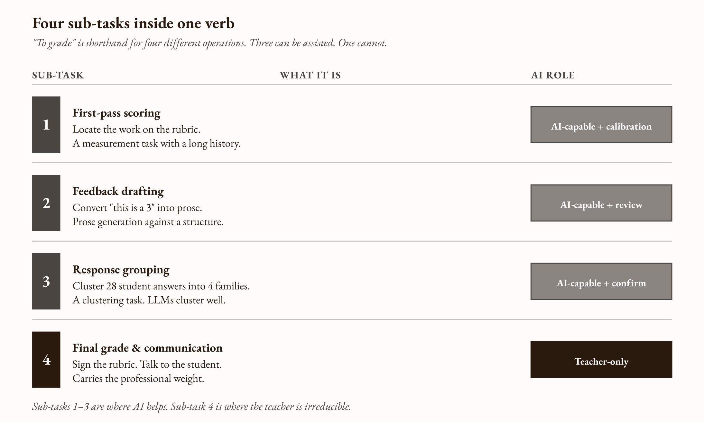
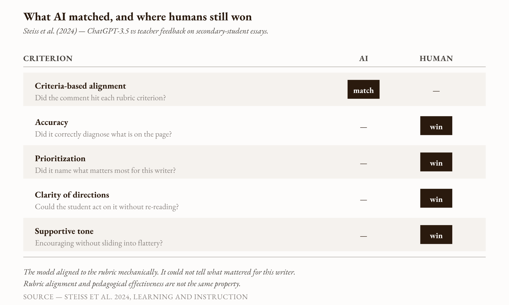
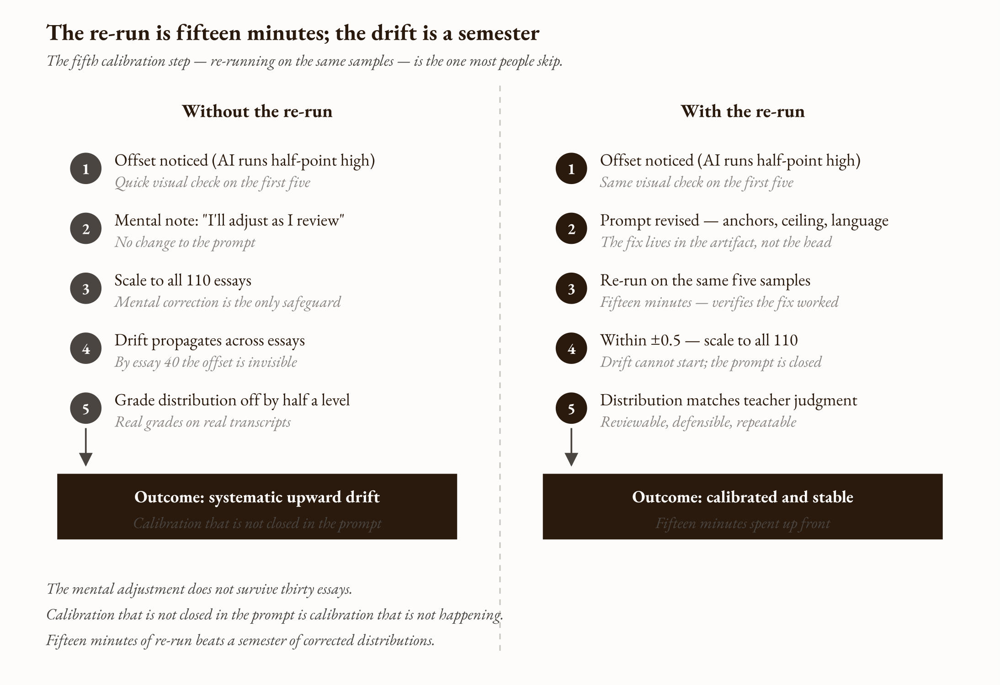
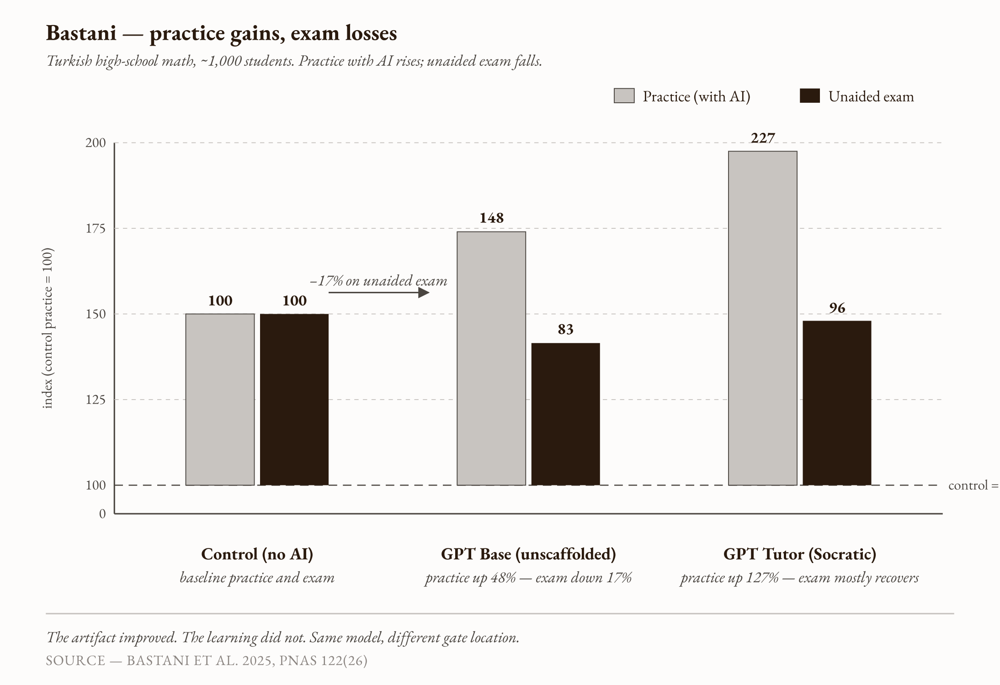
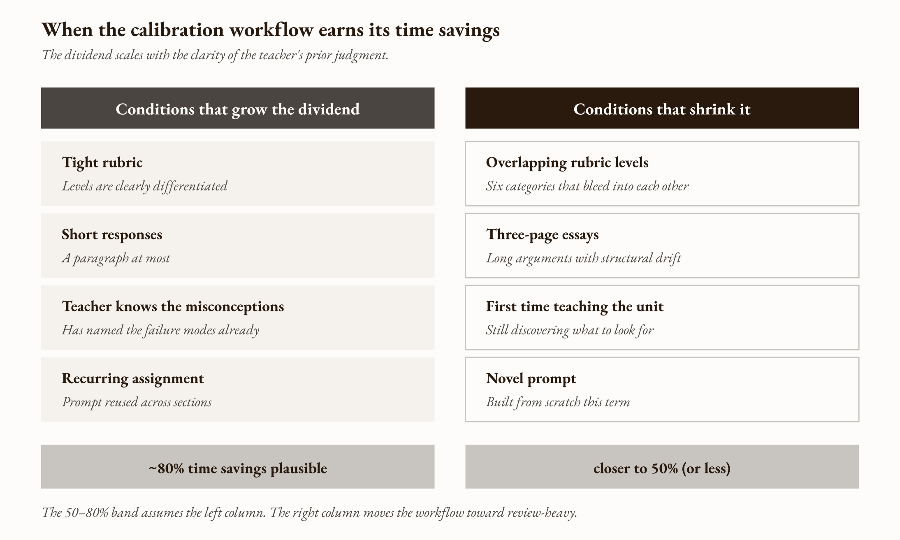
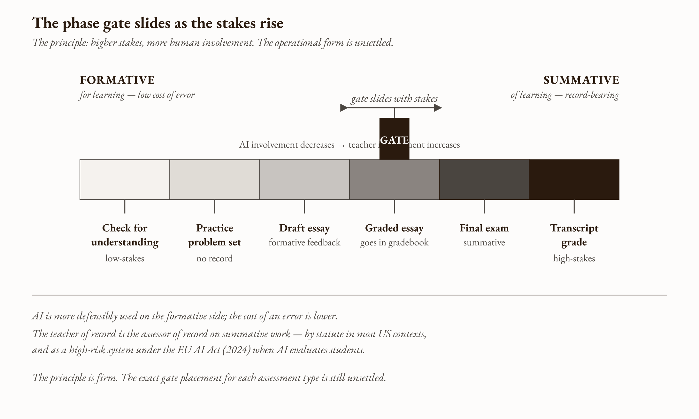

# Chapter 5 — Assessment, Grading, and Feedback with AI
*A rubric-accurate comment is not the same as a useful one. The difference is where the teacher was.*

---

*The artifact is not the learning. The feedback is not the feedback. These are the same problem.*

---

Here is a thing that is true, and it takes a moment to sit with.

A student receives a comment on her essay. The comment names her thesis, references a specific paragraph, identifies the criterion on which she scored lowest, and tells her precisely what to revise. The comment is accurate. It is well-calibrated to the rubric. The student reads it, recognizes the problem it names, and revises accordingly. The revision is better.

Did she get feedback?

In one sense, obviously yes. A piece of information traveled from a scoring process to the student and changed her work. In another sense — the sense this chapter is about — it depends entirely on where the comment came from. If it came from a teacher who read her draft and recognized, from six months of working with this student, that she has been confusing a cause-and-effect relationship since October, and named that confusion specifically in the comment, then the answer is yes. If it came from a language model that aligned to the rubric and produced a structurally correct paragraph of feedback, then the answer is: maybe. Maybe not. We don't yet know. And the reason we don't yet know is that nobody has run the trial.

This is where the chapter begins. Not with the time savings — those are real and we will get to them — but with the more important question underneath them, the one that determines whether the time savings are a genuine dividend or a trade we don't yet understand.

---

## Four sub-tasks inside one verb


*Figure 5.1 — Four horizontal rows, each labeled with one sub-task and a brief descriptor:.*

When a teacher says "I have to grade this stack," she is naming four different things at once. Pulling them apart is the first move.

The first is **first-pass scoring against a rubric.** A rubric exists. A student's work exists. The question is which level on the rubric this work sits at. This is a measurement task. It has a long history of being done by humans, by trained raters, and increasingly by machines. AI is capable here, with calibration.

The second is **feedback drafting.** Converting "this is a 3" into a paragraph that explains why it is a 3 and what would make it a 4. This is prose generation against a structure. AI is good at generating prose against a structure. AI is capable here, with review.

The third is **response grouping.** For short-answer or open-response items: noticing that twenty-eight students said roughly the same thing in five different ways, and that four clusters of response will accommodate the whole class. This is a clustering task. Large language models cluster well. AI is capable here, with teacher confirmation.

The fourth is **the final grade decision and the student-facing communication that follows.** Putting a number in the gradebook, signing the rubric, being the person who talks to the student or the parent when they want to know what it means. This is not a sub-task AI performs. It is the sub-task in which the teacher carries the professional, legal, and relational weight of having assessed this student's work. The teacher of record is the assessor of record.

There is the taxonomy. Sub-tasks one through three are where AI helps. Sub-task four is where the teacher is irreducible. Mixing them up is how a workflow that saves time becomes a workflow that loses the room.

---

## What the studies actually show


*Figure 5.2 — Three-column comparison matrix.*

Two studies establish what AI can do on sub-tasks one and two. Both are recent. Both are worth being precise about.

Steiss et al. (2024), in *Learning and Instruction*, compared ChatGPT-3.5 feedback to teacher feedback on secondary-student essays across five criteria: criteria-based alignment, accuracy, prioritization of essential features, clarity of directions, and supportive tone. The result is specific. ChatGPT *matched or exceeded* humans on criteria-based alignment. Humans *outperformed* ChatGPT on the other four. The model could align to the rubric mechanically. It could not reliably tell what mattered most for this writer, give directions the student could act on, or hit the supportive register without sliding into flattery or condescension.

Henkel et al. (2024), marking real K-12 short-answer responses from the Carousel quizzing platform, found GPT-4 with few-shot prompting reaching quadratic-weighted kappa around 0.70 against human raters, where human-rater agreement against itself sat around 0.75. The gap is small. For a short-answer item with a clear rubric, the model is operating in the second-human-rater agreement band. That is a genuine finding. It means the instrument works for that specific task.

The earlier benchmark is the Hewlett Foundation ASAP-AES Kaggle competition (2012), which established quadratic-weighted kappa as the field-standard agreement metric and produced systems that matched human raters on long-form essays in the same band. ETS's production e-rater, running since the mid-nineties, has reported human-machine agreement on TOEFL essays that approximates second-human agreement.

So the technical capability is established: near-inter-rater-reliability with humans, on well-scoped tasks, with appropriate prompting. What is *not* established by any of these studies is whether students who receive this feedback — even at that agreement level — learn as well as students who receive teacher-written feedback. That is a different study. It has not been run. And the distinction matters, because rubric alignment and pedagogical effectiveness are not the same property.

---

## The time savings, stated carefully

There is a number floating around AI-grading conversations: 70–85% time savings. Vendor marketing pages report 80%. Individual teacher reports cluster in the 70–80% range. A Springer 2022 study on short-answer marking with full manual review reported 64–74% workload reduction. The Gallup-Walton (2025) survey of over two thousand public school teachers reports 5.9 hours per week saved across all AI uses for regular users.

None of these is a peer-reviewed randomized trial across a representative population.

The honest reading: in workflows with calibration and review, the upper plausible band of reported time reductions sits around 50–80%, with vendor reports at the upper end and the peer-reviewed short-answer study as the lower anchor. The magnitude in any specific classroom depends on rubric complexity, essay length, depth of the review pass, and whether the teacher actually does all four sub-task separations or quietly collapses them. The Gallup-Walton survey is the corroborating evidence at the population level; grading is one of the highest-cost recurring tasks, so its share of the 5.9-hour dividend should fall inside that band when the workflow is right.

I will use 50–80% when I need a number. Citing 85% as a measured effect would be repeating a vendor claim as a finding.

---

## The rubric is a measuring instrument

Here is the framing that makes the calibration step obvious: a rubric is a measuring instrument, the way a kitchen scale is a measuring instrument. Like any instrument, it has to be calibrated against a known standard before it can be trusted on unknown cases. The known standard, for a grading rubric, is your judgment on a sample of student work you have already scored.

When an AI is given a rubric and asked to grade, it is scoring against its own implicit model of what the rubric means — shaped by every rubric it has seen in training. That model is usually close to yours. It is rarely identical. The discrepancy is what calibration measures, and the prompt revision is what closes it.

The educational measurement parallel is inter-rater reliability. When two human raters disagree, the standard repair is *norming*: work through anchor essays, calibrate until disagreement is within tolerance. The statistics are Cohen's kappa for nominal categories, quadratic-weighted kappa for ordinal scales, and Krippendorff's alpha for mixed designs. The conventional thresholds — κ above 0.61 is "substantial," above 0.81 is "almost perfect" (Landis and Koch 1977) — set the target. When you calibrate an AI against your own grading, you are doing what two human raters do when they norm together. You are not checking the AI's work. You are bringing a second rater into agreement with the first rater, which is you.

The calibration workflow is five steps. The fifth is the one most people skip.

Pick five student samples you have already graded — not the easiest five, but a spread: one clear pass, one clear fail, three in the contested middle. Build a prompt that includes the assignment, the full rubric, the five samples without your scores, and a request for scores plus one-sentence reasoning per response. Run it and compare the AI's scores to yours. If you scored a 2, a 4, a 3, a 4, a 3 and the AI returns 3, 4, 4, 5, 3, you have learned something specific: the AI runs half a point high on the bottom half of your range, and it invented a score level the rubric does not have on your top sample. Revise the prompt — add anchor examples at the levels the AI is missing, add a ceiling statement ("the maximum score is 4"), sharpen the language where the AI is being permissive. Then re-run on the same five samples. If you are within ±0.5 on all five, you have a calibrated prompt and you can scale.

The step people skip is that last re-run. They see the offset, trust themselves to correct for it mentally as they review later, and scale immediately. The mental adjustment does not survive thirty essays. By essay forty the systematic upward drift has propagated into the real grade distribution. Calibration that is not closed in the prompt is calibration that is not happening.


*Figure 5.3 — A two-column timeline showing "Without the re-run" vs.*

---

## What calibration does not catch

Calibration measures agreement between you and the AI on the rubric you both share. It does not measure whether the rubric itself is fair. This is where the equity question lives.

Automated essay scoring has a documented history of underscoring high-proficiency English language learner essays relative to their human-rated quality. The pattern is not unique to automated scoring — human raters underscore L2 writers too, on essays of equivalent argumentative quality. But automated scorers sometimes reproduce and sometimes amplify the human bias rather than removing it. Recent work on bias in LLM scoring of ELL essays is active and unsettled; the bias-against-L2-writers literature is established, the amplification-versus-reproduction question is contested.

A calibration step that produces κ = 0.85 against your own grades may conceal a fairness gap, especially if your five anchor essays do not include any ELL submissions. The practical move: build at least one anchor from a high-quality ELL submission, and after the first bulk run, disaggregate AI scores by student-language background and look at the means. If the AI is systematically underscoring your ELL students relative to how you would score them, additional ELL anchors close some of the gap. They do not close all of it.

High inter-rater reliability between an AI and a teacher who share a bias is not fairness. It is shared bias with a kappa statistic attached.

---

## The Bastani parallel at the feedback level


*Figure 5.4 — Three grouped bar pairs (Control, GPT Base, GPT Tutor), each pair showing.*

This is the chapter's central move, and I want to label it carefully: what follows is a *prediction*, not a measured effect. It is well-motivated by two findings — Bastani et al. (2025) at the practice level, Steiss et al. (2024) on feedback quality — but the direct feedback-level analog has not been run as a trial.

What Bastani found: about a thousand Turkish high school students, three conditions in mathematics — no AI, unscaffolded GPT-4 (GPT Base), and GPT-4 under a Socratic system prompt that gave hints instead of answers (GPT Tutor). During practice, GPT Base students outscored the control by roughly 48%. GPT Tutor students outscored them by roughly 127%. The press reported this part.

Then came the unaided exam. GPT Base students scored roughly 17% below the no-AI control — a relative reduction, not 17 absolute percentage points. The GPT Tutor condition closed most but not all of that gap. The same model, different gate location, opposite learning outcomes. The practice artifact improved. The learning did not. The students felt like they had learned. They had not.

Now run the same logic on a feedback workflow that releases AI-drafted comments to students without teacher review.

A student receives a feedback paragraph that reads like her teacher's voice, names the rubric, identifies generic features in the writing — thesis clarity, evidence quality, transitions. She reads it. She feels she got feedback. She revises: sharpens the thesis the AI said to sharpen, adds the evidence the AI said to add. The artifact improves.

The conceptual gap the *teacher* would have named — the one specific to this student, built from six months of working with her — was never in the comment, because the AI did not know what this student understood. The comment was structurally correct and contextually disconnected. The student revised the surface and missed the substrate. The teacher's pedagogical content knowledge — the knowledge that this student has been confusing cause and effect since October, that this class has been hand-waving past a key concept for three weeks — is what would have made the feedback educational. The AI had none of it.

This is the fluency trap at the feedback level. Fluent AI assistance produces a strong metacognitive signal: *I got feedback, I revised, I'm doing it right*. That signal is accurate when the feedback named the real problem. It is misleading when the feedback named a rubric-level approximation of the real problem. You cannot tell from inside. The only way to tell from outside is to measure learning outcomes, unassisted, several weeks later. No one has yet done that study on feedback specifically.

The 45 seconds it takes a teacher to read an AI-drafted comment and either keep it, edit it, or rewrite it is the cognitive insertion point at which pedagogical content knowledge gets added to a piece of feedback that otherwise has none. The phase gate is not a bureaucratic check. It is the move that converts structurally correct AI output into pedagogically active feedback. Without it, the workflow is producing feedback theater: the feel of getting feedback, without the function.

The research that would settle this is straightforward in shape: a randomized trial where one arm receives AI-drafted feedback released without review, one arm receives AI-drafted feedback after teacher review, and one arm receives teacher-written feedback. Measure revision quality, exam performance two weeks later, and student-reported uptake. As of this writing, that trial has not been published. Until it has, this stands as a prediction.

---

## Worked example — a calibration in practice

Here is the workflow on a concrete task. Numbers are illustrative; the prompt structure is the real artifact.

A high school world history teacher has 110 short-answer responses to the prompt: *Explain one cause of the French Revolution and provide one piece of evidence for it.* Her rubric is four levels. Level 4: names a specific cause, gives specific evidence, makes the causal connection explicit. Level 3: names a cause, gives evidence, leaves the causal connection implicit. Level 2: names a cause, evidence is vague or generic. Level 1: cause is missing, vague, or wrong.

She has already scored five samples: 2, 4, 3, 4, 3. She runs the first calibration pass with a prompt that includes the assignment, the rubric, the five anonymized responses, and a request for scores plus one-sentence reasoning.

The AI returns: 3, 4, 4, 5, 3. Systematic upward drift on the lower half, plus a rubric ceiling violation — the AI invented a level 5 that does not exist.

She revises the prompt. She adds three anchor examples, one each for levels 2, 3, and 4. She adds the line: "The rubric ceiling is 4. Do not assign scores above 4." She adds a negative anchor: "An essay that states a cause and names an event without connecting the two is a 2, not a 3."

She re-runs on the same five. AI returns: 2, 4, 3, 4, 3. Match on all five. She can scale.

She runs the prompt across all 110, then reviews them in batches of twenty. For each she sees the response, the AI's score, the AI's one-line reason. She keeps about 80%, edits about 15%, overrides about 5%. The 5% she overrides are mostly responses where the AI missed a misconception specific to this class — students who wrote "bread prices went up *because* of the Revolution," inverting the causal direction, which the AI scored as a valid causal statement because it was grammatically a causal statement. She has been correcting this misconception for two weeks. The AI has no idea it exists.

Total time on 110 responses: about 80 minutes, including calibration. Without AI: about four hours. The savings came not from delegating the grading but from the AI doing 80% of the prose-generation work for 80% of the responses, which the teacher reviewed. She made every grade decision. The AI drafted the comments she kept or revised.

The lesson restated: the work is not delegated. The drafting is. The judgment stays.

The limit: this worked because the rubric was tight, the responses were short, and the misconceptions she was looking for were ones she had already named for herself. If the rubric had been six overlapping levels, or the responses had been three-page essays, or she was teaching this unit for the first time and did not yet know what to look for, the workflow would have produced less savings and required more review. The dividend scales with the clarity of the teacher's prior judgment.


*Figure 5.5 — "When the calibration workflow earns its time savings".*

---

## The four conditions where the workflow stops helping

The Bastani parallel is the theoretical motivation. The four conditions are the operational form.

First: no rubric calibration before bulk processing. The AI scores against its own implicit rubric. Systematic bias propagates to the full class. The calibration drill exists to prevent this.

Second: no teacher review of AI-drafted comments. The feedback-level fluency trap fires. Students receive structurally correct, contextually disconnected feedback. The Steiss finding is the citation: AI won on criteria-based alignment and lost on accuracy, prioritization, actionability, and tone — which are the four properties that make feedback educational.

Third: feedback released without human authorization. The teacher of record has not signed off. The professional weight of summative communication has been dropped. The EU AI Act (2024) classifies AI used to evaluate students as high-risk, requiring documentation, oversight, and transparency. In the United States, teacher-of-record statutes locate summative grade authority with the licensed educator. The AI has no license. The teacher is the assessor.

Fourth: feedback that cannot be applied by this student. The advice references a skill the student does not have ("sharpen the causal mechanism") or assumes a starting point she is not at ("strengthen the counterargument" — to a student who has not written a counterargument). This is the failure mode the teacher's review catches that calibration never will: the AI does not know what this student can do.

If any of the four conditions is missing, the workflow has stopped helping. It may not yet be hurting. It has stopped helping.

---

## Formative versus summative — where the gate slides


*Figure 5.6 — A horizontal sliding scale from "formative" (left) to "summative" (right), with.*

A formative assessment is for learning: a draft, a check-for-understanding, a low-stakes problem set the student uses to figure out what she does not yet know. A summative assessment is of learning: a final exam, a graded essay, a record that goes on the transcript. The legal, ethical, and pedagogical demands on the two are different, and the phase gate sits in different places along the workflow.

AI is more defensibly used on the formative side. The cost of an error is lower — a bad formative comment can be revised with no consequence on the record. A bad summative grade carries consequences for transcripts, scholarship eligibility, the student's relationship to the work. And the regulatory environment around summative grading generally requires the teacher of record to be the assessor.

The workflow that follows from this: AI runs on the formative draft so the student gets feedback fast and revises against it. The teacher does the summative pass on the revision, informed by but not delegated to the AI's earlier work. The gate slides toward more human involvement as the stakes rise. This is the principle; the operational form of it — which contexts warrant which gate positions — is unsettled and depends on the specific assessment.

---

## Three things people get wrong

The first is that AI grades for them. It does not. The AI drafts. The teacher decides. The act of putting a grade in the gradebook is the act of taking professional responsibility for that grade, and professional responsibility cannot be delegated to a system that has no license, no employer, and no relationship with the student. The AI's contribution to a grade is no different in kind from a teaching assistant's contribution: consulted, not deciding. A teacher who skips review because "the AI is usually right" has stopped being the teacher of record for the work the AI was usually right about.

The second is that the same prompt works on every cohort. The calibration that closed the gap on this fall's section may not close it on next spring's section. The students are different — different writing levels, different misconceptions, different prior preparation. The model may be different — a calibration prompt that worked on one model version may not score the same way after an update, because the implicit rubric has shifted. Calibration drift across model versions is a real hazard. The practical move is to recalibrate at the start of each grading cycle. The five-sample drill is fifteen minutes. It is cheap. A workflow is not a fixed asset. It is a recurring discipline.

The third is that AI grading is more objective than human grading. It is more *consistent* — the same prompt run against the same essay will produce closely related scores. It is not necessarily more *accurate*. Consistency without accuracy is a measuring instrument that is reliably wrong. The ELL bias literature is the cleanest case: automated scorers and human scorers both underscore high-proficiency L2 essays relative to their human-rated quality, and automated scoring sometimes amplifies rather than reproduces the human bias. High inter-rater reliability between an AI and a teacher who share a bias is not fairness. It is shared bias with better typography.

---

## LLM-assisted exercises

**Exercise 1 — The calibration drill.** Take five student samples from a recent assignment you have already graded yourself. Not the easiest five — a spread: one clear pass, one clear fail, three in the contested middle. Build a calibration prompt: assignment, rubric, anchor examples from a *different* set than your five test samples, the five samples without your scores, a request for scores plus one-sentence reasoning. Run it. Compute the mean offset and the maximum disagreement. Revise the prompt — add anchors at the levels the AI is missing, sharpen rubric language where the AI is permissive, add negative anchors where it is generous. Re-run on the same five. If you are within ±0.5 on all five, document the prompt and the changes. If not, one more revision. If after three rounds the gap has not closed, write one paragraph on what you think the rubric is missing — calibration that fails to close is usually telling you something about the instrument, not the model.

**Exercise 2 — The bias check.** After running a bulk AI grading pass on a real assignment, pull the AI's scores into a spreadsheet. Disaggregate by one student characteristic — ELL status, IEP/504 status, or any cohort characteristic with at least five students per subgroup. Compute the mean AI score by subgroup and the mean your score by subgroup on the same samples. If the AI's subgroup mean is more than 0.5 below your corresponding mean, build at least two anchor essays from high-quality submissions in the underscored subgroup and re-run the prompt. Recompute the means. Document the change. If the AI's means are not far from yours but your own means show a subgroup gap, the AI is reproducing your existing pattern. That is a separate question, and one this chapter does not solve. The check surfaces it.

**Exercise 3 — The failure-condition diagnostic.** Take three AI-drafted comments — from a workflow you have run, or generate three using a starter prompt and a sample essay. For each, ask the four failure-condition questions: Was the prompt calibrated before this comment was generated? Did you review the comment before it would have been released? Would you sign your name to it as is? Could this specific student act on this comment without skills she does not have? Mark each as pass or fail. For each failure, write one sentence on what the prompt or workflow change would be. Run the revision and re-check.

---

## What would change my mind

A pre-registered randomized trial — at least two semesters, multiple institutions, mixed subjects — comparing student learning outcomes across three conditions: teacher-written feedback, AI-drafted feedback released with teacher review, and AI-drafted feedback released without teacher review. Outcomes measured by unassisted post-assessment two weeks after instruction.

If condition (b) — AI with review — does not produce outcomes statistically indistinguishable from (a) — teacher-written — the chapter's central claim about the review pass is wrong and the gate has to slide further toward the human side. If condition (c) — AI without review — produces outcomes indistinguishable from (b), the chapter is overstating the cost of skipping the review pass.

Neither trial has been run. Both should be.

---

## Still puzzling

The time-versus-learning question first. The time savings are real and sit in a plausible range. What we do not know is whether students learn as well from a calibrated AI-plus-review feedback workflow as they would from feedback the teacher wrote from scratch. The Bastani parallel predicts they should, provided the review pass is substantive. But no trial has measured it. The recovered hours are a real dividend. Whether the work the dividend funds — more office hours, more student conversations — closes any learning gap the workflow itself opens is the more important question, and it is open.

Then the bias question past calibration. Anchor essays from underscored subgroups close some of the AI-introduced gap. They do not close all of it. Whether a grading workflow can be both efficient and fair, given an underlying assessment process that already has its own subgroup patterns, is a question the calibration drill surfaces and does not answer.

Then calibration drift. No standard exists for re-calibrating prompts when underlying models update. Teachers running stable workflows are running them against a moving target. The practical workaround is the recurring five-sample drill. The systemic answer would require model-version-locked prompts — which most teacher-facing platforms do not yet expose — or in-product calibration tooling that flags drift automatically.

The last is the formative-summative gate placement question. The principle — the higher the stakes, the more human involvement — is right. The operational form, which AI-drafted comments are acceptable in which specific contexts, is unsettled. I do not have a hard rule for it, and I am suspicious of anyone who does.

---

## References

- Steiss et al. Comparing the quality of human and ChatGPT feedback of students' writing. *Learning and Instruction* 91: 101894, 2024. https://www.sciencedirect.com/science/article/pii/S0959475224000215
- Henkel et al. Automated grading of short-answer questions. *Learning at Scale 2024*. https://arxiv.org/abs/2405.02985
- Weegar & Idestam-Almquist. Short-answer marking with automated assistance. *IJAIED* 32(4), 2022. https://link.springer.com/article/10.1007/s40593-022-00322-1
- Gallup-Walton. The AI Dividend: New survey shows AI is helping teachers reclaim valuable time. 2025. https://www.waltonfamilyfoundation.org/the-ai-dividend-new-survey-shows-ai-is-helping-teachers-reclaim-valuable-time
- H. Bastani, O. Bastani, A. Sungu, H. Ge, Ö. Kabakcı, R. Mariman. Generative AI without guardrails can harm learning. *PNAS* 122(26): e2422633122, 2025. https://www.pnas.org/doi/10.1073/pnas.2422633122
- Landis & Koch. The measurement of observer agreement for categorical data. *Biometrics* 33(1): 159–174, 1977. https://www.jstor.org/stable/2529310
- Hewlett Foundation ASAP-AES. Kaggle competition, 2012. https://www.kaggle.com/competitions/asap-aes
- EU AI Act, Annex III, point 3 (high-risk AI in education). 2024. https://artificialintelligenceact.eu/the-act/


---

## Prompts

These prompts ask Claude to rebuild each chapter figure as a self-contained D3 v7 HTML file you can open in a browser and tinker with. Each is structural — it names the data shape and the channel choices, then hands Claude the brutalist style system to do the rest. Keep the SVG nearby; it is the anchor.

**Prerequisites:** Load `brutalist/CLAUDE.md` and `brutalist/DESIGN.md` into your Claude project context before running these prompts. They carry the color tokens, font stack, accessibility tags, and the pinned D3 7.9.0 cdnjs URL.

---

### Figure 5.1 — Four sub-tasks inside one verb

Build a standalone HTML file rendering Figure 5.1 as a four-row taxonomy table. Each row is one grading sub-task: first-pass scoring, feedback drafting, response grouping, and final grade decision. Columns: sub-task number, what it is (one short body line), AI role chip. The first three rows share a neutral tone; row four uses `--color-red` on the chip to mark "Teacher-only." Anchor the layout to the SVG in `images/05-assessment-grading-and-feedback-with-ai-fig-01.svg`. Render with `--color-*` tokens from `brutalist/DESIGN.md`, EB Garamond throughout, Inter only where DESIGN.md calls for it. Add `role="img"`, `<title>`, `<desc>`, ResizeObserver redraw, `(event, d)` hover handlers that explain each sub-task on hover, dark-mode `@media` block, and `prefers-reduced-motion` suppression. Pin D3 7.9.0 from cdnjs — no substitutions.

> Reference implementation: `d3/05-assessment-grading-and-feedback-with-ai-fig-01.html`

---

### Figure 5.2 — What AI matched, and where humans still won

Build a standalone HTML file rendering Figure 5.2 as a five-row comparison matrix from Steiss et al. (2024). Each row is one feedback criterion (criteria-based alignment, accuracy, prioritization, clarity of directions, supportive tone) with two outcome cells — one for AI, one for Human. Mark the winner with a filled chip; the loser is an em-dash. AI wins exactly one row (alignment); humans win the other four. Anchor to `images/05-assessment-grading-and-feedback-with-ai-fig-02.svg`. Use `--color-*` tokens, EB Garamond throughout. Hover on any row shows a short explanation of what that criterion measured. Include `role="img"`, `<title>`, `<desc>`, ResizeObserver redraw, `(event, d)` handlers, dark-mode and reduced-motion blocks. Pin D3 7.9.0 from cdnjs.

> Reference implementation: `d3/05-assessment-grading-and-feedback-with-ai-fig-02.html`

---

### Figure 5.3 — The re-run is fifteen minutes; the drift is a semester

Build a standalone HTML file rendering Figure 5.3 as two side-by-side five-step timelines. Left column: "Without the re-run" — offset noticed, mental note, scale, drift propagates, distribution off. Right column: "With the re-run" — offset noticed, prompt revised, re-run on the same five, within ±0.5 scale, distribution true. Each step is a numbered node with a short body line. Outcome chips at the bottom of each column: left red ("systematic upward drift"), right ink ("calibrated and stable"). Anchor to `images/05-assessment-grading-and-feedback-with-ai-fig-03.svg`. Use `--color-*` tokens, EB Garamond throughout. Hover on any node tells the reader what happens at that step. Include `role="img"`, `<title>`, `<desc>`, ResizeObserver, `(event, d)` signatures, dark-mode and reduced-motion. Pin D3 7.9.0 from cdnjs.

> Reference implementation: `d3/05-assessment-grading-and-feedback-with-ai-fig-03.html`

---

### Figure 5.4 — Bastani: practice gains, exam losses

Build a standalone HTML file rendering Figure 5.4 as a three-group, two-series bar chart. Conditions on the x-axis: Control, GPT Base, GPT Tutor. Two bars per group: practice (with AI) and unaided exam. Index so control practice equals 100; values are 100/100, 148/83, 227/96. Zero baseline on the y-axis. Add a 100-reference line and a callout that names the –17% drop on the GPT Base unaided exam relative to control. Anchor to `images/05-assessment-grading-and-feedback-with-ai-fig-04.svg`. Use `--color-*` tokens, EB Garamond for labels, JetBrains Mono for axis ticks. Hover tooltips name the value and the gate condition. Include `role="img"`, `<title>`, `<desc>`, ResizeObserver, `(event, d)` handlers, dark-mode and reduced-motion. Pin D3 7.9.0 from cdnjs.

> Reference implementation: `d3/05-assessment-grading-and-feedback-with-ai-fig-04.html`

---

### Figure 5.5 — When the calibration workflow earns its time savings

Build a standalone HTML file rendering Figure 5.5 as a two-column conditions table. Left column header "Conditions that grow the dividend"; right column header "Conditions that shrink it." Four paired rows: tight rubric / overlapping levels, short responses / three-page essays, teacher knows the misconceptions / first time teaching the unit, recurring assignment / novel prompt. Each cell has a bold row title and a small italic body line. Outcome chips at the bottom: left "~80% time savings plausible," right "closer to 50% (or less)." Anchor to `images/05-assessment-grading-and-feedback-with-ai-fig-05.svg`. Use `--color-*` tokens, EB Garamond throughout. Hover on any cell expands the reasoning for why that condition shifts the dividend. Include `role="img"`, `<title>`, `<desc>`, ResizeObserver, `(event, d)` handlers, dark-mode and reduced-motion. Pin D3 7.9.0 from cdnjs.

> Reference implementation: `d3/05-assessment-grading-and-feedback-with-ai-fig-05.html`

---

### Figure 5.6 — The phase gate slides as the stakes rise

Build a standalone HTML file rendering Figure 5.6 as a horizontal six-band scale from formative (left) to summative (right). Six bands left-to-right: check for understanding, practice problem set, draft essay, graded essay, final exam, transcript grade. Tone runs light on the left to ink on the right (AI-forward → teacher-only). Add a draggable vertical gate marker above the scale that the reader can move left or right; default position falls between draft essay and graded essay. Hover any band to see what AI's role looks like at that stake level. Anchor to `images/05-assessment-grading-and-feedback-with-ai-fig-06.svg`. Use `--color-*` tokens, EB Garamond throughout. Support keyboard arrow-key dragging on the gate for accessibility. Include `role="img"`, `<title>`, `<desc>`, ResizeObserver, `(event, d)` handlers, dark-mode and reduced-motion. Pin D3 7.9.0 from cdnjs.

> Reference implementation: `d3/05-assessment-grading-and-feedback-with-ai-fig-06.html`

---

## AI Wayback Machine

Thorndike founded American educational measurement. His law of effect, connectionist theory of learning, and the maxim *anything that exists, exists in some quantity, and so can be measured* are the chapter's framework for AI-assisted assessment in one line. The discipline he insisted on — that an assessment instrument is a tool that can be sharpened, audited, and replaced — is exactly what this chapter asks teachers to bring to AI-generated rubrics, drafts, and feedback.


*Edward Thorndike, 1874-1949. AI-generated portrait based on a public domain photograph (Wikimedia Commons).*

**Run this:**

```
Who was Edward Thorndike, and how does their work connect to the ideas in this chapter? Keep it to three paragraphs. End with the single most surprising thing about their career or thinking.
```

→ Search **"Edward Thorndike"** on Wikipedia.

**Now make the prompt better.** Try one of these:

- Ask it to apply Thorndike's framework to a specific scenario in this chapter — what gets surfaced that the chapter's prose left implicit?
- Ask about the critics of Thorndike's work and which criticisms still bite today.

What changes? What gets better? What gets worse?
