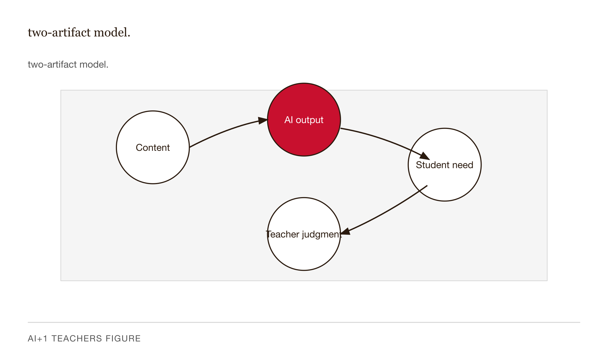
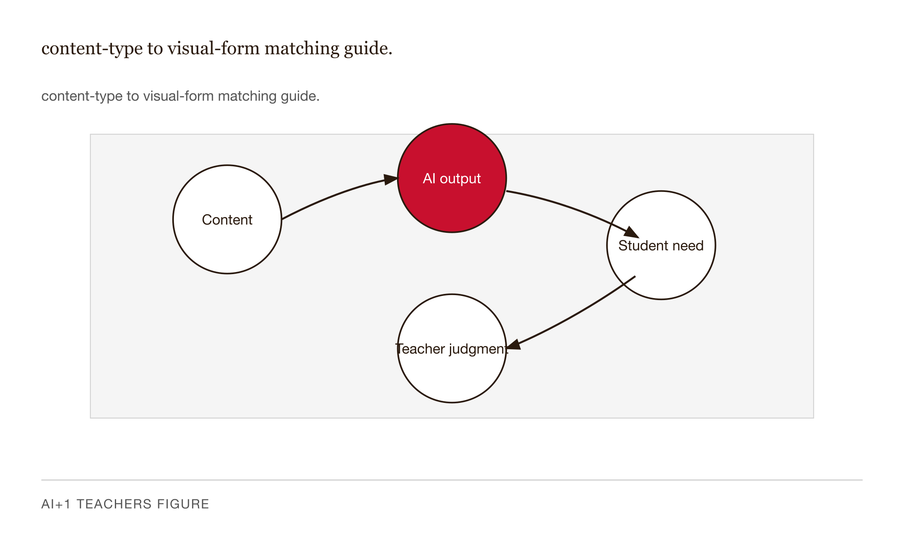
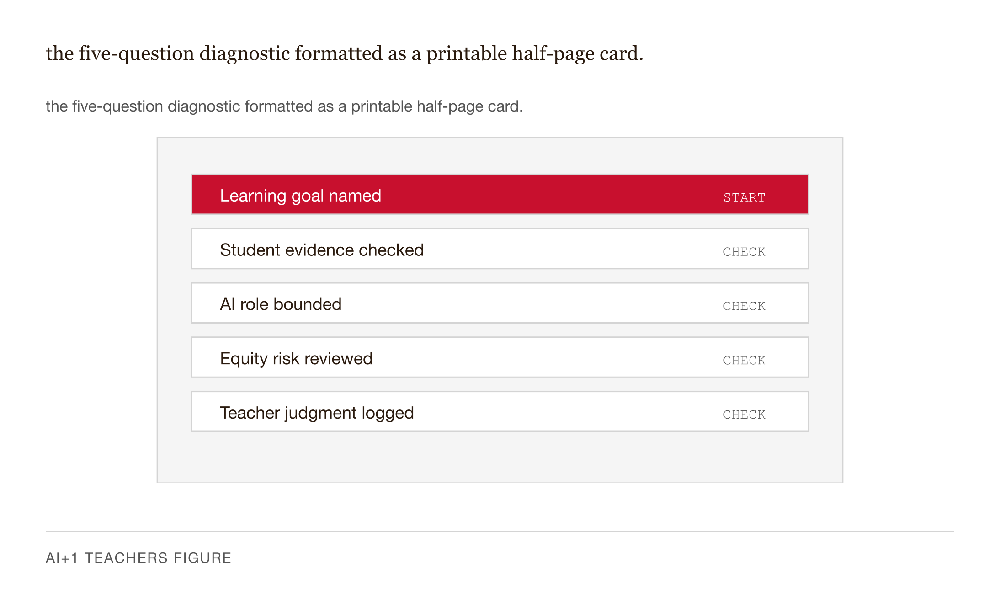
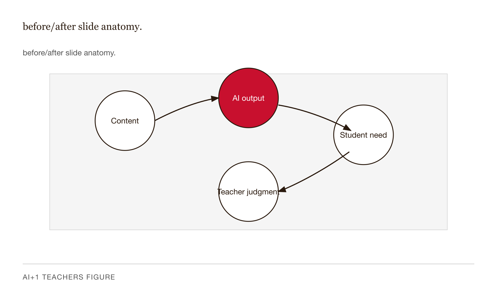
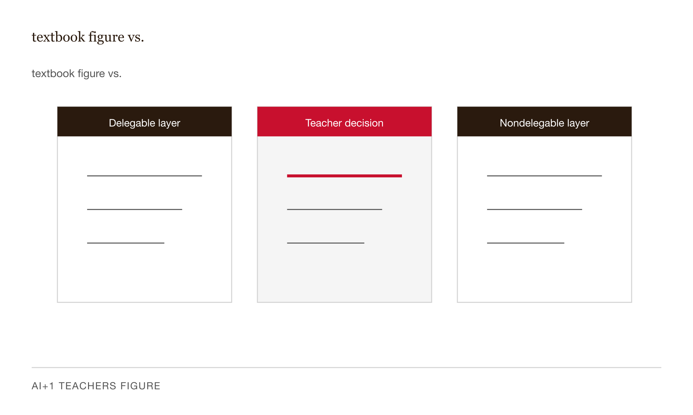

# Chapter 8 — Making Slides With AI


## TL;DR

- AI slide generators reliably produce decks that look professional and teach poorly.
- The chapter moves through LLM exercises.
- Read it for the main argument, the vocabulary it introduces, and the practical judgment it asks you to develop.

*AI slide generators reliably produce decks that look professional and teach poorly. The fix is not a better tool. It is a vocabulary for what is wrong.*

---

It is 11:42 p.m. on a Thursday. You have lecture at 9 a.m. The deck is forty-three slides long, generated by an AI tool you trust enough to use but not enough to ship without checking.

Slide twelve has a paragraph from chapter 6 of the textbook with one word bolded. Slide nineteen has a five-color bar chart of three categorical variables. Slide twenty-seven has a stock photo of a stethoscope on it, for reasons you cannot reconstruct. The slides look professional. They look done. They look wrong.

You try to fix slide twelve. You drag the text box. The bolded word loses its emphasis because the background isn't dark enough now. You change the background. The headline contrast drops below readable. You undo. You try again. You give up on slide twelve, move to slide nineteen, and within ninety seconds you have produced a different version of the same problem.

It is not 11:42 anymore. It is 12:38. The deck is no better.

The problem is not the AI. The AI did its job — it produced a deck that looks like decks look. The problem is the absence of a vocabulary for what is wrong. You can feel the wrongness. You cannot name it. And you cannot prompt the tool to fix what you cannot name.

This chapter builds the vocabulary.

---

There is a word for the thing on slide twelve. Garr Reynolds coined it in *Presentation Zen* (New Riders, 2008): **slideument**. A slideument is what you get when one file tries to do two incompatible jobs — serve as the speaker's visual anchor during a live lecture *and* serve as the audience's standalone study document. A slide is a slide. A document is a document. They have different density requirements. When you try to make one file be both, you produce something that fails at both: too dense to lecture from cleanly, too poorly structured to study from efficiently.

Here is why the failure is invisible from the author's chair.

A speaker's anchor is a sparse artifact. It holds a claim, a diagram, a single striking number — just enough to tell the speaker what comes next and give the audience something to look at while the explanation is being delivered aloud. The explanation lives in the speaker's voice. The slide gets out of the way.

A study document is a dense artifact. It holds enough prose to reconstruct the argument without anyone speaking. That is exactly what it should do — when it is read in silence, where there is no narration competing for the same channel.

The slideument is what you get when the author builds the dense artifact and then lectures from it. The slide carries the full explanation in prose. The speaker delivers the same explanation out loud. Now look at what happened: the same words are arriving on two channels simultaneously.

This is not an aesthetic problem. It is a cognitive one, and it has been measured.

Richard Mayer's Cognitive Theory of Multimedia Learning, summarized in *The Cambridge Handbook of Multimedia Learning* (3rd ed., Cambridge University Press, 2021), rests on three findings from cognitive science: humans process verbal and visual-spatial information through distinct but capacity-limited channels, and learning requires active processing in both. From these comes the **Redundancy Principle**: adding on-screen text that duplicates the spoken narration *degrades* learning, because both streams compete for the same verbal channel.

The empirical anchor is Moreno and Mayer (2002), in the *Journal of Educational Psychology*. Participants in their lightning-formation experiment who received narration plus animation outperformed those who received narration plus animation plus redundant on-screen text — on both retention and transfer measures. More on the slide produced less learning. The effect has been replicated across two decades of multimedia-learning research.

The practical translation is hard to argue with once you see it: **if you are about to say a sentence aloud, that sentence does not belong on the slide.** It belongs in the notes field, where it survives as part of the study artifact that students can export and read later. One source file. Two artifacts. The live deck is for the live audience. The notes-field export is for the student who missed class. The author's job is to decide, for each piece of content, which artifact it belongs to.

The misconception worth naming: *putting talking points on the slide helps students who struggle to follow audio.* This conflates two different students. The one sitting in the room with the speaker is harmed by redundant text — the verbal-channel collision degrades the explanation she is trying to follow in real time. The one studying alone later is helped by a separate document — which is exactly what the populated notes field, exported, becomes. One slide cannot serve both students simultaneously. The fix is not to choose one student over the other. The fix is to produce both artifacts.



*Figure 8.1 — two-artifact model.*

---

Now look at the headline on slide twelve. It says: *Oxidative Phosphorylation.*

That is not a headline. That is a filing-system label. It tells the audience which region of the discipline this slide is in. It does not tell them what to believe by the end of it.

Michael Alley at Penn State's College of Engineering developed the alternative, documented in *The Craft of Scientific Presentations* (Springer, 2nd ed. 2013). He calls it **assertion-evidence** structure. The headline is a sentence — a complete assertion stating the slide's main claim. The body is visual evidence: a diagram, a chart, a photograph, an equation, a table. No bullet lists.

The standard PowerPoint template, and almost every AI slide generator, ships the opposite default: a topic label at the top and indented bullets underneath. Alley calls this topic-subtopic structure. It is the conference-poster default, the "academic slide" default, and it is wrong for the same reason a newspaper headline that says "Sports" is wrong. A headline is not a category name. A headline is a claim.

The empirical case for the difference: Alley, Schreiber, Ramsdell, and Muffo (2006), in *Technical Communication*, found that audiences viewing assertion-evidence slides scored significantly higher on comprehension and recall than audiences viewing topic-subtopic slides on the same content. The second finding is more interesting still: student presenters who built assertion-evidence slides understood the content better than student presenters who built topic-subtopic slides on the same material. The slide structure shaped the presenter's own learning, not just the audience's.

Here is what the distinction looks like in practice:

*Oxidative Phosphorylation* is a topic label.
*The proton gradient powers ATP synthase* is a claim.

*Three Causes* is a topic label.
*MBS leverage was the load-bearing cause* is a claim.

*Introduction* is a topic label.
*Most teacher AI rollouts fail at the training step, not the tool* is a claim.

A claim is testable against the slide's evidence. The audience can, at the end of the slide, agree or disagree with it. A label is not testable against anything. The discipline is to ask, for every headline you write or accept: *what does this slide want the audience to believe?* If you cannot answer that question, neither can they.

| Topic Label | Claim Headline |
|---|---|
| Oxidative Phosphorylation | The proton gradient powers ATP synthase. |
| Three Causes | MBS leverage was the load-bearing cause. |
| Introduction | Most teacher AI rollouts fail at the training step, not the tool. |
| Methods | Random assignment isolates the treatment from selection bias. |
| Results | Treatment students outperformed controls on transfer, not retention. |

*Table 8.1 — Topic labels vs. claim headlines. A label files content; a claim makes an argument.*

---

Those are the two structural failures — the slideument problem and the topic-label problem. Three more failures live at the slide level.

The first is **seductive detail**. Harp and Mayer (1998), in the *Journal of Educational Psychology*, named it: interesting-but-irrelevant material added to instructional content reduces learning, even when audiences report enjoying the material more. The stock photo of the stethoscope on slide twenty-seven is a seductive detail. So is the cartoon of Einstein on a slide that has nothing to do with relativity. So is the "fun fact" sidebar that does not connect to the slide's claim. Mayer's Coherence Principle prescribes the fix: cut decoration. If a visual is not doing instructional work, it is taking attention and giving nothing back. The slide that feels bare after you delete the photo was already bare — the photo was hiding it.

The second is **wrong visual form**. A bulleted list is the slide editor's default for almost everything. It is the right form for exactly one kind of content: lists, where the items have no temporal, causal, or comparative relationship to each other beyond co-membership. It is the wrong form for comparisons (use a 2×2 or table), for processes (use a directed diagram), for distributions (use a chart), for single large quantities (use a number set at large size and get out of the way). Cleveland and McGill (1984), in the *Journal of the American Statistical Association*, ranked visual encodings by how accurately the eye perceives them: position along a common scale beats length beats angle beats area beats color. When a slide uses bullets to show a comparison, the audience must translate the bullets into a mental table before they can compare anything. That translation is cognitive work the slide should have done already. The author's job is to match visual form to content structure, not to accept the editor's default.



*Figure 8.2 — content-type to visual-form matching guide.*

The third is **decorative color**. Slide nineteen in the 11:42 p.m. deck has a five-color bar chart of three categorical variables. There are more colors than categories. The eye sees variation that does not encode meaning, hunts for the pattern, finds none, and disengages. Color on a teaching slide should answer one of two questions: *what category is this?* or *how much of this?* If it answers neither — if it is decoration — it is spending visual bandwidth on nothing. The discipline is to count the categories the chart needs to distinguish and use exactly that many colors, chosen from a palette designed for distinguishability. Cynthia Brewer's ColorBrewer 2.0 is the canonical reference. Two accessibility constraints that should not be negotiable: roughly 8% of men and 0.5% of women have red-green color blindness. Any distinction that matters should be encoded on a second channel — shape, label, position — in addition to color.

---

Those five failures — slideument prose, topic labels, seductive detail, wrong visual form, decorative color — are what the AI generator reproduced at scale from its training data. The training data is full of slides. It is also full of bad slides. The model learned the surface of what a complete slide looks like; it did not learn whether the slide helps an audience learn the content with a specific speaker in a specific room. No model has access to those facts. The teacher does.

So here is the diagnostic. Five questions. Thirty seconds per slide. Five minutes for a ten-slide deck.

    THE FIVE-QUESTION SLIDE DIAGNOSTIC

    1. Is the headline a claim or a topic label?
       — If label: rewrite as an assertion the evidence supports.

    2. Would this slide teach without a speaker?
       — If yes: it is a study document, too dense for live use.
         Move prose to notes; sparsen the slide body.

    3. Is there a sentence on this slide you are about to say aloud?
       — If yes: Mayer Redundancy. Move it to the notes field.

    4. Does the visual form match the content structure?
       — Bullets for a list; table for a comparison;
         diagram for a process; chart for a quantity.
       — If mismatched: rebuild the form.

    5. Is every color encoding something?
       — Count categories; count colors.
       — If colors exceed categories: remove the excess.

Run it on every AI-generated deck before it ships. The misuse to flag is applying the diagnostic to one slide and stopping. The deck-level pass is what catches structural failures — repeated topic labels, repeated redundancy — that slide-by-slide review misses.



*Figure 8.3 — the five-question diagnostic formatted as a printable half-page card.*

---

Let us run it on something real.

A teacher prompted an AI tool: *Make a slide on oxidative phosphorylation for AP Biology.* The tool returned:

> **Title:** Oxidative Phosphorylation
>
> **Body:**
> - Oxidative phosphorylation is the metabolic pathway in which the mitochondrion uses enzymes to oxidize nutrients, releasing chemical energy used to produce ATP.
> - The proton gradient established across the inner mitochondrial membrane drives ATP synthase, generating approximately 32 ATP per glucose molecule.
> - This process, discovered by Peter Mitchell in 1961 (Nobel Prize, 1978), accounts for the majority of ATP produced during aerobic respiration in eukaryotic cells.
>
> **Visual:** Stock photo of a mitochondrion, low contrast.
>
> **Colors:** Three different accent colors on the three bullets.
>
> **Notes field:** Empty.

Eighty-seven words on the slide. Reading time about twenty-five seconds.

Question 1: is the headline a claim? *Oxidative Phosphorylation* — a topic label. Fail.

Question 2: would this slide teach without a speaker? No — there is no diagram of the mechanism, no labels on the membrane, no arrow showing what flows where. It is also too dense to lecture from cleanly. It is the worst of both: too dense for live use, too poorly structured for study. Fail.

Question 3: is there a sentence on this slide the teacher is about to say aloud? Yes — every bullet is a sentence the teacher will deliver. Three redundancy collisions. Fail.

Question 4: does the visual form match the content structure? Oxidative phosphorylation is a process — directional, mechanistic, spatial. A bulleted list is a list. Wrong form. Fail.

Question 5: is every color encoding something? Three bullets, three colors, no encoding relationship between color and content. Pure decoration. Fail.

Five-for-five. The slide is a slideument with a topic label, redundant prose, wrong visual form, decorative color, and a stock-photo seductive detail.

The follow-up prompt, built on the four-component structure from Chapter 3:

    ROLE: You are a slide designer working in the assertion-evidence
    tradition (Alley) and the multimedia-learning tradition (Mayer).

    CONTEXT: Teaching slide for AP Biology, on oxidative phosphorylation.
    The speaker will lecture for about 90 seconds on this slide. Students
    who miss class will study from the notes field.

    TASK: Rewrite this slide as a live-deck slide.

    CONSTRAINTS:
    1. Headline: one sentence asserting the claim, 12 words or fewer.
       Not a topic label. Testable against the slide's evidence.
    2. Body: one visual element only — a labeled diagram, chart, or
       equation. No prose bullets. No stock photos.
    3. Notes field: the full prose explanation a student studying alone
       would need, including the Mitchell-1961 reference under Background.
    4. Color: only categorical or sequential encoding. No decoration.
    5. Output the slide and the notes field as two distinct sections.

The result:

> **Headline:** *The proton gradient powers ATP synthase.*
>
> **Body:** A diagram of the inner mitochondrial membrane. H⁺ ions queued on the high-concentration side; ATP synthase rendered as a labeled rotor; a directed arrow showing H⁺ flow through the rotor; output labeled "~32 ATP / glucose." Two colors: one for the proton-flow path, one neutral for the membrane and labels.
>
> **Notes field:** Oxidative phosphorylation is the final stage of aerobic respiration and the high-yield ATP step. The electron transport chain pumps protons across the inner mitochondrial membrane, building an electrochemical gradient. Protons flow back through ATP synthase — a rotary enzyme — and that flow drives phosphorylation of ADP to ATP. Approximately 32 ATP per glucose are produced, compared with 2 net from glycolysis. *Background:* Peter Mitchell proposed chemiosmosis in 1961 and received the Nobel Prize in 1978.

The rewrite required no new content. It required deciding what each region of the slide was *for* — headline carries the claim, body carries the visual, notes field carries the explanation — and prompting the tool to honor that division.



*Figure 8.4 — before/after slide anatomy.*

One honest note: I cannot promise the AI rebuilds the diagram correctly on the first try. AI image generation for technical diagrams is uneven. The practical workflow is to prompt for the diagram in words, build it in your slide editor, and verify every label by hand. The teacher remains responsible for content accuracy. The phase gate from Chapter 2 — *content accuracy gate* — still applies. Every AI-generated material is reviewed for errors before it reaches students.

---

There is one more failure mode worth naming because it shows up whenever teachers pull figures from a textbook into a slide. A textbook figure is engineered for a reading distance of about fourteen inches, on a printed page roughly eight inches wide, with continuous lighting and a caption directly beneath. A projected slide is read at fifteen to fifty feet, on a screen six to twelve feet wide, in variable lighting.

The implications: type that is legible in a textbook is illegible at projection. Subfigure labels — "(a)", "(b)" — that work on a printed page become unreadable when scaled to fit a slide. A diagram with five panels at textbook scale becomes a visual smear at projection.

The teacher who pastes a textbook figure unchanged into a slide is producing a faithful citation and an unreadable slide simultaneously. The fix is not to skip the citation. The fix is to **rebuild the figure for the new reading condition** — one panel, larger type, fewer labels, the caption integrated into the notes field. AI slide generators that ingest a textbook PDF and produce slides routinely embed figures designed for print into projection contexts. The teacher must either reject these figures or prompt for a rebuild.

A practical rule from Robert Bringhurst's *The Elements of Typographic Style* (Hartley & Marks, 4th ed. 2013): for display typography — and projection is display typography — size ratios between hierarchical elements should approach 2:1. A title at 44 pt over body at 22 pt is 2:1 and visible at the back of the room. A title at 32 pt over body at 28 pt is a 1.14× ratio — functionally invisible at projection distance. I should be honest: Bringhurst derived this from the modular scales of book typography, not from a controlled study of instructional slides. The rule works in practice; the empirical case for the exact ratio is missing from the literature I can name.



*Figure 8.5 — textbook figure vs.*

---

Two things I could have written as rules in this chapter but should not.

The first is Edward Tufte. Tufte's *The Cognitive Style of PowerPoint* (Graphics Press, 2003) gave us much of the vocabulary for criticizing slides — "chartjunk," "low-resolution format," the slide as information-poor artifact. Tufte's analysis of the Columbia accident slides is the canonical exhibit: NASA engineers formatted their risk assessment of foam-strike damage as PowerPoint bullets, the quantitative nuance disappeared into bullet indentation, and the people reviewing the slides did not have what they needed to assess whether seven astronauts were in danger. Tufte is a vocabulary contributor and a moralist about information design. The empirical case for most of his prescriptions rests on the Columbia exhibit plus his own priors. The controlled experiments are Mayer's and Sweller's, not Tufte's. We use Tufte's terms; we lean on Mayer's evidence when the claim is empirical.

The second is what I called "AI makes good slides." What AI makes is *plausible* slides — slides that look like what slides look like, because the training data is full of slides. The training data is also full of slideuments. The model has learned the surface form of a complete slide. It has not learned the function: *does this slide help an audience learn this content with this speaker in this room?* No model in 2026 has access to those facts. The diagnostic vocabulary is what converts the teacher's contextual knowledge — the knowledge of this class, this room, this thirty seconds of explanation — into a prompt the tool can execute. Cede the diagnostic call to the tool and you get the 11:42 p.m. deck.

---

## LLM exercises

**Exercise 1 — Run the diagnostic.** Take a deck you currently use — built yourself or AI-generated. Take the first ten slides. Run the five-question diagnostic on each. Record the time. Note your three highest-priority failures: the slides that fail the most questions, or fail in the most damaging way. Name each failure by its principle — redundancy, seductive detail, density, wrong visual form, decorative color.

**Exercise 2 — Rewrite five topic labels as claim headlines.** From any deck you have on hand, find five slide titles that are currently topic labels — "Introduction," "Methods," "Three Causes," "Background," "Key Concept." Rewrite each as a claim headline: a complete sentence, twelve words or fewer, testable against the slide's evidence, naming what the audience should believe by the end of the slide.

**Exercise 3 — Write a targeted revision prompt.** Take the highest-priority failure from Exercise 1. Write a follow-up prompt that names the specific failure and the specific fix, using the role-context-task-constraints structure from Chapter 3. Run it. Compare the before and after against the five-question diagnostic. The target: the rewritten slide passes the question that previously failed, and no new failures have been introduced.

---

## References

- Alley, M. (2013). *The Craft of Scientific Presentations* (2nd ed.). Springer.
- Alley, M., Schreiber, M., Ramsdell, K., & Muffo, J. (2006). How the design of headlines in presentation slides affects audience retention. *Technical Communication, 53*(2), 225–234.
- Bringhurst, R. (2013). *The Elements of Typographic Style* (4th ed.). Hartley & Marks.
- Brewer, C. A. ColorBrewer 2.0. https://colorbrewer2.org/
- Cleveland, W. S., & McGill, R. (1984). Graphical perception: Theory, experimentation, and application to the development of graphical methods. *Journal of the American Statistical Association, 79*(387), 531–554.
- Columbia Accident Investigation Board. (2003). *Report, Volume 1, Chapter 6.* https://www.nasa.gov/columbia/home/CAIB_Vol1.html
- Harp, S. F., & Mayer, R. E. (1998). How seductive details do their damage: A theory of cognitive interest in science learning. *Journal of Educational Psychology, 90*(3), 414–434.
- Mayer, R. E. (Ed.). (2021). *The Cambridge Handbook of Multimedia Learning* (3rd ed.). Cambridge University Press.
- Moreno, R., & Mayer, R. E. (2002). Verbal redundancy in multimedia learning: When reading helps listening. *Journal of Educational Psychology, 94*(1), 156–163.
- Reynolds, G. (2011). *Presentation Zen* (2nd ed.). New Riders.
- Tufte, E. R. (2006). *The Cognitive Style of PowerPoint* (2nd ed.). Graphics Press.
- Yue, C. L., Bjork, E. L., & Bjork, R. A. (2013). Reducing verbal redundancy in multimedia learning: An undesired desirable difficulty? *Journal of Educational Psychology, 105*(2), 266–277.

---

##  AI Wayback Machine
Vignelli's New York City subway signage and his Knoll identity standards manuals are the load-bearing precedents for what this chapter argues a teacher's slide system should be — a typographic constitution that holds across every use, that does not need to be redesigned each time it ships, that earns its consistency from constraint. His insistence that *the life of a designer is a life of fight against the ugliness* maps directly onto the chapter's argument for owning your DESIGN.md before you let any AI build a slide for you.


*Massimo Vignelli, 1931-2014. AI-generated portrait based on a public domain photograph (Wikimedia Commons).*


*Puppet Art by [Nik Bear Brown](https://www.nikbearbrown.com/).*

**Run this:**

```
Who was Massimo Vignelli, and how does their work connect to the ideas in this chapter? Keep it to three paragraphs. End with the single most surprising thing about their career or thinking.
```

→ Search **"Massimo Vignelli"** on Wikipedia.

**Now make the prompt better.** Try one of these:

- Ask it to apply Vignelli's framework to a specific scenario in this chapter — what gets surfaced that the chapter's prose left implicit?
- Ask about the critics of Vignelli's work and which criticisms still bite today.

What changes? What gets better? What gets worse?

## Prompts

Use these prompts with Claude to generate interactive D3 v7 versions of the
figures in this chapter. Each produces a standalone HTML file you can open
in a browser and modify freely.

**Prerequisites:** Load `brutalist/CLAUDE.md` and `brutalist/DESIGN.md` into
your Claude project context before using these prompts. They define the stack,
naming conventions, color system, and typography the figures use.

---

### Figure 8.1 — two-artifact model.

Create a standalone D3 v7 HTML file for a concept map titled "two-artifact model.". Use teacher AI-workflow states: learning goal, AI draft, teacher review gate, classroom use, equity check, and student evidence. Encode the AI-assisted step with one red mark and all teacher-controlled checks with neutral ink. Include direct labels, a zero baseline if values are shown, short annotations, accessible SVG title and description, responsive redraw with ResizeObserver, dark-mode CSS variables, and reduced-motion handling. Use the D3 7.9.0 CDN and inline CSS/JS only.

> Reference implementation: `d3/08-making-slides-with-ai-fig-01.html`

---

### Figure 8.2 — content-type to visual-form matching guide.

Create a standalone D3 v7 HTML file for a concept map titled "content-type to visual-form matching guide.". Use teacher AI-workflow states: learning goal, AI draft, teacher review gate, classroom use, equity check, and student evidence. Encode the AI-assisted step with one red mark and all teacher-controlled checks with neutral ink. Include direct labels, a zero baseline if values are shown, short annotations, accessible SVG title and description, responsive redraw with ResizeObserver, dark-mode CSS variables, and reduced-motion handling. Use the D3 7.9.0 CDN and inline CSS/JS only.

> Reference implementation: `d3/08-making-slides-with-ai-fig-02.html`

---

### Figure 8.3 — the five-question diagnostic formatted as a printable half-page card.

Create a standalone D3 v7 HTML file for a checklist or diagnostic card titled "the five-question diagnostic formatted as a printable half-page card.". Use teacher AI-workflow states: learning goal, AI draft, teacher review gate, classroom use, equity check, and student evidence. Encode the AI-assisted step with one red mark and all teacher-controlled checks with neutral ink. Include direct labels, a zero baseline if values are shown, short annotations, accessible SVG title and description, responsive redraw with ResizeObserver, dark-mode CSS variables, and reduced-motion handling. Use the D3 7.9.0 CDN and inline CSS/JS only.

> Reference implementation: `d3/08-making-slides-with-ai-fig-03.html`

---

### Figure 8.4 — before/after slide anatomy.

Create a standalone D3 v7 HTML file for a concept map titled "before/after slide anatomy.". Use teacher AI-workflow states: learning goal, AI draft, teacher review gate, classroom use, equity check, and student evidence. Encode the AI-assisted step with one red mark and all teacher-controlled checks with neutral ink. Include direct labels, a zero baseline if values are shown, short annotations, accessible SVG title and description, responsive redraw with ResizeObserver, dark-mode CSS variables, and reduced-motion handling. Use the D3 7.9.0 CDN and inline CSS/JS only.

> Reference implementation: `d3/08-making-slides-with-ai-fig-04.html`

---

### Figure 8.5 — textbook figure vs.

Create a standalone D3 v7 HTML file for a side-by-side comparison diagram titled "textbook figure vs.". Use teacher AI-workflow states: learning goal, AI draft, teacher review gate, classroom use, equity check, and student evidence. Encode the AI-assisted step with one red mark and all teacher-controlled checks with neutral ink. Include direct labels, a zero baseline if values are shown, short annotations, accessible SVG title and description, responsive redraw with ResizeObserver, dark-mode CSS variables, and reduced-motion handling. Use the D3 7.9.0 CDN and inline CSS/JS only.

> Reference implementation: `d3/08-making-slides-with-ai-fig-05.html`
