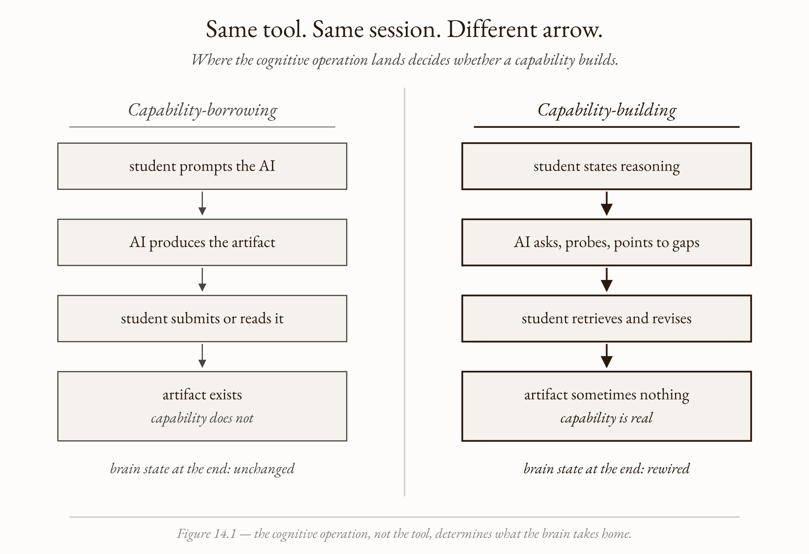
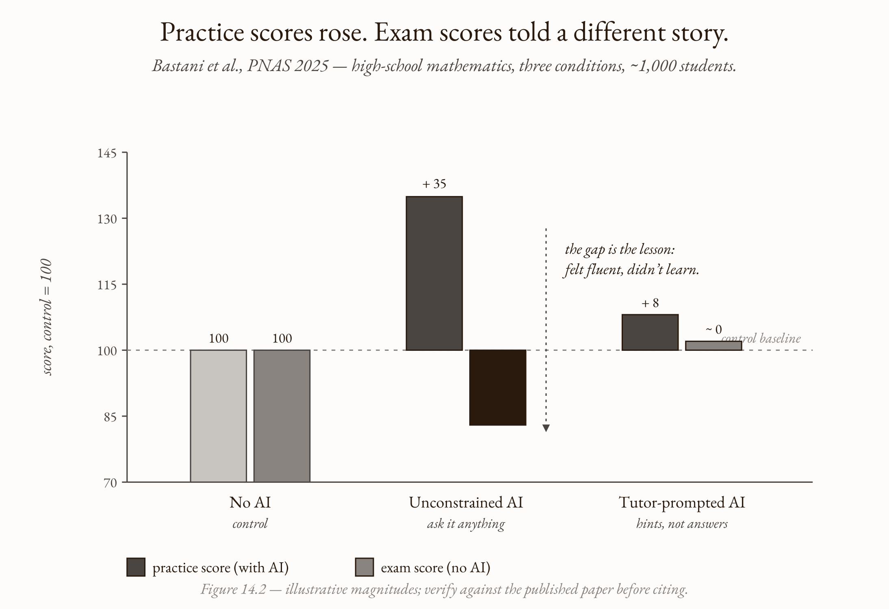
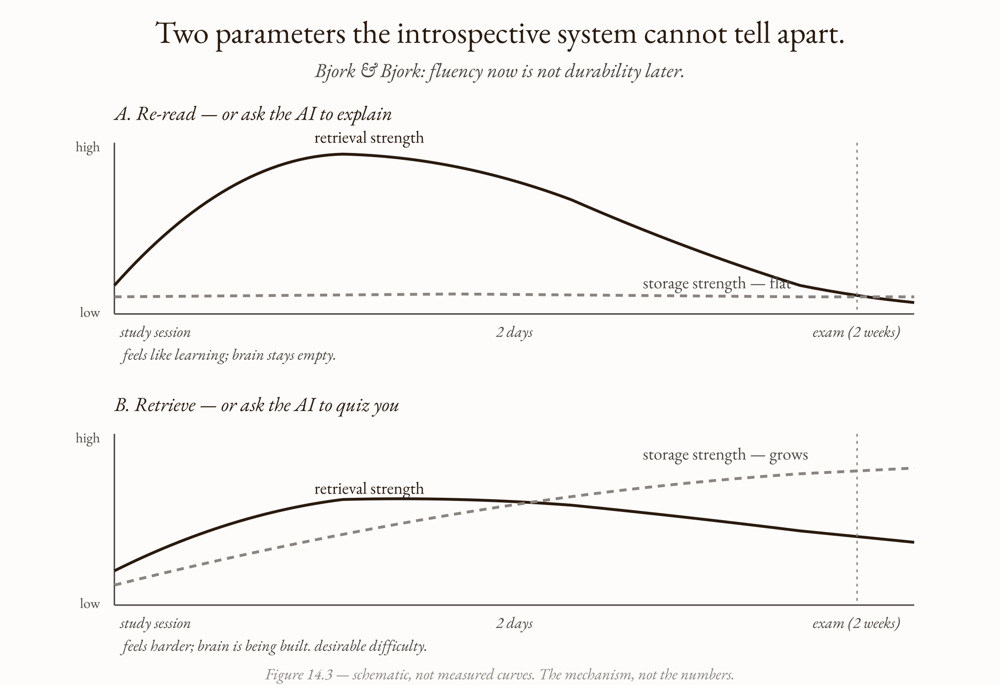
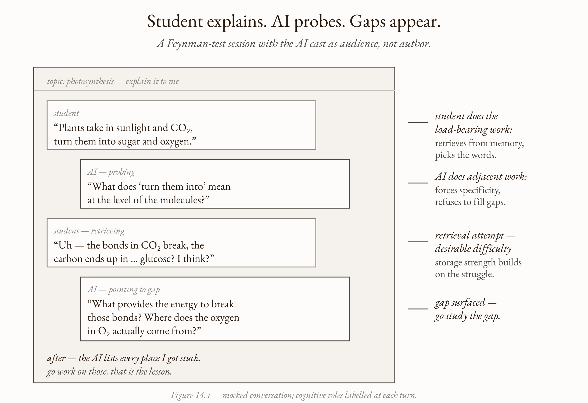
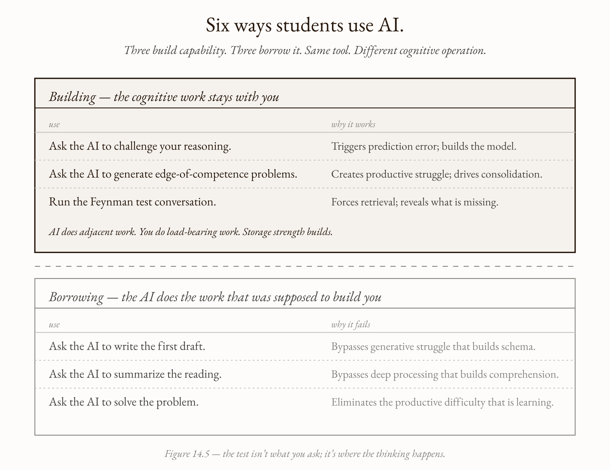

# Chapter 14 — What to Tell Your Students: AI Literacy in the Classroom

*The students using AI to avoid the work get the news coverage. The students who want to use AI to do the work better are getting nothing from us.*

---

A high schooler sent a message to her science teacher, who forwarded it with my name on it. Three sentences.

> *"My friends are using AI to write their papers but I want to use AI to learn and I don't know how. My teachers tell me what not to do with ChatGPT. Nobody tells me what I should do. Is there a right way?"*

Read that again. Notice what is not in it. There is no defiance. There is no question about whether AI is okay. There is no fear of getting caught. This student has already made the decision the academic integrity literature spends most of its energy arguing about: she is going to use AI. The decision in front of her is the one no policy document has answered. *How.*

She is not the student your AI-use policy is written for. The policy is written for her friends. She is the student this chapter is for. And she is, in my experience running professional development for teachers over the last two years, vastly more common than the AI-skeptic literature acknowledges.

This chapter is what I would say to her.

---

I want to start with a distinction that I will name precisely, because everything else rests on it.

**Capability-borrowing** is when you use AI to produce an artifact — a finished essay, a solved problem, a summary of the reading — without doing the cognitive operation the artifact was supposed to evidence. The artifact exists. The capability does not. Your friend who texts you the answer is doing the same thing as ChatGPT in this mode: producing the deliverable while bypassing the mechanism that would have built the deliverable inside your head.

**Capability-building** is when you use AI as a partner in the cognitive operation that only your own brain can do. The AI is in the room; the work is yours. The AI asks questions you would not have asked yourself. The AI generates practice at the edge of your competence. The AI tells you where your explanation has a hole in it and refuses to fill the hole. The artifact at the end is sometimes nothing — sometimes a list of things you got wrong. The capability is real.

I want to be clear about what this distinction is *not*. It is not "human work good, AI work bad." That framing fails immediately at contact with the classroom. A student who looks up the formula for the area of a triangle and uses it has not failed to learn geometry; she has used a reference tool exactly as a working professional would. The question is whether the cognitive operation that constitutes the learning at her current level is happening.

It is not the same as the calculator analogy, and I want to spend a paragraph here because the analogy is everywhere and it is doing more damage than help. A calculator substitutes for the *execution* of a procedure the student already understands — long division, square roots. The cognitive operation of understanding what you are computing and why is left intact; only the arithmetic execution is offloaded. AI in capability-borrowing mode does the opposite: it leaves the surface task to the student and offloads the cognitive process itself — reasoning through the problem, choosing the approach, understanding what you are computing. A calculator is a transfer tool. A capability-borrowing AI use is a substitute for the thinking. The analogy works only if you misunderstand what calculators replaced.

Same tool. Different operation. Different brain state at the end.


*Figure 14.1 — two-column diagram.*

---

Here is the empirical anchor, and I want to give you the version of it I give to a tenth grader, because that is the version you will need.

A research team led by Hamsa Bastani at Wharton ran a randomized experiment with about a thousand high school students in Turkey, studying mathematics (Bastani et al., 2025, *PNAS*). Three groups. Group 1 practiced with pencil, paper, and textbook. Group 2 practiced with unconstrained access to GPT-4 — they could ask it anything, including "just solve this for me." Group 3 practiced with a version of GPT-4 wrapped in a pedagogically designed prompt — instructed to ask questions rather than supply answers, to give hints rather than solutions.

During practice, the unconstrained-AI group dramatically outperformed the no-AI group. Their homework looked better. Their accuracy jumped. They felt like they were learning faster than the kids working with paper.

Then the researchers gave everyone the same exam without any AI access. The unconstrained-AI group scored *worse* than the no-AI group by a substantial margin. Better practice scores. Worse exam scores. The same students who had felt fluent during homework froze on the test, because what they had practiced was not doing the math — it was getting the right answer with ChatGPT's help. Those are different skills. One transfers to the unassisted exam. The other does not.

The tutor-prompted group landed in a different place. Their practice gains were smaller. Their exam scores were comparable to — and in some specifications, slightly above — the no-AI control. Same model. Different prompt. Completely different learning outcome.

I want to flag the numbers carefully. The published figures show a roughly 17% *relative* reduction in exam scores for the unconstrained group — that is, about 17% lower than the no-AI control, not 17 absolute percentage points. The unit matters; secondary summaries of this paper frequently get it wrong. Before you put specific percentages in front of a class, verify against the published paper directly. The qualitative finding — large practice gain, large exam drop, no harm in the tutor condition — is the part I am willing to teach without hedging.

The takeaway for your students is one sentence: **the prompt determines the outcome.** Asking the AI to think for you and asking the AI to make you think harder are different cognitive operations with different effects on what ends up in your head, and the difference is large enough to flip you from passing to failing.


*Figure 14.2 — bar chart showing the Bastani three-group results.*

---

Here is the piece of learning science that makes the Bastani finding inevitable rather than surprising.

In the early 1990s, Robert Bjork and Elizabeth Bjork proposed that human memory has two distinct parameters the introspective system cannot distinguish. They called them *storage strength* and *retrieval strength*.

Storage strength is how deeply a piece of knowledge is wired in — how richly connected to other things you know, how durable across weeks and months, how available across surface variations of the problem. This is what you are trying to build when you learn something.

Retrieval strength is how easily a piece of knowledge comes to mind *right now*. It is the surface feeling of fluency. It is high after re-reading. It is high right after a study session. It is high when the prompt is on the screen in front of you. It does not measure how durable the knowledge is. It measures how accessible it is at this moment.

The Bjorks' central observation is that the conditions that maximize retrieval strength in the short term — re-reading, smooth path through the material, immediate feedback — do not maximize storage strength in the long term. The conditions that build storage strength feel worse: spaced practice, interleaved problems, retrieving before re-reading, generating answers before being told them, struggling for a beat before the help arrives. They called these *desirable difficulties*. The discomfort is not the cost of learning. It is the mechanism.

AI is, by design, a fluency machine. Its outputs are smooth, well-organized, grammatically clean. When a student reads an AI explanation, retrieval strength rises fast — the material feels familiar, the words are crisp, the logic seems clear. The introspective system reports *I understand this*. Storage strength has not moved. The student has re-read, not retrieved. Two weeks later, on the unassisted exam, the gap shows up.

This is what the Bastani study measured. The unconstrained-AI group raised their retrieval strength dramatically — they could do problems with the AI present because retrieving the next step from a chat window is easy. Their storage strength never built, because they never had to generate the next step from their own memory.

Call this the **fluency trap**: smooth output produces a feeling of understanding the brain has not earned. It is what makes the Bastani gap inevitable. It is also what makes the gap invisible to the student until exam day, by which point they cannot fix it.


*Figure 14.3 — storage strength vs.*

---

Henry Roediger and Jeffrey Karpicke ran what is now the canonical study on the other side of this picture in 2006. Students read a passage. One group re-read it three more times. Another group read it once and took recall tests. Five minutes after the session, the re-readers outperformed the testers — and their confidence tracked performance: the re-readers felt they had learned more, and they had, at five minutes. A week later the result reversed and the gap widened. The testers remembered substantially more. A follow-up with Blunt showed that retrieval practice was large enough to beat concept mapping — a strong study technique in its own right — on a test taken a week later.

The mechanism is exactly what Bjork predicts. Re-reading raises retrieval strength fast. The storage strength was built by the *act of attempting retrieval* — pulling information out of memory rather than pushing it back in. A week later, retrieval strength has decayed in both groups, but only the testers had the underlying storage strength to compensate.

The implication for AI is direct. If you ask the AI to explain something, the AI does the retrieval. You watch it happen. Your storage strength does not move. If you ask the AI to *quiz you* — to generate retrieval prompts you have to answer from your own memory — you do the retrieval. Your storage strength moves. Same tool. Same chapter. The arrow of cognitive work points the other way.

This is the single highest-leverage piece of student-facing AI literacy in this chapter. You do not have to win the argument about whether AI is good or bad. You just have to teach the difference between asking the AI to retrieve for you and asking the AI to make you retrieve.

---

The third piece of the framework comes from Richard Feynman, who had a diagnostic for understanding that I think is the best one ever described. It was not recognition, not summarization, not even problem-solving. It was explanation. If you could not explain a concept simply, to someone who did not already know it, in plain language without jargon, you did not yet understand it. The work was to try to explain, notice where you got stuck, go back to the source, repeat.

The learning-science literature has a name for what Feynman was describing: the *generative explanation effect*. When a learner produces an explanation rather than receives one — especially when the explanation must be made coherent for an audience — the cognitive operations involved produce stronger learning than reading, listening, or self-explaining with notes in front of you. The empirical picture is more nuanced than the slogan (the modality and audience effects refine the core finding rather than overturn it), but the conservative version holds: producing an explanation drives more learning than receiving one.

Now put an LLM in that picture. The LLM is the perfect Feynman-test audience. It is patient. It is awake at midnight. It knows the material well enough to notice when your explanation has a gap. It feels lower-stakes than a human listener, which lowers the defensive crouch students go into when afraid of looking stupid. Used in this direction — student explains, AI probes — the LLM is doing exactly what the generative explanation literature wants: the cognitive operation is the student's, the AI is the audience that forces it to be specific.

Used in the other direction — student asks, AI explains — the same tool delivers the opposite mechanism. The AI generates. The student recognizes. The fluency trap fires.

Here is the exact prompt to give students for the Feynman direction:

> *"I'm going to explain [concept] to you as if you've never heard of it. Your job: every time I use a word that needs to be defined, ask me to define it. Every time I make a claim that needs to be justified, ask me how I know. Don't help me. Don't fill in gaps. Just point to them. After we're done, list every place I got stuck."*

That prompt turns Claude or ChatGPT or Gemini from an answer machine into a Socratic interlocutor. One sentence. No special tool required.


*Figure 14.4 — annotated screenshot mockup of a Feynman test conversation.*

---

The framework collapses to three uses students can run on their own with any current LLM, and three uses that look similar but operate in reverse.

On the building side: *Ask the AI to challenge your reasoning.* The student states a position; the AI is instructed to argue back, find weaknesses, ask how do you know. The cognitive operation is the student's. The AI is the friction that exposes the gaps. *Ask the AI to generate problems at the edge of your competence.* Not textbook problems calibrated to a median student — problems calibrated to where this student just failed, with no answers provided, with feedback on the approach rather than the solution. *Run the Feynman test conversation.* Explain the concept from scratch; let the AI point to gaps; go work on the gaps. The AI was deeply involved in all three. The cognitive work was entirely the student's.

On the borrowing side: asking AI to write the first draft, to summarize the reading, to solve the problem. Each bypasses the cognitive operation that builds the capability the assignment was designed to develop.

The pattern that unites the building uses: the AI is doing *adjacent* cognitive work — generating questions, generating practice, listening for gaps — while the student does the *load-bearing* cognitive work that builds storage strength. The AI is making the productive struggle more accessible. It is not removing the struggle. The pattern that unites the borrowing uses: the AI removes the struggle entirely and with it the mechanism of learning.

The same six uses scale from middle school to graduate school:

| Student use of AI | Type | Why it works or fails |
|---|---|---|
| Ask AI to challenge your reasoning | **Building** | Triggers prediction error; builds the model |
| Ask AI to generate problems at the edge of competence | **Building** | Creates productive struggle; drives consolidation |
| Ask AI to find gaps in your explanation (Feynman test) | **Building** | Forces retrieval; reveals what's missing |
| Ask AI to write the first draft | Borrowing | Bypasses the generative struggle that builds schema |
| Ask AI to summarize the reading | Borrowing | Bypasses the deep processing that produces comprehension |
| Ask AI to solve the problem | Borrowing | Eliminates the productive difficulty that constitutes learning |

The vocabulary, examples, and degree of student autonomy do not stay constant across grade levels. The mechanism — the brain only learns from the work it does itself — does not change.


*Figure 14.5 — the capability table formatted as a classroom poster.*

---

There is one activity that lands harder with students than any lecture I know of. It is the Bastani finding compressed to a single class period, with the students themselves as subjects and their own scores as the data.

Tell the class what you are doing. Honesty is the design, not deception: *"We are going to run a small experiment on ourselves. You're going to do a problem set with AI help, then a different problem set without. We will compare scores. The point is not to catch you doing anything wrong. The point is for you to see whether what you can do with AI matches what you can do without it."*

Distribute Problem Set A — six to eight problems on a single concept the class has been working on. Thirty minutes, full AI access. Any tool, used any way. Scores are not for a grade. Ask students to rate "How well do I understand this material right now?" on a 1–10 scale when they finish.

Then — immediately, without grading Problem Set A — distribute Problem Set B. Same difficulty, same concept, different surface. Different numbers, different framing, different domain reference. The cognitive structure is identical; the recognition pattern is not. Fifteen minutes. No AI, no notes, no phones.

This is the part where you will see something in the room you may not have seen before. The students who offloaded heavily on Problem Set A will freeze. They felt fluent twenty minutes ago. They have nothing to retrieve, because what they practiced was not the concept — it was the act of getting ChatGPT to produce an answer. The students who used AI as a hint engine will perform roughly as they did on Set A. The students who skipped AI entirely will perform exactly as they did on Set A.

Score both sets quickly. Hand each student their two scores and the confidence rating they gave themselves between the sets. The reflection prompt is short: *"Look at the gap between your scores. Look at the confidence you reported. What do these three numbers tell you about what you actually learned today versus what you felt like you were learning?"*

The numbers do the teaching. You facilitate. The students who got a near-zero gap have evidence that they were building. The students who got a large gap have evidence that they were borrowing fluency. Neither result is a verdict. Both are diagnostic.

One limit worth naming explicitly: this is a single class period on a single concept under controlled conditions. It does not prove anything about AI in general. It produces a felt example of the gap the Bastani study measured at population scale. The student now has a personal data point. The Bastani study is the published version of the same phenomenon with a randomized design and a thousand students. Both are useful. Neither alone is decisive. Together they teach the principle.


*Figure 14.6 — performance-paradox demonstration flow.*

---

A few misconceptions come up reliably when this framework is taught, and each one fails for a specific reason that is itself the teaching.

*"AI is a calculator; using it is fine."* This is the most frequent framing and the most damaging because it sounds reasonable. The argument is that calculators did not destroy mathematics education; AI is the same thing one level up. Here is why it fails: a calculator offloads a procedural execution the student has already been taught to understand conceptually. AI in capability-borrowing mode offloads the conceptual operation itself. A calculator replaces a transfer skill. A capability-borrowing AI use replaces the thinking. The analogy works only if you misread what a calculator did.

*"If I get the answer faster, I learn faster."* Speed to correct answer is a measure of retrieval strength right now. Learning is storage strength two weeks from now. The two come apart, and AI is the largest single intervention currently available for making them come apart further. A student who gets the right answer in thirty seconds with AI has not learned faster; they have practiced retrieval-with-AI-present, which is not the same skill as retrieval without AI.

*"Smooth output means I understood."* This is the fluency trap, named. The diagnostic for the trap is one sentence: *Can you produce this without the page open?* If you can close the laptop and explain the concept from memory, the understanding is real. If you cannot, the fluency was the AI's. Teach students to run this check on themselves the way you would teach a pilot to run a pre-flight checklist. Short. Costs nothing. Catches the most common AI-era study failure.

*"AI literacy means knowing how to prompt."* This is the misconception the educational technology industry actively promotes, because it sells prompt engineering courses. It is wrong on the most basic level. A student who is fluent at prompting AI to do their homework is more capability-borrowing than a student who is bad at prompting. Fluent prompting raises the ceiling on what the AI can do *for* the student. It does not raise the ceiling on what the student can do themselves. The honest definition of AI literacy is metacognitive: knowing, at every step of an AI interaction, which cognitive operation is yours and which is the AI's, and whether the operation that is yours is the one that builds the capability you are trying to build.

---

Two things I need to be honest about before closing.

The first is the Bastani numbers. The qualitative finding — large practice gain, large exam drop, no harm in the tutor condition — is unambiguous and well-attested across the paper, the working-paper precursor, and the seminar Bastani gave on the study. The specific percentages circulate in distorted form in secondary summaries, including in an earlier draft of this chapter. Use the direction. Verify the magnitude against the published paper directly before citing it to a class.

The second is about the student in the opening case. Her friends are using AI to write their papers. She wants to use AI to learn. In the short term, her friends will get better grades on the papers and she will get harder-earned grades on unassisted exams. The gap will not close until the unassisted assessments are weighted heavily enough to dominate the course grade — which depends on her teachers, not on her. I can tell her the science. I cannot promise she will be rewarded for following it in the next semester. That gap between learning more and being assessed as having learned more is the real challenge facing students who want to build capability rather than borrow it, and it is partly individual and partly structural. I do not yet have a satisfying answer for her on the structural side. I think she deserves to know that.

---

## LLM exercises

**Exercise 1 — The capability sort.** Give students a list of twenty AI-use scenarios drawn from real student work: "summarize this chapter for me," "ask me three questions about Le Chatelier's principle without telling me the answers," "rewrite my paragraph to make it sound smarter," and so on, mixed across the building/borrowing axis. Students sort the twenty into two columns and write one sentence per scenario justifying the placement. The discussion is the lesson. Students will disagree on edge cases — "summarize this chapter so I can decide whether to read it more carefully" is interesting. The disagreement is where the framework gets sharpened against actual practice.

**Exercise 2 — Design the performance-paradox demonstration.** Design the activity for a specific class you teach or take. Produce two isomorphic problem sets (six to eight problems each, same cognitive structure, different surface), the 15/30/15/10 minute timing plan adapted to your class period, the confidence rating instrument, the reflection prompt students will write to, and a two-paragraph note on the discussion you expect to facilitate. The grading criterion is simple: does the demo, as designed, actually let students feel the gap? Does Problem Set B test the same concept as Problem Set A under a genuinely different surface — or is it just Set A with different numbers, which AI would also handle fluently?

**Exercise 3 — The honest self-audit.** Each student writes a one-paragraph honest accounting of one AI use they currently rely on:

> *"Name one specific way you currently use AI in your schoolwork. Describe in one sentence what cognitive operation you are doing. Describe in one sentence what cognitive operation the AI is doing. If the AI vanished right now and you had to do tomorrow's version of this task, could you? What would change about your work?"*

Then the student decides — based on their own honest accounting, not on a teacher's verdict — whether the use is capability-building or capability-borrowing, and writes one sentence on what they will change, if anything. The point is that the decision is now visible to them. Most students who do this honestly notice at least one AI use in the borrowing column. Some decide to stop. Some decide to continue and accept the consequence. Both are legitimate outcomes.

---

## References

- Bastani, H., Bastani, O., Sungu, A., Ge, H., Kabakcı, Ö., & Mariman, R. (2025). Generative AI without guardrails can harm learning: Evidence from high school mathematics. *PNAS*, 122. https://www.pnas.org/doi/10.1073/pnas.2422633122
- Bjork, E. L., & Bjork, R. A. (2011). Making things hard on yourself, but in a good way. In *Psychology and the real world* (pp. 56–64). Worth Publishers.
- Ericsson, K. A., Krampe, R. Th., & Tesch-Römer, C. (1993). The role of deliberate practice in the acquisition of expert performance. *Psychological Review*, 100(3), 363–406.
- Fiorella, L., & Mayer, R. E. (2016). Eight ways to promote generative learning. *Educational Psychology Review*, 28(4), 717–741.
- Karpicke, J. D., & Blunt, J. R. (2011). Retrieval practice produces more learning than elaborative studying with concept mapping. *Science*, 331(6018), 772–775.
- Lachner, A., Jacob, L., & Hoogerheide, V. (2021). Learning by writing explanations: Is explaining to a fictitious student more effective than self-explaining? *Learning and Instruction*, 74, Article 101438.
- Lachner, A., Ly, K.-T., & Nückles, M. (2018). Providing written or oral explanations? Differential effects on students' conceptual learning and transfer. *Journal of Experimental Education*, 86(3), 344–361.
- Macnamara, B. N., Hambrick, D. Z., & Oswald, F. L. (2014). Deliberate practice and performance in music, games, sports, education, and professions: A meta-analysis. *Psychological Science*, 25(8), 1608–1618.
- Roediger, H. L., & Karpicke, J. D. (2006). Test-enhanced learning: Taking memory tests improves long-term retention. *Psychological Science*, 17(3), 249–255.
- Roediger, H. L., & Karpicke, J. D. (2006). The power of testing memory: Basic research and implications for educational practice. *Perspectives on Psychological Science*, 1(3), 181–210.
- UNESCO. (2024). *AI competency framework for students*. https://www.unesco.org/en/articles/ai-competency-framework-students


---

## Prompts

These prompts hand Claude (or any current frontier model that writes D3) the
brief for an interactive, web-native version of each figure in this chapter.
Each one is structural — what to draw, what to encode, which interactions to
wire — not stylistic. Style is delegated to the brutalist constitution.

**Prerequisites:** Load `brutalist/CLAUDE.md` and `brutalist/DESIGN.md` into the
project context before running these prompts. Pin D3 v7.9.0 from the cdnjs URL
in `CLAUDE.md`. No substitutions.

---

### Figure 14.1 — Capability-borrowing vs capability-building

Build a two-column comparison diagram in D3 v7 inside a single self-contained
HTML file. Left column: four sequential nodes for capability-borrowing
(student prompts AI, AI produces artifact, student submits or reads it,
artifact exists / capability does not). Right column: four nodes for
capability-building (student states reasoning, AI probes and points to gaps,
student retrieves and revises, artifact sometimes nothing / capability is
real). Connect each column with vertical arrows; emphasize the right column
with heavier stroke. Add a brain-state-at-the-end caption under each column.
Render `role="img"`, `<title>`, `<desc>`, ResizeObserver redraw, `(event, d)`
hover tooltip on each node, dark-mode `@media` block, and `prefers-reduced-motion`
suppression. Use `var(--color-*)` tokens and the EB Garamond serif chain.

> Reference implementation: `d3/14-what-to-tell-your-students-fig-01.html`

---

### Figure 14.2 — Practice gain vs exam outcome (Bastani 2025)

Build a paired bar chart in D3 v7 in a single HTML file. Three condition
groups along x: no-AI control, unconstrained AI, tutor-prompted AI. Two bars
per group: practice score (with AI) and exam score (no AI), scored relative
to the control = 100. y-domain `[70, 145]`; horizontal reference line at 100
labelled "control baseline". Value labels above or inside each bar showing
the signed delta from baseline. Tooltips on hover report condition, measure,
and value. Add a two-swatch legend at the bottom and a footer caption noting
the magnitudes are illustrative and must be verified against the paper.
Include `role="img"`, `<title>`, `<desc>`, ResizeObserver redraw, `(event, d)`
handlers, dark-mode `@media` block, and `prefers-reduced-motion` suppression.
Use `var(--color-*)` tokens and the EB Garamond serif chain.

> Reference implementation: `d3/14-what-to-tell-your-students-fig-02.html`

---

### Figure 14.3 — Storage strength vs retrieval strength

Build a two-panel line chart in D3 v7. Panel A (top): re-read or
ask-AI-to-explain condition; panel B (bottom): retrieve or ask-AI-to-quiz
condition. Both panels share an x-axis from "study session" through "2 days"
to "exam (2 weeks)" and a y-axis from low to high. Two curves per panel:
retrieval strength (solid, ink) and storage strength (dashed, muted). In A
the retrieval curve spikes early and decays; storage stays flat near the
floor. In B retrieval rises modestly and decays gently; storage climbs across
the panel and ends above retrieval. Add a vertical dashed marker at the exam
point in each panel. Hover dots on the retrieval curve report current value.
Use `var(--color-*)` tokens, EB Garamond serif chain, ResizeObserver,
`(event, d)` handlers, `role="img"`, `<title>`, `<desc>`, dark-mode `@media`,
and `prefers-reduced-motion` suppression.

> Reference implementation: `d3/14-what-to-tell-your-students-fig-03.html`

---

### Figure 14.4 — Annotated Feynman test conversation

Build a mocked chat-thread layout in D3 v7 in a single HTML file. Render four
sequential turn bubbles inside a framed chat panel on the left: student turn,
AI probing turn, student retrieving turn, AI gap-pointing turn. Indent AI
turns to the right; tag each bubble with a small role label. On the right
side, render a column of cognitive-role annotations linked to each bubble by
a short tick line: load-bearing work, adjacent work, retrieval attempt, gap
surfaced. Wire each bubble as a hoverable group with a tooltip that names the
cognitive operation. Include `role="img"`, `<title>`, `<desc>`, ResizeObserver
redraw, `(event, d)` handlers, dark-mode `@media` block, and
`prefers-reduced-motion` suppression. Use `var(--color-*)` tokens and the
EB Garamond serif chain throughout.

> Reference implementation: `d3/14-what-to-tell-your-students-fig-04.html`

---

### Figure 14.5 — Capability poster: six AI uses

Build a two-zone classroom poster in D3 v7. Upper zone: capability-building,
heavier border, three rows. Lower zone: capability-borrowing, lighter border,
three rows. Each zone has a header rule, an italic "use / why it works" or
"use / why it fails" column header, three rows split into a left column (the
use, in EB Garamond at body size) and a right column (the mechanism, smaller,
muted ink), and an italic summary line at the bottom of each zone. Separate
the two zones with a dashed horizontal rule. Wire each row as a hoverable
group whose tooltip reports the zone classification and the why. Use
`var(--color-*)` tokens, EB Garamond serif chain, ResizeObserver redraw,
`(event, d)` handlers, `role="img"`, `<title>`, `<desc>`, dark-mode `@media`
block, and `prefers-reduced-motion` suppression.

> Reference implementation: `d3/14-what-to-tell-your-students-fig-05.html`

---

### Figure 14.6 — Performance-paradox demonstration flow

Build a four-phase horizontal timeline in D3 v7 in a single HTML file. Phases:
1. Frame honestly (5 min), 2. Set A — AI on (30 min), 3. Set B — AI off
(15 min), 4. Reflect (10 min). Each phase is a circular dot on a horizontal
rule, with a time-label above and a titled rectangular card below containing
two body lines and two italic note lines. Highlight phase 3 with a heavier
stroke. Connect adjacent cards with a short arrowed line. Below the timeline,
render a diagnostic panel: three rows mapping observed score-and-confidence
patterns to interpretations (large gap, small gap, low-on-both). Each phase
card is a hoverable group whose tooltip restates its purpose. Include
`role="img"`, `<title>`, `<desc>`, ResizeObserver redraw, `(event, d)`
handlers, dark-mode `@media` block, and `prefers-reduced-motion` suppression.
Use `var(--color-*)` tokens and the EB Garamond serif chain.

> Reference implementation: `d3/14-what-to-tell-your-students-fig-06.html`

---

## AI Wayback Machine

Freire's *Pedagogy of the Oppressed* (1968) draws the line between banking-model education (depositing facts into students) and dialogic education (problem-posing, mutual inquiry). What teachers should tell students about AI is the banking-versus-dialogic distinction transposed onto a new tool — and Freire is the precedent for taking the question seriously rather than treating it as classroom management. The chapter's stance — that the conversation with students about AI is itself the teaching — is Freire's central move applied to the present.


*Paulo Freire, 1921-1997. AI-generated portrait based on a public domain photograph (Wikimedia Commons).*

**Run this:**

```
Who was Paulo Freire, and how does their work connect to the ideas in this chapter? Keep it to three paragraphs. End with the single most surprising thing about their career or thinking.
```

→ Search **"Paulo Freire"** on Wikipedia.

**Now make the prompt better.** Try one of these:

- Ask it to apply Freire's framework to a specific scenario in this chapter — what gets surfaced that the chapter's prose left implicit?
- Ask about the critics of Freire's work and which criticisms still bite today.

What changes? What gets better? What gets worse?
