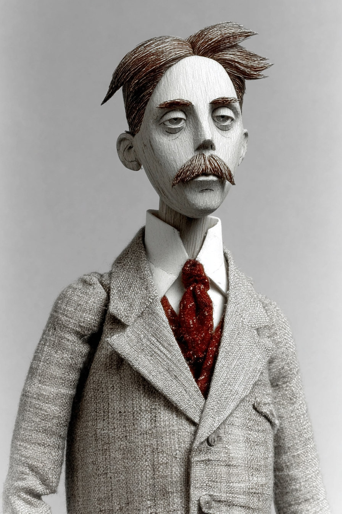

# AI for Teachers A Practitioner's Guide — Wayback Sections

> Extracted from `chapters/`. Each entry corresponds to one chapter file.
> Sections are instructor-authored. Missing sections show a placeholder only.
> Do not edit this file directly — edit the source chapter file, then re-run extraction.

---

## Chapter 00: AI for Teachers A Practitioner's Guide
*Source: `chapters/00-frontmatter.md`*

> **Section not yet authored.** No `## AI Wayback Machine` block found in this chapter file.
> To add this section, edit the source chapter file directly.

---

## Chapter 00: Introduction
*Source: `chapters/00-introduction.md`*

> **Section not yet authored.** No `## AI Wayback Machine` block found in this chapter file.
> To add this section, edit the source chapter file directly.

---

## Chapter 01: Chapter 1 — The AI Dividend: What Teachers Actually Get Back
*Source: `chapters/01-the-ai-dividend.md`*

##  AI Wayback Machine
The instinct to study where a teacher's hours actually go — and to redesign the workflow around what matters — was operationalized in American teacher training in the 1960s and 70s by **Madeline Hunter** (1916–1994). Hunter's ITIP framework (Instructional Theory Into Practice) broke teaching into observable elements: anticipatory set, objective and purpose, input, modelling, checking for understanding, guided practice, closure, independent practice. The point was not to mechanize teaching but to surface the structure underneath good lessons so that the structure could be taught — and so that a teacher overwhelmed by a hundred small decisions could compare their day against a checklist and recover the parts that had drifted. The audit move in this chapter — the social studies teacher writing down where the week's forty-two hours actually go — is Hunter's instinct applied to time instead of to a single lesson.


*Madeline Hunter, circa 1980. AI-generated portrait based on a public domain photograph (Wikimedia Commons).*

**Run this:**

```
Who was Madeline Hunter, and how does her ITIP framework connect to the time-audit move in this chapter? Keep it to three paragraphs. End with the single most surprising thing about her career or impact.
```

→ Search **"Madeline Hunter"** on Wikipedia.

**Now make the prompt better.** Try one of these:

- Ask it to map the seven ITIP elements onto the AI-Appropriate / Hybrid / Human-Required zones in this chapter.
- Ask about the criticism Hunter's framework received from researchers in the 1990s — what survives and what doesn't?

What changes? What gets better? What gets worse?

---

## Chapter 02: Chapter 2 — The Phase Gate: What AI Handles, What You Must Keep
*Source: `chapters/02-the-phase-gate.md`*

##  AI Wayback Machine
Skinner's programmed instruction and teaching machines (1954-58) are the chapter's intellectual ancestor: design the contingency, set the schedule, decide what counts as a successful response, and let the learner work through the gate one frame at a time. The phase-gate framework this chapter develops for AI use is Skinner's instinct re-applied to a teacher's day rather than a single student's worksheet.


*B.F. Skinner, 1904-1990. AI-generated portrait based on a public domain photograph (Wikimedia Commons).*


*Puppet Art by [Nik Bear Brown](https://www.nikbearbrown.com/).*

**Run this:**

```
Who was B.F. Skinner, and how does their work connect to the ideas in this chapter? Keep it to three paragraphs. End with the single most surprising thing about their career or thinking.
```

→ Search **"B.F. Skinner"** on Wikipedia.

**Now make the prompt better.** Try one of these:

- Ask it to apply Skinner's framework to a specific scenario in this chapter — what gets surfaced that the chapter's prose left implicit?
- Ask about the critics of Skinner's work and which criticisms still bite today.

What changes? What gets better? What gets worse?

---

## Chapter 03: Chapter 3 — Prompting That Works: The Foundation Skill
*Source: `chapters/03-prompting-that-works.md`*

##  AI Wayback Machine
The discipline behind the four-component prompt — make the student do the work; never give them the answer — is older than computing. **Charlotte Mason** (1842–1923) built a whole pedagogy on it. Her method, developed in the British Parents' National Educational Union from the 1880s onward, asked the child to *narrate* — to retell, in their own words, what they had just read. Mason believed children should encounter primary sources directly, then produce the synthesis themselves. The teacher's job was to set the conditions, ask the precise question, and refuse to summarize on the student's behalf. The same move, exactly, sits inside every prompt that produces real teacher-grade output: name the role, name the task, name the constraints, name the format — then let the model do the synthesis without leaking the answer.


*Charlotte Mason, circa 1890. AI-generated portrait based on a public domain photograph (Wikimedia Commons).*

**Run this:**

```
Who was Charlotte Mason, and how does her "narration" method connect to the four-component prompt anatomy in this chapter? Keep it to three paragraphs. End with the single most surprising thing about her pedagogy or career.
```

→ Search **"Charlotte Mason"** on Wikipedia.

**Now make the prompt better.** Try one of these:

- Ask it to rewrite a standard middle-school comprehension question as a Mason-style narration prompt — what changes?
- Ask it about Mason's six-volume *Home Education* series and which volume contains her sharpest pedagogical claim.

What changes? What gets better? What gets worse?

---

## Chapter 04: Chapter 4 — Lesson Planning and Curriculum Design with AI
*Source: `chapters/04-lesson-planning-with-ai.md`*

##  AI Wayback Machine
The two-sentence sticky note in this chapter — *what should students understand, and what evidence shows they understand it* — did not begin with Grant Wiggins and Jay McTighe in 1998. It began with **Ralph W. Tyler** (1902–1994), the American educator whose 1949 *Basic Principles of Curriculum and Instruction* set out four questions that every curriculum must answer: what educational purposes should the school seek to attain; what educational experiences can be provided that are likely to attain these purposes; how can these educational experiences be effectively organized; and how can we determine whether these purposes are being attained. The *Tyler rationale* — objectives, experiences, organization, evaluation — is the structural skeleton beneath backward design, beneath outcomes-based education, and beneath the lesson-planning workflow in this chapter. When you write Stage 1 and Stage 2 before opening the AI, you are doing Tyler's first and fourth steps; when the AI proposes activities and you sequence them, you are doing his second and third. The chapter's prompt-then-revise workflow is Tyler's rationale with a new tool inserted at the activity-design step.


*Ralph W. Tyler, circa 1950. AI-generated portrait based on public-domain reference photographs.*

**Run this:**

```
Who was Ralph Tyler, and how does his 1949 Tyler rationale (objectives, experiences, organization, evaluation) connect to the backward-design and prompt-then-revise workflow in this chapter? Keep it to three paragraphs. End with the single most surprising thing about his career or method.
```

→ Search **"Ralph W. Tyler"** on Wikipedia.

**Now make the prompt better.** Try one of these:

- Ask the model to translate Tyler's four questions into a one-page lesson-planning intake form a teacher could fill out before opening an AI tool — what survives the translation, and what gets lost?
- Ask whether Tyler's rationale is fundamentally compatible with backward design, or whether Wiggins and McTighe quietly reversed one of his steps.

What changes? What gets better? What gets worse?

---

[^shulman86]: Shulman, L. S. (1986). Those Who Understand: Knowledge Growth in Teaching. *Educational Researcher*, 15(2), 4–14. <https://journals.sagepub.com/doi/10.3102/0013189X015002004>. The 1987 companion piece: Shulman, L. S. (1987). Knowledge and Teaching: Foundations of the New Reform. *Harvard Educational Review*, 57(1), 1–22.

[^nfer]: NFER & Education Endowment Foundation (2024). *ChatGPT in Lesson Preparation: A Teacher Choices Trial — Evaluation Report.* Cluster-randomised trial, 68 secondary schools, 259 KS3 science teachers, ten weeks. <https://d2tic4wvo1iusb.cloudfront.net/production/documents/projects/chatgpt_in_lesson_planning_-_evaluation_report.pdf?v=1736353004>. EEF news summary: <https://educationendowmentfoundation.org.uk/news/teachers-using-chatgpt-alongside-a-guide-to-support-them-to-use-it-effectively-can-cut-lesson-planning-time-by-over-30-per-cent>.

[^ubd]: Wiggins, G., & McTighe, J. (2005). *Understanding by Design* (2nd ed.). Alexandria, VA: ASCD. <https://www.ascd.org/books/understanding-by-design-expanded-2nd-edition?variant=103055>.

[^liu25]: Liu, X. (2025). *An Evaluation of the Pedagogical Soundness and Usability of AI-Generated Lesson Plans Across Different Models and Prompt Frameworks in High-School Physics.* arXiv:2510.19866. <https://arxiv.org/abs/2510.19866>. Preprint, not yet peer-reviewed.

[^rand]: RAND Corporation (2025). *Uneven Adoption of Artificial Intelligence Tools Among U.S. Teachers and Principals in the 2023–2024 School Year* (RR-A134-25). <https://www.rand.org/pubs/research_reports/RRA134-25.html>.

[^aila]: Education Endowment Foundation (2025). *Lesson planning using AI lesson assistant, Aila — Teacher Choices Trial.* ~450 Key Stage 2 teachers, 86 English primary schools; results expected 2026. <https://educationendowmentfoundation.org.uk/projects-and-evaluation/projects/aila-teacher-choices-trial>.

---

## Chapter 05: Chapter 5 — Assessment, Grading, and Feedback with AI
*Source: `chapters/05-assessment-grading-and-feedback-with-ai.md`*

##  AI Wayback Machine
Thorndike founded American educational measurement. His law of effect, connectionist theory of learning, and the maxim *anything that exists, exists in some quantity, and so can be measured* are the chapter's framework for AI-assisted assessment in one line. The discipline he insisted on — that an assessment instrument is a tool that can be sharpened, audited, and replaced — is exactly what this chapter asks teachers to bring to AI-generated rubrics, drafts, and feedback.


*Edward Thorndike, 1874-1949. AI-generated portrait based on a public domain photograph (Wikimedia Commons).*



*Puppet Art by [Nik Bear Brown](https://www.nikbearbrown.com/).*

**Run this:**

```
Who was Edward Thorndike, and how does their work connect to the ideas in this chapter? Keep it to three paragraphs. End with the single most surprising thing about their career or thinking.
```

→ Search **"Edward Thorndike"** on Wikipedia.

**Now make the prompt better.** Try one of these:

- Ask it to apply Thorndike's framework to a specific scenario in this chapter — what gets surfaced that the chapter's prose left implicit?
- Ask about the critics of Thorndike's work and which criticisms still bite today.

What changes? What gets better? What gets worse?

---

## Chapter 06: Chapter 6 — Differentiation with AI: Reading Levels, Scaffolds, and Supports
*Source: `chapters/06-differentiation-with-ai.md`*

##  AI Wayback Machine
The framework this chapter rests on did not start with the Lexile score. It started with a Russian psychologist who died in 1934. **Lev Vygotsky** named the gap between what a student can do alone and what she can do with help the *zone of proximal development*. The support that lives inside that gap — the sentence frame, the partner read, the worked example — is what later researchers called *scaffolding*. The distinction between leveling (which changes the text) and scaffolding (which changes the support around the text) is Vygotsky's distinction made operational. If you take only one idea from the prior literature into your AI-assisted differentiation workflow, take this one.


*Lev Vygotsky (1896–1934). AI-generated portrait based on public domain photographs (Wikimedia Commons).*


*Puppet Art by [Nik Bear Brown](https://www.nikbearbrown.com/).*

**Run this:**

```
Who was Lev Vygotsky, and how does his Zone of Proximal Development
connect to the distinction between leveling and scaffolding in this
chapter? Keep it to three paragraphs. End with the single most
surprising thing about the publication history of his work.
```

→ Search **"Lev Vygotsky"** on Wikipedia.

**Now make the prompt better.** Try one of these:

- Ask it to map a specific WIDA Level 2 sentence frame and a graphic-organizer scaffold to Vygotsky's ZPD — which part is the "more knowledgeable other," which part is the "tool," and what does the student supply?
- Ask it about why Vygotsky's work was suppressed in the USSR for almost three decades, and what that does to the timeline of how scaffolding entered Western education research.

What changes? What gets better? What gets worse?

---

## Chapter 07: Chapter 7 — Communication with AI: Parents, Admin, and Documentation
*Source: `chapters/07-communication-with-ai.md`*

##  AI Wayback Machine
The ideas in this chapter didn't appear from nowhere. **Carl Rogers (1902–1987)** built a clinical psychology around an idea that sounds soft and is structurally precise — that human change happens through a specific relational stance, not through technique. *On Becoming a Person* (1961) named the three conditions: unconditional positive regard, congruence (the helper does not perform), and accurate empathy (the helper checks what they heard against what was said). Active listening, the move you may have learned as "reflect back what you heard," is his — and it works for exactly the reason this chapter's gate works. The listener supplies form; the speaker supplies content; the listener confirms by reading back. Rogers' clinical insight is the structural ancestor of the bullets-first discipline. The model converts your bullets into appropriately-toned prose the way a Rogerian counselor reflects content back to the speaker — only the original speaker can supply what is to be said. Apply Rogers to teacher-to-parent, teacher-to-student, and teacher-to-colleague communication and the entire chapter's framework drops out: the relational evidence has to come from the person who actually noticed; the model can polish the container but cannot supply the contents.


*Carl Rogers, mid-twentieth century. AI-generated portrait based on public-domain photographs.*

**Run this:**

```
Who was Carl Rogers, and how does his person-centered approach connect to the framework for AI-assisted teacher communication with parents, students, and colleagues that this chapter develops? Map his three conditions — unconditional positive regard, congruence, and accurate empathy — onto the three communication categories the chapter distinguishes (routine, sensitive, relational-evidence). End with the single most surprising thing about his career.
```

→ Search **"Carl Rogers"** on Wikipedia.

**Now make the prompt better.** Try one of these:

- Ask it how Rogers' "encounter group" experiments might inform the way schools structure parent–teacher conferences when AI is in the loop.
- Ask it whether Rogers' insistence on congruence — the helper does not perform — survives translation through an AI register-conversion step, and where the seam shows.

What changes? What gets better? What gets worse?

---

## Chapter 08: Chapter 8 — Making Slides With AI
*Source: `chapters/08-making-slides-with-ai.md`*

##  AI Wayback Machine
Vignelli's New York City subway signage and his Knoll identity standards manuals are the load-bearing precedents for what this chapter argues a teacher's slide system should be — a typographic constitution that holds across every use, that does not need to be redesigned each time it ships, that earns its consistency from constraint. His insistence that *the life of a designer is a life of fight against the ugliness* maps directly onto the chapter's argument for owning your DESIGN.md before you let any AI build a slide for you.


*Massimo Vignelli, 1931-2014. AI-generated portrait based on a public domain photograph (Wikimedia Commons).*


*Puppet Art by [Nik Bear Brown](https://www.nikbearbrown.com/).*

**Run this:**

```
Who was Massimo Vignelli, and how does their work connect to the ideas in this chapter? Keep it to three paragraphs. End with the single most surprising thing about their career or thinking.
```

→ Search **"Massimo Vignelli"** on Wikipedia.

**Now make the prompt better.** Try one of these:

- Ask it to apply Vignelli's framework to a specific scenario in this chapter — what gets surfaced that the chapter's prose left implicit?
- Ask about the critics of Vignelli's work and which criticisms still bite today.

What changes? What gets better? What gets worse?

---

## Chapter 09: Chapter 9 — Making Graphs and Data Visualizations with AI
*Source: `chapters/09-making-graphs-and-data-visualizations-with-ai.md`*

##  AI Wayback Machine
Bertin's *Sémiologie graphique* (1967) — the seven retinal variables, the systematic decomposition of any chart into mark, channel, and question — is the chart-selection vocabulary every teacher needs before they ask AI to make a graph. The chapter's framework is Bertin operationalized for the classroom-data use case: name the question first, choose the channel that answers it, accept that the chart's job is to make one comparison legible, not to make many comparisons available.


*Jacques Bertin, 1918-2010. AI-generated portrait based on a public domain photograph (Wikimedia Commons).*

**Run this:**

```
Who was Jacques Bertin, and how does their work connect to the ideas in this chapter? Keep it to three paragraphs. End with the single most surprising thing about their career or thinking.
```

→ Search **"Jacques Bertin"** on Wikipedia.

**Now make the prompt better.** Try one of these:

- Ask it to apply Bertin's framework to a specific scenario in this chapter — what gets surfaced that the chapter's prose left implicit?
- Ask about the critics of Bertin's work and which criticisms still bite today.

What changes? What gets better? What gets worse?

---

## Chapter 10: Chapter 10 — Writing with AI: An Introduction
*Source: `chapters/10-writing-with-ai-an-introduction.md`*

##  AI Wayback Machine
Murray's process-writing pedagogy — the idea that writing is a recursive movement among planning, drafting, and revising rather than a linear march from outline to polish — is the cognitive frame this chapter borrows for thinking about AI-as-drafter versus AI-as-Socratic-partner. His essay *Internal Revision* (1978) is still the cleanest map of which loops the writer must do alone and which can be assisted from outside.


*Donald Murray, 1924-2006. AI-generated portrait based on a public domain photograph (Wikimedia Commons).*

**Run this:**

```
Who was Donald Murray, and how does their work connect to the ideas in this chapter? Keep it to three paragraphs. End with the single most surprising thing about their career or thinking.
```

→ Search **"Donald Murray"** on Wikipedia.

**Now make the prompt better.** Try one of these:

- Ask it to apply Murray's framework to a specific scenario in this chapter — what gets surfaced that the chapter's prose left implicit?
- Ask about the critics of Murray's work and which criticisms still bite today.

What changes? What gets better? What gets worse?

---

## Chapter 11: Chapter 11 — Coding with AI: An Introduction
*Source: `chapters/11-coding-with-ai-an-introduction.md`*

##  AI Wayback Machine
Hopper invented the first compiler (A-0, 1952) and wrote much of what became COBOL. Her teaching ethos — *the most dangerous phrase in the language is we have always done it that way* — and her habit of explaining computing to non-programmers in their own vocabulary is the disposition this chapter asks teachers to bring to coding with AI. A teacher learning to code is doing what Hopper spent her career doing: insisting that the machine be made legible to the person who needs it, not the other way around.


*Grace Hopper, 1906-1992. AI-generated portrait based on a public domain photograph (Wikimedia Commons).*


*Puppet Art by [Nik Bear Brown](https://www.nikbearbrown.com/).*

**Run this:**

```
Who was Grace Hopper, and how does their work connect to the ideas in this chapter? Keep it to three paragraphs. End with the single most surprising thing about their career or thinking.
```

→ Search **"Grace Hopper"** on Wikipedia.

**Now make the prompt better.** Try one of these:

- Ask it to apply Hopper's framework to a specific scenario in this chapter — what gets surfaced that the chapter's prose left implicit?
- Ask about the critics of Hopper's work and which criticisms still bite today.

What changes? What gets better? What gets worse?

---

## Chapter 12: Chapter 12 — Building Your AI Workflow: Monday Morning to End of Year
*Source: `chapters/12-building-your-ai-workflow.md`*

##  AI Wayback Machine
The argument that a teaching week can be made tractable by writing it down belongs to a longer engineering tradition than it sounds. **Henry Laurence Gantt** (1861–1919) was an American mechanical engineer who, working with Frederick Winslow Taylor at Midvale Steel and then on his own, invented the production planning chart that still carries his name. The Gantt chart — horizontal bars on a time axis showing scheduled tasks, their durations, their dependencies, and their actual progress against plan — turned a foreman's tacit week into a wall-sized explicit document anyone on the shop floor could read in five seconds. The United States Army built warships against Gantt's charts in the First World War; the Hoover Dam was built against them; every project-management tool you have ever used is downstream of them. The deep idea is not the bars. The deep idea is that the schedule has to live outside the planner's head, in a form a second person can read, or it does not really exist. *Workflow.md* is the same move at the scale of a single teacher's week: a captured library and a recurring schedule, written down so that future-you can read them on a hard Wednesday without rebuilding them from scratch.


*Henry Gantt, circa 1910. AI-generated portrait based on public-domain reference photographs.*

**Run this:**

```
Who was Henry Gantt, and how does his invention of the Gantt chart and his work on scientific scheduling connect to the prompt library plus weekly schedule plus maintenance cycle in this chapter? Keep it to three paragraphs. End with the single most surprising thing about his career or method.
```

→ Search **"Henry Gantt"** on Wikipedia.

**Now make the prompt better.** Try one of these:

- Ask the model to translate Gantt's original 1910s production-planning chart into a one-week teacher schedule template — what survives the translation, and what gets lost?
- Ask whether Gantt's break from Taylor on the question of worker bonuses changes how you should think about teacher AI adoption as a system-design problem.

What changes? What gets better? What gets worse?

---

[^davenport]: Davenport, T. H., & Prusak, L. (1998). *Working Knowledge: How Organizations Manage What They Know.* Harvard Business School Press. <https://store.hbr.org/product/working-knowledge-how-organizations-manage-what-they-know/3014>.

[^gallup]: Gallup & Walton Family Foundation (2025). *Teaching for Tomorrow: Unlocking Six Weeks a Year With AI.* Survey fielded March 18 – April 11, 2025, n = 2,232 U.S. public K–12 teachers via RAND American Teacher Panel. <https://news.gallup.com/poll/691967/three-teachers-weekly-saving-six-weeks-year.aspx>. Full PDF: <https://static.waltonfamilyfoundation.org/df/fb/eba12807470a9402d7433cc47dba/teaching-for-tomorrow-unlocking-six-weeks-a-year-with-ai-report.pdf>.

[^rand]: Diliberti, M. K., Lake, R. J., & Weiner, S. R. (2025). *More Districts Are Training Teachers on Artificial Intelligence: Findings from the American School District Panel* (RR-A956-31). RAND Corporation. <https://www.rand.org/pubs/research_reports/RRA956-31.html>. The 68% figure refers to teachers reporting no formal AI training during 2024–25; verify exact wording against the primary report before publication.

[^wood]: Wood, W., & Neal, D. T. (2007). A new look at habits and the habit-goal interface. *Psychological Review*, 114(4), 843–863. <https://dornsife.usc.edu/wendy-wood/wp-content/uploads/sites/183/2023/10/wood.neal_.2007psychrev_a_new_look_at_habits_and_the_interface_between_habits_and_goals.pdf>. Wood, W., & Rünger, D. (2016). Psychology of habit. *Annual Review of Psychology*, 67, 289–314.

[^rogers]: Rogers, E. M. (2003). *Diffusion of Innovations* (5th ed.). Free Press.

[^cbam]: Hall, G. E., & Hord, S. M. (2020). *Implementing Change: Patterns, Principles, and Potholes* (5th ed.). Pearson Education. SEDL CBAM resources: <https://sedl.org/cbam/>.

---

## Chapter 13: Chapter 13 — Academic Integrity, Privacy, and Honest Use
*Source: `chapters/13-academic-integrity-privacy-and-honest-use.md`*

##  AI Wayback Machine
The ideas in this chapter didn't appear from nowhere. **Plato** (~428–348 BCE) recorded the first sustained argument that a new communication technology might *appear* to produce knowledge while corroding it. In the *Phaedrus*, Socrates tells the myth of the god Theuth presenting writing to King Thamus as a remedy for memory. Thamus refuses: writing, he says, produces "forgetfulness in the souls of those who learn it," because they will trust the external marks rather than do the internal work — they will "have the appearance of wisdom, not the reality." That argument is the load-bearing structure under the Bastani result. Detection looks for the external marks. Design asks whether the internal work happened.


*Plato, ~428–348 BCE. AI-generated portrait based on a public domain engraving of the classical bust (Wikimedia Commons).*

**Run this:**

```
Who was Plato, and how does the Phaedrus dialogue's critique of writing — that it produces "forgetfulness of memory" and "the appearance of knowledge, not the reality" — map onto this chapter's framework for academic integrity with AI? Keep it to three paragraphs. End with the single most surprising thing about how Plato's own use of the written dialogue contradicts the argument he puts in Socrates's mouth.
```

→ Search **"Plato"** and **"Phaedrus (dialogue)"** on Wikipedia.

**Now make the prompt better.** Try one of these:

- Ask it to rewrite the Theuth and Thamus myth with AI as Theuth and a 2026 teacher as Thamus — what does the king refuse, and on what grounds?
- Ask it about the difference between *anamnesis* (recollection as recovering knowledge the soul already has) and the externalized "knowledge" the dialogue criticizes — which of this chapter's five diagnostic questions tests for the difference?

---

## Chapter 14: Chapter 14 — What to Tell Your Students: AI Literacy in the Classroom
*Source: `chapters/14-what-to-tell-your-students.md`*

##  AI Wayback Machine
Freire's *Pedagogy of the Oppressed* (1968) draws the line between banking-model education (depositing facts into students) and dialogic education (problem-posing, mutual inquiry). What teachers should tell students about AI is the banking-versus-dialogic distinction transposed onto a new tool — and Freire is the precedent for taking the question seriously rather than treating it as classroom management. The chapter's stance — that the conversation with students about AI is itself the teaching — is Freire's central move applied to the present.


*Paulo Freire, 1921-1997. AI-generated portrait based on a public domain photograph (Wikimedia Commons).*

**Run this:**

```
Who was Paulo Freire, and how does their work connect to the ideas in this chapter? Keep it to three paragraphs. End with the single most surprising thing about their career or thinking.
```

→ Search **"Paulo Freire"** on Wikipedia.

**Now make the prompt better.** Try one of these:

- Ask it to apply Freire's framework to a specific scenario in this chapter — what gets surfaced that the chapter's prose left implicit?
- Ask about the critics of Freire's work and which criticisms still bite today.

What changes? What gets better? What gets worse?

---

## Chapter 97: The Fundamental Themes
*Source: `chapters/97-fundamenta-themes.md`*

> **Section not yet authored.** No `## AI Wayback Machine` block found in this chapter file.
> To add this section, edit the source chapter file directly.

---

## Chapter 99: 99 Back Matter
*Source: `chapters/99-back-matter.md`*

> **Section not yet authored.** No `## AI Wayback Machine` block found in this chapter file.
> To add this section, edit the source chapter file directly.

---
